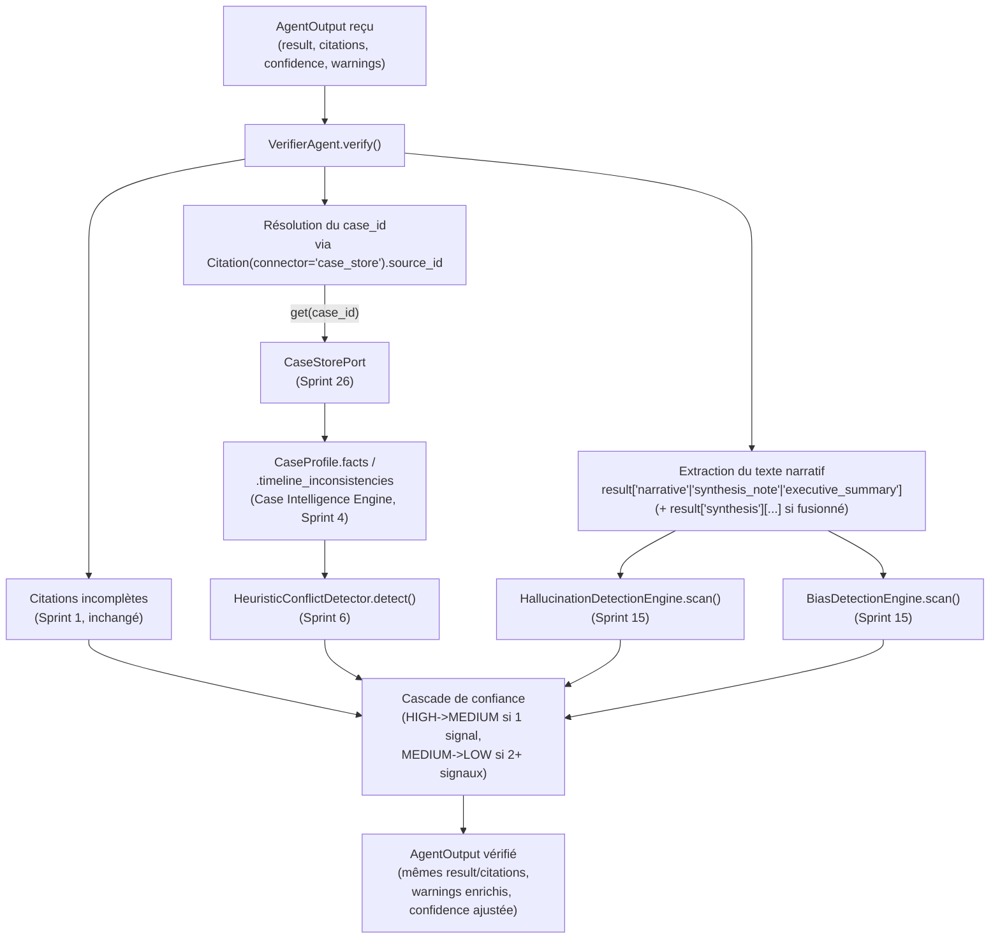
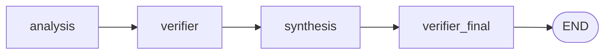

# 159 — Architecture : Agent Vérificateur enrichi (Sprint 31)

Ce document décrit l'enrichissement de `tmis.agents.verifier_agent.
VerifierAgent` (analyse de cohérence approfondie) et la correction du
graphe de `tmis.agents.orchestrator.Orchestrator` qui l'accompagne. Voir
le rapport d'audit (`docs/reports/sprint-31-rapport-audit.md`) pour le
détail composant par composant et le rapport d'architecture
(`docs/reports/sprint-31-rapport-architecture.md`) pour les décisions.

## Principe : composition stricte sur trois moteurs déjà livrés

Ce sprint n'implémente que `VerifierAgent` et le graphe de
l'`Orchestrator`. Les 7 autres agents de `tmis.agents` (recherche
documentaire, jurisprudence, contrat, veille, rédaction, stratégie,
collaboration) restent les placeholders Sprint 1 inchangés — chacun garde
son propre sprint dédié (33-36) ou reste hors roadmap actuelle.

`VerifierAgent.verify()` ne reconstruit aucune détection : il compose sur
trois moteurs déjà livrés, chacun invoqué exactement comme conçu :

- `tmis.legal_reasoning.conflicts.engine.HeuristicConflictDetector`
  (Sprint 6) pour la cohérence dossier ;
- `tmis.ai_governance.hallucination_detection.engine.
  HallucinationDetectionEngine` (Sprint 15) pour les hallucinations ;
- `tmis.ai_governance.bias_detection.engine.BiasDetectionEngine`
  (Sprint 15) pour les biais.

## Vue d'ensemble

## Ce que l'agent ne reconstruit jamais

| Besoin | Composant existant réutilisé | Ce que l'agent ne fait pas |
|---|---|---|
| Détection de conflits/contradictions/doublons | `HeuristicConflictDetector.detect(facts, timeline_inconsistencies)` (Sprint 6) | Un second moteur de cohérence ; les `Conflict` retournés sont reformatés en `warnings`, jamais recalculés |
| Détection d'hallucinations | `HallucinationDetectionEngine.scan(text)` (Sprint 15), lui-même bâti sur `ResponseEvaluator` (Sprint 14) | Un second compteur de citations ou détecteur de contradictions |
| Détection de biais | `BiasDetectionEngine.scan(text)` (Sprint 15) | Un second détecteur de généralisation ; les détecteurs enregistrés (`register()`) restent ceux du moteur existant |
| Lecture du dossier | `CaseStorePort.get(case_id)` (Sprint 26) | Un second entrepôt de dossiers |

## Résolution du `case_id` sans changer aucun contrat

`AgentOutput` n'a jamais porté de champ `case_id` et Sprint 31 ne pouvait
pas lui en ajouter un (contrainte "zéro changement de signature"). La
seule donnée disponible est la liste `citations: list[Citation]` — et
`SynthesisAgent` y attache déjà, depuis le Sprint 30, une `Citation`
`connector="case_store"` dont `source_id` est le `case_id` du dossier
résumé (`SynthesisAgent.run`, citation finale). `VerifierAgent` réutilise
cette convention telle quelle : `_resolve_case_id()` cherche la première
`Citation` de cette forme dans `output.citations`. Aucune sortie
d'Analyse seule n'en porte (elle cite le document, pas le dossier), donc
la cohérence dossier ne se déclenche naturellement qu'une fois la sortie
de Synthèse fusionnée dans l'état — précisément ce que la correction du
graphe (section suivante) garantit désormais.

## Texte narratif scanné : quelles clés, pourquoi

Seules les clés dont la valeur est réellement produite par un appel
modèle (`TMISKernel.complete()`), jamais une agrégation déterministe,
sont scannées :

| Clé | Agent | Générée par |
|---|---|---|
| `result["narrative"]` | `AnalysisAgent` | `TMISKernel.complete()` (`_generate_narrative`) |
| `result["synthesis_note"]` | `SynthesisAgent` | `TMISKernel.complete()` (`_generate_synthesis_note`) |
| `result["executive_summary"]` | `SynthesisAgent` | `CaseSummaryGenerator.generate()`, seul champ des quatre à appeler un modèle — `chronological_summary`/`documentary_summary`/`case_status` sont des agrégations déterministes (voir `CaseSummaryGenerator` docstring) |

Après fusion (`_fuse_with_synthesis`), le résultat de Synthèse vit sous
`result["synthesis"]` plutôt qu'à la racine — `_extract_narrative_texts()`
regarde donc les mêmes trois clés à la racine, puis, si présente, dans ce
sous-dictionnaire `"synthesis"` (le seul niveau d'imbrication que la
fusion introduit). Aucune clé n'est renommée.

## Dégradation de confiance : règle explicite

Pour chacune des quatre catégories de vérification (citations
incomplètes, conflits, hallucinations, biais), un "signal" est compté si
cette catégorie a produit au moins un nouvel avertissement **pendant cet
appel** à `verify()` :

1. `signal_categories >= 1` et `confidence == HIGH` → `confidence = MEDIUM`.
2. `signal_categories >= 2` et `confidence == MEDIUM` (après l'étape 1,
   donc en cascade dans le même appel) → `confidence = LOW`.
3. La confiance n'est jamais remontée.

Ceci remplace la règle Sprint 1 ("`if warnings: HIGH -> MEDIUM`", qui
réagissait à *tout* avertissement déjà présent dans `output.warnings`,
même sans rapport avec ce que le Vérificateur contrôle lui-même) par une
règle qui ne réagit qu'aux signaux que cet appel a lui-même confirmés.
`test_verifier_flags_incomplete_citations` (Sprint 1, toujours vert)
continue de valider `HIGH -> MEDIUM` sur un seul signal ; les nouveaux
tests valident la cascade `HIGH -> LOW` sur plusieurs signaux.

## Aucun contenu supprimé ni réécrit

`verify()` retourne toujours `output.result` et `output.citations` tels
quels — seuls `warnings` (uniquement des ajouts) et `confidence`
(uniquement des dégradations) changent. Même principe que
`HallucinationDetectionEngine` et `BiasDetectionEngine` eux-mêmes, qui
ne suppriment jamais de texte.

## Correction du graphe de l'Orchestrator

### Le bug : Synthèse ne passait jamais par le Vérificateur

Le graphe Sprint 30 était `analysis -> verifier -> synthesis -> END`.
`run_verifier` n'était câblé qu'entre `"analysis"` et `"synthesis"` : la
sortie de `SynthesisAgent` — ses citations, et le texte narratif de
`synthesis_note`/`executive_summary` — atteignait `END` sans jamais
passer par `.verify()`, en contradiction directe avec la première phrase
du docstring de `VerifierAgent` : « Every other agent's output is routed
through this agent before the orchestrator fuses a final response. »
Les tests Sprint 29/30 ne l'ont jamais détecté car aucun n'exerçait de
scénario où la sortie de Synthèse portait elle-même un problème à
signaler — ils vérifiaient la fusion, pas la vérification de ce qui est
fusionné.

### Le choix : une seconde passe de `verify()`, pas un déplacement du nœud

Deux options étaient possibles. Le choix retenu : garder
`analysis -> verifier -> synthesis` strictement inchangé, et ajouter un
nœud `verifier_final` entre `"synthesis"` et `END`, qui appelle
`self._verifier_agent.verify()` une seconde fois sur la sortie fusionnée.

Pourquoi pas l'autre option (déplacer `"verifier"` après `"synthesis"`,
soit `analysis -> synthesis -> verifier -> END`) : le rapport
d'architecture Sprint 30 (`docs/reports/sprint-30-rapport-architecture.
md`) justifie explicitement le positionnement `"verifier"` avant
`"synthesis"` — « `SynthesisAgent` consomme la sortie déjà vérifiée du
pipeline (...) la Synthèse est conceptuellement la dernière étape d'un
pipeline de traitement de dossier ». Ce raisonnement reste valide et n'a
pas besoin d'être défait : Analyse doit toujours être vérifiée avant que
Synthèse ne s'exécute. Le bug n'est pas que l'ordre `analysis -> verifier
-> synthesis` était faux — c'est qu'aucun nœud ne vérifiait ce qui vient
*après*. Ajouter une seconde passe en fin de graphe corrige exactement
ce manque, sans rouvrir une décision déjà motivée.

Ce choix est aussi celui qui prolonge le patron déjà documenté par les
Sprints 29/30 dans le docstring de `Orchestrator` : « one that runs
*after* Synthesis is inserted between `"synthesis"` and `END` » — un
futur agent terminal suit la même règle, désormais entre `"synthesis"`
et `"verifier_final"` (le patron du docstring est mis à jour en
conséquence pour le préciser).

### Conséquence sur `_fuse_with_synthesis`

Inchangée. `_fuse_with_synthesis` continue de fusionner `result` sous la
clé `"synthesis"` et de conserver `previous.confidence` (la confiance
issue de la première passe de vérification, sur la sortie d'Analyse). La
seconde passe (`verifier_final`) part ensuite de cette confiance et
applique la même cascade documentée ci-dessus sur les signaux détectés
dans la sortie fusionnée complète.

## Patron de câblage pour un futur agent (Sprint 32 et suivants)

Voir le docstring de `tmis.agents.orchestrator.Orchestrator` pour la
procédure à jour : un futur agent terminal (produisant un livrable, pas
un post-processeur comme le Vérificateur) s'insère entre `"synthesis"`
et `"verifier_final"`, jamais après — `verifier_final` doit rester le
dernier nœud avant `END` pour que tout output atteignant `END` ait été
vérifié.
