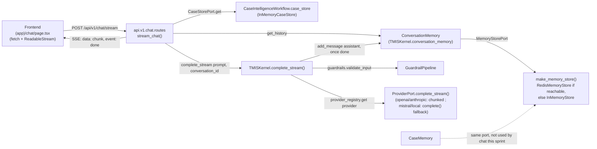

# 160 — Architecture : Chat IA en streaming (Sprint 32)

Ce document décrit l'ajout d'un chat conversationnel généraliste en
streaming, appuyé strictement sur `TMISKernel.complete_stream()`. Voir le
rapport d'audit (`docs/reports/sprint-32-rapport-audit.md`) pour le détail
composant par composant et le rapport d'architecture
(`docs/reports/sprint-32-rapport-architecture.md`) pour les décisions et
leur justification.

## Périmètre strict : chat généraliste, pas de recherche juridique

Ce sprint câble un chat généraliste sur `TMISKernel.complete()` /
`complete_stream()` uniquement — les mêmes deux points d'entrée que tout
le reste du dépôt utilise pour parler à un modèle. **Aucun agent de
`tmis.agents` et aucun `ResearchOrchestrator`/LRE n'est branché ici** :
c'est explicitement le périmètre du Sprint 33 (« Recherche exposée dans
le chat avec citations », voir docs/09-roadmap-30-sprints.md). Le chat
d'aujourd'hui ne cite donc jamais de source — il ne fait que discuter.

## Vue d'ensemble



`CaseMemory` shares `MemoryStorePort`/`make_memory_store()` with
`ConversationMemory` (both are namespaced views over the same store,
see `TMISKernel.__init__`) but this sprint's chat endpoint never calls
it — only `ConversationMemory` is exercised by the chat turn. It appears
in the diagram to make the shared-store relationship explicit, as the
prompt requests.

## Phase 1 — Streaming au niveau Provider/Kernel

### `ProviderPort.complete_stream` — extension additive du Protocol

```python
def complete_stream(self, prompt: str, *, model: str | None = None) -> AsyncIterator[str]: ...
```

Ajoutée à côté de `complete()`, jamais à la place. `complete()` n'a pas
été modifiée — même signature, même comportement, mêmes tests Sprint 2
toujours verts.

### Un écart de Phase 0 qui a déterminé le design des 4 adaptateurs

La Phase 0 a confirmé, par lecture directe des 4 fichiers
`ai/providers/*_provider.py`, qu'**aucun des quatre n'effectue le moindre
appel réseau vers un SDK vendeur** — chacun reste le stub déterministe
Sprint 2 (« Sprint 2 scope: no real network call is made yet »). Il n'y a
donc, aujourd'hui, aucun flux SDK natif à relayer pour *aucun* provider.

Le prompt de ce sprint demande un repli `complete()` + chunk unique «
pour un provider dont le SDK ne supporte pas nativement le streaming ».
Plutôt que d'inventer un nouveau critère, ce sprint réutilise le seul
signal déjà déclaré dans le dépôt : `ProviderCapabilities.
supports_streaming`, déjà `True` pour `openai`/`anthropic` et `False`
pour `mistral`/`local` depuis le Sprint 2.

- `openai`/`anthropic` (`supports_streaming=True`) : `complete_stream()`
  appelle `complete()` puis découpe le texte déterministe mot par mot
  (`"".join(chunks) == complete().text`, vérifié par test). Ce n'est pas
  un flux SDK réel — il n'y en a pas — mais un découpage qui honore la
  capacité déjà annoncée plutôt que de la contredire silencieusement en
  renvoyant, comme `mistral`/`local`, un seul chunk.
- `mistral`/`local` (`supports_streaming=False`) : `complete_stream()`
  appelle `complete()` et yield le texte entier en un seul chunk — jamais
  d'échec, exactement la clause de repli du prompt.

Conséquence assumée : le jour où un vrai SDK est câblé sur un provider
(hors périmètre de ce sprint), son `complete_stream()` devra être
réécrit pour relayer le flux SDK réel plutôt que de découper un texte
déjà entièrement généré — ce sprint ne prétend pas résoudre ce problème
par anticipation, il documente honnêtement l'état actuel.

### `TMISKernel.complete_stream()` — un écart corrigé silencieusement dans l'implémentation, pas dans le comportement

Le prompt de ce sprint décrit `complete_stream()` comme routant « via
`AIIntelligenceFabric` exactement comme `complete()` ». La Phase 0 a
confirmé par lecture directe de `TMISKernel.complete()`
(`ai/kernel/kernel.py`) que ce n'est pas exact : `complete()` appelle
`self.guardrails.validate_input()` puis `self.provider_registry.
get(provider_name).complete(prompt)` directement — jamais
`AIIntelligenceFabric`. `AIIntelligenceFabric` (`tmis.ai_fabric.fabric`)
est une façade séparée que les modules métier appellent, mais que
`TMISKernel` lui-même n'a jamais appelée depuis sa création.

`complete_stream()` reproduit donc le routage *réel* de `complete()`
(guardrails puis `provider_registry`), pas la description du prompt —
sinon `complete_stream()` aurait un comportement différent de
`complete()` sur un point (choix du provider) qu'aucune des deux
méthodes ne fait aujourd'hui varier avec `AIIntelligenceFabric`. Voir le
rapport d'audit pour la confirmation complète de cet écart.

Différences volontaires avec `complete()`, documentées plutôt que
laissées implicites :

- **Pas de cache** : `complete_stream()` n'utilise jamais `self.cache`.
  Un flux partiel ne peut pas être servi depuis une valeur mise en cache
  de la même façon qu'une réponse complète ; ne cacher que le résultat
  assemblé ferait qu'un hit de cache et un miss de cache se comportent
  différemment (livraison incrémentale vs. bloc unique immédiat) — une
  incohérence non demandée par le prompt et non construite par
  anticipation.
- **Pas de métriques d'évaluation** (`Evaluator.record`) : le prompt ne
  le demande pas, et le faire correctement demanderait de faire circuler
  le nom du modèle réellement utilisé à travers `ProviderPort.
  complete_stream()` (le Protocol ne le retourne pas, contrairement à
  `ModelResponse.model` sur la voie non-streaming) — une extension de
  signature non demandée. Signalé ici plutôt que construit par
  anticipation, dans le même esprit que le garde-fou de gouvernance
  volontairement absent de la Phase 3 (voir plus bas).
- **Journalisation dans `ConversationMemory` une fois le flux terminé,
  jamais chunk par chunk** : `complete_stream()` accepte un
  `conversation_id: uuid.UUID | None` optionnel ; si fourni, les chunks
  sont accumulés dans une liste locale et `ConversationMemory.
  add_message(conversation_id, "assistant", "".join(chunks))` n'est
  appelé qu'après la fin de la boucle `async for`. Un appelant qui lirait
  `get_history()` pendant qu'un flux est encore en cours ne voit donc
  jamais un tour assistant partiel.

## Phase 2 — `ai/memory/factory.make_memory_store()`

Reproduit exactement le patron `ai/cache/factory.make_cache()` du
Sprint 28 : `RedisMemoryStore` si Redis répond à un `PING`, sinon
`InMemoryStore` — jamais d'échec au démarrage.

Le prompt exige « un seul mécanisme de connexion Redis pour tout le
dépôt », déjà vérifié en Phase 0 comme le patron établi par
`ai.cache.factory._shared_redis_client()` (`@lru_cache`, un seul client
Redis process-wide, probé une seule fois). Plutôt que de faire dialer une
seconde connexion à `ai.memory.factory` — ou d'importer directement le
nom privé `_shared_redis_client` par-dessus la frontière de module —
`ai.cache.factory` gagne un accesseur public minimal,
`get_shared_redis_client()`, qui ne fait qu'appeler
`_shared_redis_client()`. `ai.memory.factory.make_memory_store()`
l'appelle : quand Redis est configuré et joignable, `RedisCache` et
`RedisMemoryStore` finissent par partager le même client/pool de
connexions (vérifié par test :
`tests/unit/ai/test_memory_factory.py::
test_memory_store_and_cache_share_the_one_redis_client`).

`TMISKernel.__init__` remplace `memory_store or InMemoryStore()` par
`memory_store or make_memory_store()` — `InMemoryStore` reste le défaut
si aucun `memory_store` n'est injecté et si Redis n'est pas joignable,
exactement comme avant pour les tests et le dev local.

## Phase 3 — Endpoint SSE

`POST /api/v1/chat/stream` (`tmis.api.v1.chat.routes`), une
`StreamingResponse` Starlette native (`media_type="text/event-stream"`)
— confirmé en Phase 0 qu'aucune dépendance `sse-starlette` n'existe déjà
dans `pyproject.toml`, et qu'aucune n'était nécessaire.

Séquence :

1. Si `case_id` est fourni, `CaseIntelligenceWorkflow.case_store.
   get(case_id)` (même port `CaseStorePort`, même singleton que les
   routes `case_intelligence` existantes via `get_case_intelligence_
   workflow()`) — `404` si absent.
2. `kernel.guardrails.validate_input(message)` appelé *avant* de renvoyer
   la `StreamingResponse` plutôt que de laisser `complete_stream()` le
   faire paresseusement à la première itération : une fois les en-têtes
   HTTP envoyés par `StreamingResponse`, une exception levée dans le
   générateur ne peut plus devenir un code de statut — un `400` propre
   n'est possible qu'en validant *avant* de retourner la réponse.
3. `ConversationMemory.get_history(conversation_id)` puis construction du
   prompt en réutilisant le format `"role: content"` déjà écrit par
   `ConversationMemory.add_message` (pas une seconde convention de
   prompt) : `"\n".join([*history, f"user: {message}"])`, préfixé de
   `"[Dossier: {case_id}]"` si un dossier est fourni.
4. `ConversationMemory.add_message(conversation_id, "user", message)` —
   le tour utilisateur est persisté ici, par l'endpoint, puisque
   `TMISKernel` ne voit jamais le message brut isolé (seulement le
   prompt composé avec l'historique).
5. `kernel.complete_stream(prompt, provider=..., conversation_id=...)` :
   chaque chunk est encodé `data: {"chunk": "..."}\n\n` ; le tour
   assistant est persisté par le Kernel lui-même une fois le flux terminé
   (voir Phase 1) — pas une seconde fois par l'endpoint.
6. `event: done\ndata: {}\n\n` signale la fin du flux au frontend.

### Pas de garde-fou de gouvernance/hallucination sur le chat — signalé, pas construit

Le prompt est explicite : `VerifierAgent` reste scopé aux sorties
d'agents du graphe `Orchestrator`, pas au chat brut. Ce sprint ne branche
donc aucun contrôle de hallucination/biais sur les réponses du chat. Un
besoin réel existe pourtant : un chat généraliste sans citation
(rappelé au paragraphe « Périmètre strict » ci-dessus) est exactement le
scénario où `HallucinationDetectionEngine`/`BiasDetectionEngine`
(Sprint 15, déjà livrés et déjà composés par `VerifierAgent` au
Sprint 31) auraient le plus de valeur, puisqu'aucune citation ne vient
étayer la réponse. Signalé ici et dans le rapport d'audit plutôt que
construit par anticipation — un candidat naturel pour un sprint dédié
(gouvernance du chat) ou pour une extension du Sprint 33 une fois la
recherche sourcée branchée.

## Phase 4 — Frontend

`frontend/src/app/(app)/chat/page.tsx` remplace `ModulePlaceholder` par
une interface de chat complète, client component (`"use client"`) :
liste de messages (bulles utilisateur/assistant), zone de saisie
(`textarea`, Entrée pour envoyer/Maj+Entrée pour un saut de ligne),
indicateur de streaming (curseur clignotant tant que le tour assistant
n'est pas terminé), sélecteur de dossier optionnel.

Consomme le SSE du Phase 3 via `fetch` + `ReadableStream` (pas
`EventSource` : `EventSource` ne supporte que des requêtes `GET`, alors
que l'endpoint attend un corps JSON `POST`) — un parseur minimal découpe
le flux sur `"\n\n"` et met à jour le contenu du dernier message
assistant à chaque chunk `data: {"chunk": ...}`.

La Phase 0 a confirmé qu'aucun composant de bulle de message ni aucun
appel `fetch` vers l'API n'existait ailleurs dans le frontend avant ce
sprint (chaque page métier est un simple `ModulePlaceholder` statique) —
ce chat est la première page du dépôt à effectivement parler au backend.
Réutilise donc ce qui existe déjà (`Card`/`CardContent`, `Button`, les
tokens de couleur sémantiques `bg-primary`/`bg-muted`/`text-destructive`/
`border-input` déjà utilisés par `button.tsx`/`card.tsx`, compatibles
clair/sombre sans code additionnel) plutôt que d'introduire une nouvelle
primitive `ui/` pour un champ de saisie texte simple, qui n'existait pas
non plus avant ce sprint.

Pas de sélecteur de dossier sous forme de liste déroulante : aucun
endpoint de listing des `CaseProfile` n'existe côté `case_intelligence`
(seuls `GET/POST/PATCH/DELETE /{case_id}/profile` existent, jamais un
`GET /cases`) et en ajouter un dépasserait le périmètre Phase 3 de ce
sprint. Le sélecteur est donc un champ texte libre pour l'identifiant du
dossier, validé côté serveur par le `404` du point 1 ci-dessus.

## Vérification manuelle bout en bout

Backend (`uvicorn tmis.main:app`) et frontend (`next dev`) démarrés
localement, testés ensemble :

- `curl -N` sur `/api/v1/chat/stream` avec le provider `openai` par
  défaut : plusieurs chunks `data:` distincts reçus dans l'ordre, suivis
  de `event: done` — pas un seul bloc.
- Un second appel sur la même `conversation_id` montre l'historique
  complet (tour précédent utilisateur + assistant) injecté dans le
  prompt du second tour.
- `case_id` inconnu → `404` avant tout octet de flux.
- Interface `/chat` pilotée via Playwright (Chromium) : envoi d'un
  message, bulles utilisateur/assistant correctement positionnées et
  colorées en clair et en sombre (bascule du thème existant, aucun style
  additionnel requis), curseur de streaming visible pendant la
  réception, message d'erreur affiché proprement (et bulle assistant
  vide retirée) sur un `case_id` invalide, aucune erreur console.
