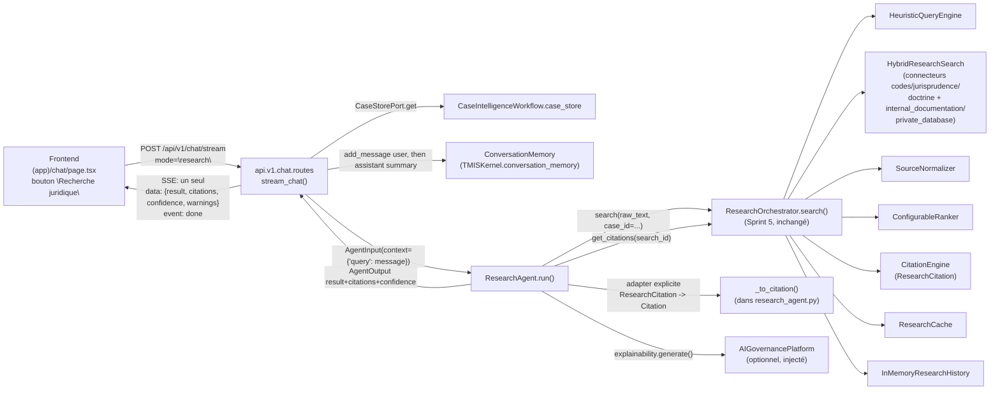

# 161 — Architecture : Agent Recherche Documentaire (Sprint 33)

Ce document décrit le câblage réel du `ResearchAgent` sur le `Research
Orchestrator` (Sprint 5, la LRE) et son exposition additive dans le chat
du Sprint 32. Voir le rapport d'audit
(`docs/reports/sprint-33-rapport-audit.md`) pour le détail composant par
composant et le rapport d'architecture
(`docs/reports/sprint-33-rapport-architecture.md`) pour les décisions et
leur justification.

## Périmètre strict : un seul agent, une seule extension additive

Ce sprint remplace **uniquement** le placeholder `ResearchAgent` par une
implémentation réelle, et étend **uniquement** l'endpoint de chat du
Sprint 32 d'un mode `"research"` — additif, jamais une réécriture.
**Aucun autre agent de `tmis.agents` n'est touché** (`JurisprudenceAgent`,
`ContractAgent`, `WatchAgent`, etc. restent des placeholders, chacun son
propre sprint dédié — voir docs/09-roadmap-30-sprints.md). **Ni
`ResearchOrchestrator` ni son pipeline interne** (`HeuristicQueryEngine`,
`HybridResearchSearch`, `SourceNormalizer`, `ConfigurableRanker`,
`CitationEngine`, `ResearchCache`, `InMemoryResearchHistory`,
`ResearchEvaluator`) ne sont modifiés — `ResearchAgent` les appelle tels
quels via `ResearchOrchestrator.search()`, le seul point d'entrée public.

## Vue d'ensemble



## Phase 1 — `ResearchAgent` réel

### Convention de contexte : `agent_input.context["query"]`

`AnalysisAgent` lit `agent_input.context.get("document_id")` ;
`SynthesisAgent` n'utilise aucune clé de `context` (il ne consomme que
`agent_input.case_id`). Ni l'un ni l'autre n'établit de convention pour
« le texte d'une requête ». `ResearchAgent` introduit `context["query"]`
— un nom minimal, direct, cohérent avec le style `"document_id"` déjà en
place (un substantif décrivant exactement la donnée attendue).

### `ResearchOrchestrator.search()` : seul point d'entrée, aucune logique réimplémentée

```python
case_id = str(agent_input.case_id) if agent_input.case_id is not None else None
response = await self._orchestrator.search(query, case_id=case_id)
```

`ResearchAgent` ne connaît ni le classement, ni la déduplication, ni le
cache trois couches, ni les connecteurs : tout cela reste entièrement
dans `ResearchOrchestrator` et son pipeline (Sprint 5). L'agent expose
la `ResearchResponse` déjà produite sous le contrat `AgentPort`.

### L'adaptateur `ResearchCitation -> Citation`

`ResearchCitation` (le schéma de `tmis.legal_research.citations.schemas`)
porte `source_id`, `title`, `date`, `document_type`, `reference`,
`excerpt` — mais **aucun nom de connecteur**. Le contrat agents
`Citation` (`tmis.ai.schemas.citation`) porte `source_id`, `connector`,
`excerpt`, `reference`. La conversion ne peut donc pas se limiter à un
renommage de champs.

**Décision** : `ResearchOrchestrator.search()` construit
`response.results` (des `ResearchResult`, qui portent `connector`) et les
citations retournées par `get_citations(search_id)` à partir de la
*même* liste `ranked`, dans le *même* ordre (voir
`ResearchOrchestrator.search`, lignes citations = tuple(...) juste après
`results=tuple(ranked)`). L'adaptateur zippe donc `response.results` et
`get_citations(response.search_id)` par position pour récupérer le bon
`connector` :

```python
@staticmethod
def _to_citation(result: ResearchResult, citation: ResearchCitation) -> Citation:
    return Citation(
        source_id=citation.source_id,
        connector=result.connector,
        excerpt=citation.excerpt,
        reference=citation.reference,
    )
```

C'est exactement le patron déjà établi par
`RetrievedChunk.to_citation(connector, reference)` (`tmis.ai.schemas.
citation`) : le nom du connecteur est une donnée que l'appelant fournit
explicitement, jamais un champ que `Citation` porte lui-même par
déduction. L'adaptateur vit dans `tmis.agents.research_agent` — jamais
dans `tmis.legal_research.citations`, qui n'a pas à connaître le contrat
`agents`.

`title` et `date` (portés par `ResearchCitation` mais absents de
`Citation`) ne sont pas perdus : ils restent disponibles dans
`AgentOutput.result["results"]` (voir `_result_to_dict`), que le frontend
affiche à côté de chaque citation plutôt que d'étendre le schéma
`Citation` lui-même (interdit par la contrainte « zéro changement de
signature »).

### Confiance : reflète `cache_hit` et le nombre de résultats

```python
@staticmethod
def _confidence_for(response: ResearchResponse) -> ConfidenceLevel:
    if not response.results:
        return ConfidenceLevel.LOW
    if response.cache_hit:
        return ConfidenceLevel.HIGH
    return ConfidenceLevel.MEDIUM
```

Aucun résultat -> `LOW` (rien à montrer). Résultats servis depuis le
cache de classement -> `HIGH` (une réponse déjà produite et stable).
Résultats fraîchement calculés -> `MEDIUM` (une première exécution, pas
encore éprouvée par une répétition).

### Pas de câblage `AIIntelligenceFabric` — signalé, pas oublié

Contrairement à `AnalysisAgent`/`SynthesisAgent`, `ResearchAgent` n'appelle
jamais `TMISKernel.complete()` lui-même : tout travail génératif éventuel
(embeddings de la recherche vectorielle, décisions de connecteur) reste
entièrement interne à `ResearchOrchestrator`/`HybridResearchSearch`, hors
périmètre de ce sprint. `AIIntelligenceFabric.route()` n'aurait donc rien
à router ici — le câbler aurait été une façade vide, pas un vrai besoin.
`AIGovernancePlatform.explainability`, en revanche, s'applique bien :
chaque exécution enregistre un rapport consultable (combien de résultats,
combien de connecteurs, `cache_hit`), optionnel comme pour les deux
agents précédents (`governance: AIGovernancePlatform | None = None`).

## Phase 2 — Extension additive du chat

### `ChatMessageRequest.mode: Literal["general", "research"] = "general"`

Un champ explicite plutôt qu'une détection d'intention automatique
(demandée par le prompt) : `mode` par défaut à `"general"` préserve le
comportement exact du Sprint 32 pour tout appelant existant qui ne
connaît pas ce nouveau champ.

### `stream_chat()` : une branche additive, pas une réécriture

La validation partagée (`case_id` existence, guardrails sur `message`)
reste commune aux deux modes, exactement comme avant. Seul le corps de
la fonction se ramifie :

- `mode == "general"` : chemin du Sprint 32, **strictement inchangé**
  (`ConversationMemory.get_history` -> `_build_prompt` ->
  `kernel.complete_stream()` chunk par chunk).
- `mode == "research"` : persiste le tour utilisateur, appelle
  `ResearchAgent.run()` une seule fois (pas de streaming token par
  token — rien à streamer, la réponse est déjà entièrement calculée),
  persiste un résumé texte du tour assistant dans `ConversationMemory`
  (`_research_summary_text`, jamais les structures `result`/`citations`
  brutes, que `ConversationMemory` — une liste de chaînes
  `"role: content"` — n'a aucun moyen de représenter), puis renvoie un
  **unique** événement SSE `data: {"result": ..., "citations": ...,
  "confidence": ..., "warnings": ...}` suivi de `event: done`.

### `AgentInput.case_id: uuid.UUID | None` vs `ChatMessageRequest.case_id: str`

Écart de Phase 0 documenté, pas corrigé : `AgentInput.case_id` est typé
`uuid.UUID | None` (contrat agents, signature gelée), alors que
`ChatMessageRequest.case_id` — et plus largement tout `case_id` de
`case_intelligence` (`CaseStorePort.get(case_id: str)`, aucune contrainte
de format UUID, voir `api/v1/case_intelligence/routes.py`) — est une
chaîne libre. `_research_agent_input()` tente `uuid.UUID(payload.
case_id)` ; si le format ne correspond pas, l'agent reçoit `case_id=None`
plutôt qu'un rejet de toute la requête : la recherche s'exécute quand
même, elle ne tague simplement pas l'entrée d'historique de la LRE avec
ce dossier. Choix cohérent avec le reste du dépôt (dégradation
gracieuse plutôt qu'échec dur sur une donnée optionnelle) — voir
`test_chat_stream_research_mode_with_a_non_uuid_case_id_still_searches`.

## Phase 3 — Frontend

Un bouton bascule (`variant="default"` actif / `"outline"` inactif,
`aria-pressed`) à côté du champ dossier existant, qui commute `mode`
entre `"general"` et `"research"`. En mode recherche :

- le corps de la requête envoie `mode: "research"` ;
- la réponse n'est jamais lue via la boucle `reader.read()` incrémentale
  du mode général (il n'y a qu'un seul événement `data:`, pas des chunks
  à assembler) : `response.text()` puis extraction du bloc `data:` unique ;
- le message assistant correspondant porte un champ `research` (le
  payload SSE complet) plutôt que du texte, et un composant dédié
  (`ResearchResults`) affiche chaque résultat (titre, type de document +
  date + référence, extrait, connecteur source) avec un badge de
  confiance coloré et les avertissements éventuels — jamais un flux de
  texte token par token sur des données qui n'en ont pas besoin.

Aucune nouvelle primitive `ui/` : `Button`/`Card`/`cn()` déjà en place
depuis le Sprint 32 suffisent.

## Vérification manuelle bout en bout

Backend (`uvicorn tmis.main:app`) et frontend (`next dev`) démarrés
localement :

- `curl` sur `/api/v1/chat/stream` avec `mode: "research"` : un seul
  bloc `data:` contenant `result`/`citations`/`confidence`/`warnings`
  suivi de `event: done` — jamais de chunks multiples.
- Interface `/chat` pilotée via Playwright (Chromium) : bascule du
  bouton « Recherche juridique », requête « contrat de travail », les
  résultats s'affichent avec titre, référence, extrait et source ; retour
  au mode général, un message « Bonjour » suivant montre que le tour de
  recherche précédent (« Recherche juridique : 1 resultat(s) trouve(s)
  (...) ») a bien été réinjecté dans l'historique consommé par
  `_build_prompt` — la persistance additive fonctionne réellement, pas
  seulement en test.
