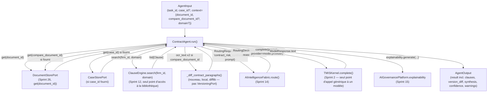

# 163 — Architecture : Agent Contrats (Sprint 35)

Ce document décrit le câblage réel du `ContractAgent` sur la bibliothèque
de clauses du cabinet (`ClauseEngine`, Sprint 12) pour la détection de
clauses à risque et de clauses manquantes, et sur
`AIIntelligenceFabric`/`TMISKernel` (Sprint 14/2) pour la synthèse de
risques générative — le même patron que `AnalysisAgent` (Sprint 29) pour
sa partie génération. Voir le rapport d'audit
(`docs/reports/sprint-35-rapport-audit.md`) pour le détail composant par
composant et le rapport d'architecture
(`docs/reports/sprint-35-rapport-architecture.md`) pour les décisions et
leur justification.

## Périmètre strict : un seul agent

Ce sprint remplace **uniquement** le placeholder `ContractAgent` par une
implémentation réelle. **Aucun autre agent de `tmis.agents` n'est
touché** (`WatchAgent` garde son propre sprint dédié — Sprint 36 —,
`DraftingAgent`/`StrategyAgent`/`CollaborationAgent` restent hors du
roadmap de 41 sprints, voir la note de révision après le Sprint 29 dans
docs/09-roadmap-30-sprints.md). Ni `ClauseEngine`, ni
`CabinetTemplateEngine`, ni `KnowledgeSpace`, ni `AIIntelligenceFabric`,
ni `TMISKernel`, ni `AIGovernancePlatform` ne sont modifiés —
`ContractAgent` les appelle tels quels, comme `AnalysisAgent` et
`JurisprudenceAgent` avant lui. `ContractAgent` n'est ni ajouté au graphe
LangGraph de l'`Orchestrator`, ni exposé dans le chat — même choix que
`JurisprudenceAgent` au Sprint 34 (voir « Ce qui reste volontairement hors
périmètre » ci-dessous).

## Vue d'ensemble



## Lecture du contrat : le même port que `AnalysisAgent`, pas un second parseur

`ContractAgent.run()` lit `agent_input.context["document_id"]` et appelle
`DocumentStorePort.get(document_id)` — le même port, la même
`InMemoryDocumentStore()` par défaut, que `AnalysisAgent`. `DocumentRecord
.ocr_text` est le texte déjà extrait par le pipeline Document Intelligence
(Sprint 3) ; `raw_bytes` n'est jamais relu ni re-parsé ici, conformément à
la contrainte explicite du prompt. Sans `document_id` ou avec un
identifiant introuvable, l'agent retourne immédiatement une confiance
`LOW` et un avertissement explicite — même patron que `AnalysisAgent`.

## Détection de clauses à risque et de clauses manquantes : `ClauseEngine` seul, aucune bibliothèque concurrente

### `ClauseEngine.search(firm_id, domain)` : un seul appel, toute la bibliothèque du domaine

`ContractAgent` résout un `LegalDomain` à partir de
`agent_input.context["domain"]` (retombe sur `LegalDomain.COMMERCIAL` par
défaut — le domaine que `legal_copilot_framework.copilots.contrats`
utilise déjà pour la revue contractuelle) puis appelle
`self._clause_engine.search(firm_id, domain=domain)` **une seule fois**
pour récupérer toute la bibliothèque de clauses connue du cabinet pour ce
domaine. Aucun filtre `clause_type`/`keyword` n'est passé à cet appel :
c'est `ContractAgent`, pas `ClauseEngine`, qui confronte ensuite chaque
`Clause` retournée au texte du contrat.

### Pour chaque `Clause` de la bibliothèque : présente, manquante, ou à risque

```python
clauses = self._clause_engine.search(self._firm_id, domain=domain)
findings = self._detect_clause_risks(document, clauses)
```

Pour chaque `Clause` :

1. **Présence** : le `clause_type` (mots-clés) ou le `title` de la clause
   apparaît-il dans `document.ocr_text` ? Si non → `status: "missing"`.
   C'est le mécanisme qui joue le rôle des « sections manquantes » pour ce
   sprint (voir plus bas pourquoi `CabinetTemplateEngine` ne joue pas ce
   rôle).
2. **Si présente** : la variante (`ClauseVariant`) la plus proche du texte
   du contrat est choisie par recouvrement de mots significatifs
   (`_overlap_score`). Si les notes de cette variante contiennent un
   indicateur de risque explicite (« risque », « défavorable »,
   « déséquilibr[é] », « abusif », etc. — les mots que le cabinet lui-même
   a déjà écrits dans `ClauseVariant.notes` en créant la clause), la
   clause est reportée `risk_notes` = ces notes. Sinon, si le
   recouvrement avec la variante la plus proche reste faible (< 30 % des
   mots significatifs), la clause est reportée comme rédigée en
   formulation non standard. Sinon, aucun risque n'est signalé.

Cette confrontation ne réinvente ni une bibliothèque de clauses (elle lit
exclusivement des `Clause`/`ClauseVariant` retournés par
`ClauseEngine.search()`) ni un second mécanisme de scoring sémantique
lourd — un recouvrement de mots explicite, dans le même esprit que
`KeywordOverlapReranker` (Sprint 2/28) déjà présent dans le dépôt pour un
besoin similaire (comparer un texte à une référence sans modèle
d'embedding dédié).

### Pourquoi `CabinetTemplateEngine` n'est **pas** câblé : aucun `DocumentType` ne représente un contrat

La mission demandait d'évaluer, en Phase 0, si `CabinetTemplateEngine`
(dont la `structure` — les sections attendues — est indexée par
`DocumentType`, Sprint 7) pouvait aussi servir à détecter des sections
manquantes dans un contrat. La lecture directe de
`tmis.legal_drafting.templates.schemas.DocumentType` montre que les neuf
valeurs de cet enum sont `CONSULTATION`, `NOTE_INTERNE`, `COURRIER`,
`MISE_EN_DEMEURE`, `REQUETE`, `ASSIGNATION`, `CONCLUSIONS`, `MEMOIRE`,
`SYNTHESE` — **aucune ne représente un contrat**. `CabinetTemplateEngine
.list_templates(firm_id, document_type)` ne peut donc renvoyer aucun
gabarit structurel pertinent pour un contrat sans que le cabinet ait, par
convention locale, rangé un modèle de contrat sous l'un de ces neuf types
— ce qui produirait des faux positifs/négatifs plutôt qu'une détection
fiable.

**Décision** : ne pas câbler `CabinetTemplateEngine` pour ce sprint.
Ajouter une dixième valeur à `DocumentType` (ex. `CONTRAT`) étendrait un
enum partagé, conçu et documenté pour les neuf types de document du
Sprint 7 (voir `tmis.legal_drafting.templates.schemas`), à un usage qu'il
n'a jamais eu vocation à couvrir — exactement le type d'extension que le
prompt met en garde contre pour `VersioningPort` (voir plus bas), et pour
la même raison : le modèle de données ne correspond pas à ce que ce
sprint doit produire. La détection de « sections manquantes » demandée
par la mission est donc entièrement portée par `ClauseEngine` : un
`clause_type` connu du domaine mais absent du texte du contrat **est**
la section manquante recherchée, sans avoir besoin d'un second mécanisme.
Ce choix laisse `CabinetTemplateEngine` disponible, inchangé, pour un
futur sprint qui déciderait explicitement d'étendre `DocumentType` — une
décision de modélisation qui dépasse le périmètre de celui-ci.

## Comparaison de versions : question ouverte tranchée avant tout code

### Pourquoi `InMemoryVersioningService.compare()` n'est pas réutilisable ici

La mission posait explicitement la question et demandait de la trancher
en Phase 0. Lecture directe de
`tmis.legal_drafting.versioning.{service,ports,schemas}` :

- `VersioningPort.snapshot(document_id, sections: list[Section], author)`
  et `.compare(document_id, version_a: int, version_b: int)` opèrent sur
  des **numéros de version d'un même `document_id`**, stockés en interne
  par `InMemoryVersioningService` au fil des éditions du Legal Drafting
  Studio (`sections: list[Section]`, elles-mêmes composées de
  `Paragraph`).
- `VersionDiff` compare deux `DocumentVersion` **du même document**, à la
  granularité du paragraphe identifié par `Paragraph.id` (un identifiant
  stable, attribué par le Studio à la création du paragraphe).

Un contrat de ce sprint est, lui, un `DocumentRecord` **uploadé** (deux
fichiers distincts, deux `document_id` différents, un texte brut
`ocr_text` sans aucune notion de `Paragraph.id` stable) — pas deux
versions d'un même document du Studio. Le modèle de données de
`VersioningPort` ne correspond donc pas à ce que ce sprint doit comparer :
appeler `compare(document_id, version_a, version_b)` sur deux contrats
uploadés séparément n'a pas de sens (ce ne sont ni le même `document_id`,
ni des `version_number` d'un historique de snapshots), et forcer
`VersioningPort` à accepter aussi des `DocumentRecord` briserait la
garantie actuelle du port — un seul modèle de document couvert,
clairement délimité par sa propre suite de tests.

### Décision : un type minimal local, pas une extension de `VersioningPort`

`ContractAgent` définit `ContractVersionDiff` (frozen dataclass, dans
`tmis/agents/contract_agent.py`, pas un nouveau module partagé — il n'a
qu'un seul appelant) : `added_paragraphs`, `removed_paragraphs`,
`changed_paragraphs` (paires avant/après), au même esprit que
`VersionDiff` mais calculé par `difflib.SequenceMatcher` (bibliothèque
standard Python) sur des paragraphes de texte brut (`ocr_text.split
("\n\n")`), jamais sur des `Section`/`Paragraph` du Studio. Ce diff n'est
produit **que** si `agent_input.context["compare_document_id"]` est
fourni et résout à un second `DocumentRecord` réellement persisté ;
sinon, `result["version_diff"]` vaut `None`.

Cette décision respecte la contrainte explicite du prompt : « ne pas
étendre `VersioningPort` à un modèle de document qu'il n'a jamais eu
vocation à couvrir ». `ContractVersionDiff` n'est ni un second moteur de
versioning (aucun stockage, aucun `snapshot()`, aucun historique — un
simple calcul stateless à la demande) ni une bibliothèque de comparaison
concurrente : c'est le type de retour minimal nécessaire pour exposer un
résultat que `difflib` produit déjà.

## Synthèse de risques : le travail réellement nouveau, patron `AnalysisAgent`

### Confirmé absent ailleurs dans le dépôt (Phase 0)

`legal_copilot_framework.copilots.contrats` (lu, non câblé) ne fait que
déclarer un `CopilotSpec` de démonstration avec son propre
`PromptRegistry` (Sprint 24, son propre docstring : « Demonstrates the
architecture, not full contract-law logic ») — aucune détection de
risque, aucune synthèse générative réelle. `ClauseEngine` et
`CabinetTemplateEngine` eux-mêmes ne savent confronter ni l'un ni l'autre
un contrat uploadé à leur contenu (c'est la prémisse même de ce sprint).
La synthèse de risques est donc un besoin réel, pas un doublon.

### `AIIntelligenceFabric.route()` → `TMISKernel.complete()`, comme `AnalysisAgent`/`JurisprudenceAgent`

```python
async def _generate_synthesis(
    self, document, case_profile, findings, version_diff
) -> tuple[str, str]:
    prompt = self._build_prompt(document, case_profile, findings, version_diff)
    model_name, provider_name = self._route_model(prompt)
    response = await self._kernel.complete(prompt, provider=provider_name)
    return model_name, response.text
```

Un seul point d'appel génératif (`TMISKernel.complete()`), routé par
`AIIntelligenceFabric.route(RoutingRequest(firm_id,
"contract_risk_synthesis", prompt))` — un `task_type` propre à ce sprint,
au même titre que `"document_analysis"` (Sprint 29) et
`"jurisprudence_comparison"` (Sprint 34). Sans `fabric` injecté
(paramètre optionnel, comme pour les deux agents précédents), le routage
retombe sur le provider par défaut du Kernel plutôt que d'échouer.
`ContractAgent` n'importe ni ne connaît
`legal_copilot_framework.prompts.PromptRegistry` : un seul mécanisme de
prompting pour cette responsabilité dans tout le dépôt.

### Le prompt inclut les clauses détectées, le dossier et le diff de version

Le prompt liste chaque clause à risque (titre, type, notes de risque) et
chaque clause manquante, ajoute le dossier (`CaseProfile.title` et nombre
d'acteurs) si un `case_id` a été résolu, et un résumé chiffré du diff de
version (paragraphes ajoutés/supprimés/modifiés) si un second document a
été comparé — pour que la synthèse réponde à « quels risques, dans quel
contexte, qu'est-ce qui a changé ? ».

## Confiance

```python
@staticmethod
def _confidence_for(clauses: list[Clause], warnings: list[str]) -> ConfidenceLevel:
    if not clauses:
        return ConfidenceLevel.LOW
    if warnings:
        return ConfidenceLevel.MEDIUM
    return ConfidenceLevel.HIGH
```

Même structure que `AnalysisAgent._confidence_for` : si la bibliothèque
de clauses du cabinet ne contient rien pour ce domaine, il n'y a rien de
fiable à confronter (`LOW`, même verdict qu'un document sans entité
pré-extraite) ; un avertissement quelconque (dossier introuvable,
document de comparaison introuvable, avertissements portés par le
`DocumentRecord` lui-même) dégrade à `MEDIUM` ; sinon `HIGH`. La confiance
reflète la fiabilité de la confrontation à la bibliothèque, pas le nombre
de clauses à risque trouvées : un contrat propre (aucune clause à risque)
avec une bibliothèque riche et sans avertissement reste `HIGH`.

## Explicabilité

`AIGovernancePlatform.explainability.generate(...)` enregistre, pour
chaque exécution : la lecture du contrat via `DocumentStorePort`, le
nombre de clauses confrontées et leur répartition (à risque/manquantes),
la lecture du dossier via `CaseStorePort` si un `case_id` a été résolu, la
comparaison de version si un second document a été fourni, et le modèle
utilisé pour la synthèse — optionnel comme pour les deux agents
précédents (`governance: AIGovernancePlatform | None = None`).

## Ce qui reste volontairement hors périmètre

- **`Orchestrator` (graphe LangGraph)** : `ContractAgent` n'y est pas
  ajouté — même choix que `JurisprudenceAgent` au Sprint 34, pour la même
  raison (ni `ResearchAgent` ni `JurisprudenceAgent` n'y ont jamais été
  ajoutés ; étendre ce graphe n'est ni demandé par ce sprint ni une
  conséquence triviale du travail déjà fait).
- **Chat** : `ContractAgent` n'est exposé qu'au travers de
  `tmis.agents.bootstrap.get_contract_agent()`, pas d'un mode dédié du
  chat — non demandé par ce sprint.
- **`CabinetTemplateEngine`** : évalué en Phase 0, non câblé — voir la
  section dédiée ci-dessus. Reste disponible, inchangé, pour un sprint
  futur qui déciderait explicitement d'étendre `DocumentType`.
- **`legal_copilot_framework.copilots.contrats`** : lu, non modifié, non
  câblé — un second mécanisme de prompting pour la même responsabilité
  aurait été introduit sinon, explicitement interdit par la mission.

## Patron de câblage disponible pour l'agent suivant

`WatchAgent` (Sprint 36) peut choisir, comme `ContractAgent` l'a fait ici,
entre les patrons déjà établis (`ResearchAgent` : délégation pure à un
port existant ; `AnalysisAgent`/`JurisprudenceAgent`/`ContractAgent` :
câblage `AIIntelligenceFabric`/`TMISKernel` pour une synthèse générative)
— et, si un besoin de ce sprint ne correspond à aucun modèle de données
existant (comme la comparaison de version ici), préférer un type minimal
local scopé à l'agent plutôt que d'étendre un port conçu pour un autre
usage.
