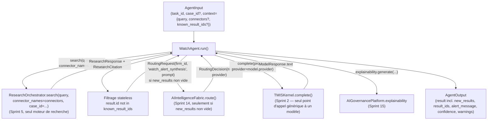

# 164 — Architecture : Agent Veille (Sprint 36)

Ce document décrit le câblage réel du `WatchAgent` sur le Legal Research
Engine (`ResearchOrchestrator.search()`, Sprint 5) pour la recherche
filtrée par connecteurs surveillés, la détection stateless de ce qui est
nouveau depuis une exécution précédente, et une synthèse d'alerte
optionnelle via `AIIntelligenceFabric`/`TMISKernel` (Sprint 14/2) — le
même patron que `JurisprudenceAgent` (Sprint 34) et `ContractAgent`
(Sprint 35) pour combiner délégation à un port existant et génération.
Voir le rapport d'audit (`docs/reports/sprint-36-rapport-audit.md`) pour
le détail composant par composant et le rapport d'architecture
(`docs/reports/sprint-36-rapport-architecture.md`) pour les décisions et
leur justification.

## Périmètre strict : un seul agent, le dernier de `tmis.agents`

Ce sprint remplace **uniquement** le placeholder `WatchAgent` par une
implémentation réelle. C'est le sixième et **dernier** des six agents de
`tmis.agents` prévus par cette table de 41 sprints
(`ResearchAgent` Sprint 33, `JurisprudenceAgent` Sprint 34, `ContractAgent`
Sprint 35, `WatchAgent` Sprint 36 — avec `AnalysisAgent` Sprint 29 et
`SynthesisAgent`/`VerifierAgent` Sprints 30/31, cela fait sept agents
réels au total dans `tmis.agents`, le placeholder Sprint 1 en comptant
neuf ; `DraftingAgent`/`StrategyAgent`/`CollaborationAgent` restent hors
de ce roadmap, voir la note de révision après le Sprint 29 dans
docs/09-roadmap-30-sprints.md). Aucun autre agent n'est touché, ni
`ResearchOrchestrator`, ni `ConnectorManager`, ni `ResearchHistoryPort`,
ni `AIIntelligenceFabric`, ni `TMISKernel`, ni `AIGovernancePlatform`.
`WatchAgent` n'est ni ajouté au graphe LangGraph de l'`Orchestrator`, ni
exposé dans le chat, ni câblé sur une tâche Celery périodique — mêmes
choix que `JurisprudenceAgent`/`ContractAgent` avant lui, pour la
première raison, et une décision explicite tranchée en Phase 0 pour la
troisième (Question Ouverte n°2 ci-dessous).

## Vue d'ensemble



## Recherche filtrée par connecteurs : `ResearchOrchestrator.search()` seul, aucun second moteur

### Configuration de veille : ce qui est réellement nouveau dans ce sprint

La mission identifie explicitement que la recherche elle-même n'est pas
nouvelle. Ce qui est nouveau est la **structure d'une configuration de
veille**, lue depuis `agent_input.context` :

- `query: str` — la requête surveillée (comme `ResearchAgent`/
  `JurisprudenceAgent`) ;
- `connectors: list[str] | None` — les connecteurs surveillés. Passés
  tels quels à `ResearchOrchestrator.search(connector_names=connectors)` ;
  `None` (absent du contexte) recherche tous les connecteurs enregistrés,
  exactement comme `ResearchAgent` ne filtre jamais. Contrairement à
  `JurisprudenceAgent`, qui fixe en dur `["jurisprudence"]`, `WatchAgent`
  laisse l'appelant choisir les connecteurs à surveiller — c'est le sens
  même d'une veille configurée, par opposition à une recherche
  spécialisée sur un domaine fixe ;
- `case_id` (sur `AgentInput`, pas dans `context`) — dossier optionnel,
  transmis à `ResearchOrchestrator.search(case_id=...)` comme les trois
  agents précédents.

### Confirmation Phase 0 : aucun second registre de connecteurs requis

`ConnectorManager.list_connectors()` (`tmis.ai.connectors.manager`)
confirme que les connecteurs sont déjà tous enregistrés sur le
`ConnectorManager` partagé du Kernel (`codes`, `jurisprudence`,
`doctrine` par défaut, plus tout connecteur additionnel enregistré via
`register()`) : « sources configurées » de la mission n'introduit donc
aucun nouveau registre — c'est une liste de `connector_names` parmi ceux
déjà connus, passée telle quelle à `ResearchOrchestrator.search()`
(elle-même déléguant à `ConnectorManager.search(connector_names=...)`,
Sprint 5). Un nom de connecteur inconnu ou désactivé est simplement
absent des résultats (`ConnectorManager.search()` l'ignore déjà
silencieusement) — aucune validation supplémentaire n'est nécessaire côté
`WatchAgent`.

```python
connector_names = self._resolve_connectors(agent_input.context.get("connectors"))
case_id = str(agent_input.case_id) if agent_input.case_id is not None else None
response = await self._orchestrator.search(
    query, connector_names=connector_names, case_id=case_id
)
```

Chaque `ResearchCitation` de la réponse est convertie en `Citation` par
le même adaptateur partagé, `tmis.agents.citations.
research_citation_to_citation` — aucun second chemin de conversion.

## Question Ouverte n°1 : détection de nouveauté — stateless, aucun nouveau store

### Les deux options posées par la mission

1. **(a) Stateless** : l'appelant fournit `known_result_ids` dans
   `agent_input.context`, l'agent renvoie ce qui n'y figure pas.
2. **(b) `WatchStorePort`** : un nouveau port persiste, par configuration
   de veille, les identifiants déjà vus.

### Confirmation Phase 0 : `ResearchHistoryPort` ne compare jamais deux exécutions

Lecture directe de `tmis.legal_research.history.{ports,schemas,
in_memory_history}` : `ResearchHistoryPort.record()` ajoute une
`ResearchHistoryEntry` (id, query_text, timestamp, connectors_used,
duration_ms, result_count, user_id, case_id) à chaque appel de
`ResearchOrchestrator.search()` ; `list_for_user`/`list_for_case`/
`list_all` ne font que filtrer/lister ces entrées. Aucune méthode ne
compare le contenu de deux recherches entre elles, et
`ResearchHistoryEntry` ne conserve même pas la liste des `ResearchResult.
id` d'une exécution — seulement `result_count`, un entier. Ce n'est donc
structurellement pas un mécanisme de détection de nouveauté : l'utiliser
pour cela aurait exigé de l'étendre à un usage qu'il n'a jamais eu
vocation à couvrir, exactement le type d'extension que la mission met en
garde contre.

### Décision : option (a), stateless

`WatchAgent` n'introduit aucun nouveau store. `agent_input.context.
get("known_result_ids")` (liste de chaînes, défaut vide) est comparé aux
`result.id` de la réponse fraîchement obtenue :

```python
known_result_ids = self._resolve_known_ids(agent_input.context.get("known_result_ids"))
...
new_pairs = [
    (result, citation)
    for result, citation in zip(response.results, research_citations, strict=True)
    if result.id not in known_result_ids
]
```

`result["result_ids"]` renvoie systématiquement **l'ensemble** des
identifiants de cette exécution (pas seulement les nouveaux) : c'est ce
que l'appelant doit fusionner (union, jamais remplacement — un résultat
qui disparaît d'une recherche future à cause d'un ré-classement ne doit
pas redevenir « nouveau » plus tard) avec son propre `known_result_ids`
avant la prochaine exécution de la même veille. `WatchAgent` ne connaît
lui-même aucune notion de « configuration de veille persistante » —
c'est délibéré : la persistance d'une configuration nommée (avec
planification, préférences utilisateur, notifications) est un sujet de
sprint distinct, hors périmètre de celui-ci (voir Question Ouverte n°2).

### Pourquoi (a) est suffisant et (b) n'a pas été retenu

Une alerte utile nécessite de savoir ce qui est nouveau — mais **pas**
que `WatchAgent` lui-même se souvienne d'une exécution à l'autre. Le
contrat `AgentPort` (`run(agent_input) -> AgentOutput`) est déjà
intégralement stateless pour les six autres agents de `tmis.agents` :
aucun n'accumule d'état entre deux appels de `run()`, l'état durable
(dossier, document, historique de recherche) vit toujours dans un port
externe injecté. Introduire un `WatchStorePort` local à cet agent aurait
été le seul agent à rompre ce principe pour un besoin que l'appelant peut
déjà satisfaire lui-même (conserver une liste d'identifiants d'un appel à
l'autre est trivial côté appelant, qui a de toute façon besoin d'un
mécanisme de planification/persistance de configuration que ce sprint
n'implémente pas — voir Question Ouverte n°2). (a) reste donc l'option
qui n'introduit aucun composant que le dépôt n'a pas déjà les moyens de
composer proprement, conformément à la contrainte explicite de la
mission. Si un futur sprint dédié à la planification récurrente des
veilles a besoin de persister des configurations nommées, ce sprint-là
choisira le port adapté à ce besoin plus large (probablement une
configuration de veille complète — requête, connecteurs, dossier,
planification — pas seulement un ensemble d'identifiants) plutôt que
d'étendre `WatchAgent` a posteriori.

## Question Ouverte n°2 : pas de tâche Celery périodique

La mission ne mentionne, pour ce sprint, que « alertes ciblées depuis
sources configurées » — pas de planification automatique. Lecture directe
de `tmis.core.tasks.{celery_app,document_tasks,case_tasks}` : le patron
Celery existant (un `Celery` unique, `tmis.core.tasks.celery_app`,
réutilisé par toute tâche du dépôt) déclenche des traitements
**événementiels** (upload d'un document → pipeline DIE → CIE) — jamais un
déclenchement périodique/planifié ; aucune tâche `@celery_app.task` du
dépôt ne s'exécute sur un `crontab`/`beat_schedule`, et
`tmis.core.tasks.celery_app` ne configure aucun `beat_schedule`.

**Décision : aucune tâche Celery périodique ajoutée.** Câbler une veille
récurrente exigerait, au minimum, un `beat_schedule` (absent de tout le
dépôt), une notion de « configuration de veille nommée et persistée »
(hors périmètre — voir Question Ouverte n°1), et un mécanisme de
notification à l'utilisateur (absent de ce sprint) : ni triviale, ni
strictement additive au patron Celery existant. `WatchAgent.run()`
s'exécute exclusivement à la demande, comme les six autres agents de
`tmis.agents` — l'orchestration d'une veille récurrente (planification,
notifications, préférences utilisateur) reste un sujet de sprint futur,
non couvert par cette table de 41 sprints.

## Synthèse d'alerte : générative, mais jamais le seul support des faits

### Décision : générative, à un seul point d'appel, seulement si nécessaire

La mission demandait d'évaluer si une alerte gagne à rester
structurée/déterministe plutôt que narrative. Décision retenue : **les
deux** — le contenu structuré (`new_results`, avec `id`/`title`/
`excerpt`/`connector`/`reference`/`date`/`score` pour chaque résultat
nouveau) reste systématiquement présent et **est** la source de vérité de
l'alerte, exactement comme `result["results"]` l'est déjà pour
`ResearchAgent`/`JurisprudenceAgent`. Un message narratif optionnel,
`alert_message`, est généré par-dessus — même patron `AIIntelligenceFabric
.route()` → `TMISKernel.complete()` que les trois agents précédents
(`AnalysisAgent`, `JurisprudenceAgent`, `ContractAgent`), jamais un second
client LLM :

```python
async def _generate_alert(
    self, query: str, new_pairs: list[_ResultCitationPair], case_id: str | None
) -> tuple[str, str]:
    prompt = self._build_prompt(query, new_pairs, case_id)
    model_name, provider_name = self._route_model(prompt)
    completion = await self._kernel.complete(prompt, provider=provider_name)
    return model_name, completion.text
```

`_route_model()` reproduit exactement le patron des trois agents
précédents : `RoutingRequest(firm_id, "watch_alert_synthesis", prompt)`
(un `task_type` propre à ce sprint), retombant sur `"default", None` sans
`fabric` injecté.

### Pourquoi la génération n'est pas sautée entièrement (contrairement à la tentation du "tout déterministe")

Une alerte de veille est destinée à un juriste qui doit décider en
quelques secondes si elle mérite son attention — une liste brute de
résultats structurés (titre, référence, extrait tronqué) exige de
parcourir chaque entrée pour en saisir la portée collective (combien de
décisions convergent, y a-t-il un dossier concerné). Un court message
généré, dans le même esprit que la comparaison de `JurisprudenceAgent` ou
la synthèse de risques de `ContractAgent`, répond à cette exigence sans
dupliquer aucun mécanisme existant.

### Pourquoi la génération n'est pas retenue comme le seul support des faits (contrairement au "tout narratif")

Contrairement à la comparaison de jurisprudence ou à la synthèse de
risques contractuels — qui produisent un jugement réellement nouveau
(convergence/divergence, clause à risque) qu'aucune structure de données
existante ne capture — une alerte de veille est fondamentalement un
**filtrage** : "ces résultats précis sont nouveaux depuis la dernière
fois". Faire reposer cette information exclusivement sur un texte généré
introduirait un risque de paraphrase inexacte (référence, date, ou
extrait légèrement déformés par le modèle) sur un fait qui est déjà
connu avec exactitude par le code appelant. `new_results` (structuré,
calculé sans passer par un modèle) reste donc la source de vérité
consultée par tout appelant programmatique ; `alert_message` est une
couche de lisibilité, jamais un remplacement.

### La génération est sautée quand il n'y a rien de nouveau

Comme `JurisprudenceAgent` saute sa comparaison sur zéro résultat,
`WatchAgent` ne génère `alert_message` que si `new_pairs` est non vide :
une veille sans nouveauté n'a rien à synthétiser, et déclencher un appel
`TMISKernel.complete()` pour produire "rien de nouveau" serait un coût
sans valeur ajoutée face à l'avertissement explicite déjà porté par
`AgentOutput.warnings`.

## Confiance

```python
@staticmethod
def _confidence_for(response: ResearchResponse) -> ConfidenceLevel:
    if not response.results:
        return ConfidenceLevel.LOW
    if response.cache_hit:
        return ConfidenceLevel.HIGH
    return ConfidenceLevel.MEDIUM
```

Même structure que `ResearchAgent._confidence_for` : la confiance reflète
la fiabilité de la recherche elle-même (rien trouvé du tout pour cette
veille -> `LOW` ; un résultat servi depuis le cache -> `HIGH` ; sinon
`MEDIUM`), indépendamment du nombre de résultats *nouveaux*. Une veille
qui ne trouve rien de nouveau depuis la dernière exécution reste une
recherche réussie (elle a bien interrogé les connecteurs surveillés) —
ce n'est pas un problème de fiabilité, seulement l'absence d'alerte à
émettre, signalée par un avertissement explicite plutôt que par une
confiance dégradée.

## Explicabilité

`AIGovernancePlatform.explainability.generate(...)` enregistre, pour
chaque exécution : la requête et les connecteurs surveillés (ou « tous
connecteurs enregistrés » si `connectors` est absent du contexte), le
nombre de résultats reçus et le nombre de résultats nouveaux, et le
modèle utilisé pour l'alerte si une génération a eu lieu — optionnel
comme pour les trois agents précédents (`governance:
AIGovernancePlatform | None = None`). `documents_consulted` ne référence
que les résultats **nouveaux** (ce que l'alerte a réellement porté à
l'attention), pas l'ensemble des résultats de la recherche.

## Ce qui reste volontairement hors périmètre

- **`Orchestrator` (graphe LangGraph)** : `WatchAgent` n'y est pas
  ajouté — même choix que `ResearchAgent`/`JurisprudenceAgent`/
  `ContractAgent` avant lui.
- **Chat** : `WatchAgent` n'est exposé qu'au travers de
  `tmis.agents.bootstrap.get_watch_agent()`, pas d'un mode dédié du
  chat — non demandé par ce sprint.
- **Tâche Celery périodique / planification** : évaluée et écartée
  explicitement — voir Question Ouverte n°2 ci-dessus. Le patron Celery
  existant (`tmis.core.tasks`) reste disponible, inchangé, pour un futur
  sprint de planification récurrente.
- **`WatchStorePort` (option 1b)** : évalué et écarté — voir Question
  Ouverte n°1 ci-dessus. `agent_input.context["known_result_ids"]` porte
  entièrement le besoin de ce sprint.
- **`domain.watch`** : confirmé vestige vide (même statut que
  `domain.case_analysis` tranché au Sprint 29) — non peuplé par ce
  sprint, `WatchAgent` ne dépend d'aucun type de `tmis.domain.watch`.

## Dernier agent de `tmis.agents` prévu par ce roadmap

Avec ce sprint, les six agents de `tmis.agents` que cette table de 41
sprints prévoyait de rendre réels le sont tous : `AnalysisAgent`
(Sprint 29), `SynthesisAgent` (Sprint 30), `VerifierAgent` (Sprint 31),
`ResearchAgent` (Sprint 33), `JurisprudenceAgent` (Sprint 34),
`ContractAgent` (Sprint 35), `WatchAgent` (Sprint 36) — sept agents
réels en tout, le placeholder Sprint 1 en ayant posé neuf
(`DraftingAgent`/`StrategyAgent`/`CollaborationAgent` restent hors de ce
roadmap de 41 sprints, voir la note de révision après le Sprint 29 dans
docs/09-roadmap-30-sprints.md). Aucun sprint suivant de cette table ne
porte plus la mention « les N autres agents de `tmis.agents` restent des
placeholders ».
