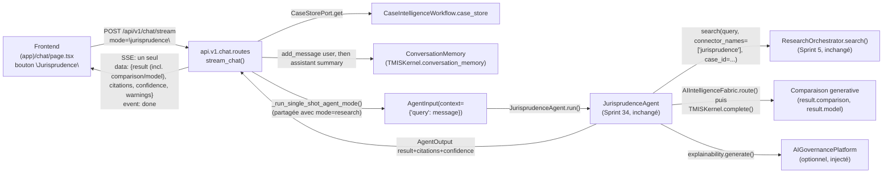

# 165 — Architecture : Exposition de `JurisprudenceAgent` dans le chat (Sprint 38)

Ce document décrit l'extension additive du chat (Sprint 32, mode
`"general"` ; Sprint 33, mode `"research"`) d'un troisième mode,
`"jurisprudence"`, câblé sur `JurisprudenceAgent` (Sprint 34, déjà réel —
voir docs/162-architecture-agent-jurisprudence.md). Voir le rapport
d'audit (`docs/reports/sprint-38-rapport-audit.md`) pour le détail
composant par composant et le rapport d'architecture
(`docs/reports/sprint-38-rapport-architecture.md`) pour les décisions et
leur justification.

## Périmètre strict : un seul agent, une seule extension additive

Ce sprint est le premier d'une série de quatre sprints d'exposition
d'agents dans le chat (39, 40, 41 pour `ContractAgent`, `WatchAgent`,
`Orchestrator`). Il étend **uniquement** l'endpoint `/api/v1/chat/stream`
d'un mode `"jurisprudence"` — additif, jamais une réécriture. **Aucun
agent autre que `JurisprudenceAgent` n'est touché** : `ContractAgent`,
`WatchAgent` et `Orchestrator` ont chacun une forme d'API différente
(voir docs/09-roadmap-30-sprints.md, note de révision après ce sprint) et
restent hors périmètre. `JurisprudenceAgent` lui-même, `ResearchOrchestrator`
et son pipeline interne ne sont pas modifiés — ce sprint consomme
`get_jurisprudence_agent()` (déjà câblé au Sprint 34) tel quel.

## Vue d'ensemble



## Phase 0 — Ce qui a été confirmé avant tout code

La Phase 0 a relu, sans aucune supposition, les cinq fichiers désignés
par la mission et confirmé qu'aucun n'avait changé de forme depuis son
sprint d'origine (voir docs/reports/sprint-38-rapport-audit.md pour le
détail ligne par ligne) :

- `ChatMessageRequest.mode` (Sprint 33) : `Literal["general", "research"]`
  — un seul littéral à étendre, comme prévu.
- `JurisprudenceAgent.result` (Sprint 34) : exactement la forme de
  `ResearchAgent.result` (`search_id`, `query`, `results`,
  `connectors_used`, `duration_ms`, `cache_hit`) plus `comparison: str |
  None` et `model: str | None` — confirmé par lecture directe de
  `jurisprudence_agent.py::run()`.
- `get_jurisprudence_agent()` (Sprint 34, `agents/bootstrap.py`) : déjà
  câblé (`ResearchOrchestrator` partagé, `TMISKernel`/
  `AIIntelligenceFabric`, `CaseStorePort` de `CaseIntelligenceWorkflow`,
  `AIGovernancePlatform`) — rien à construire, seulement à consommer via
  `Depends()`.
- `(app)/chat/page.tsx` (Sprint 33) : patron confirmé (`ChatMode`, bouton
  bascule `aria-pressed`, rendu conditionnel `message.research`,
  composant `ResearchResults`).

Aucun écart trouvé : le code a pu commencer directement sur cette base.

## Phase 1 — Backend : une branche additive, pas une troisième copie

### Décision : généraliser `_research_agent_input`/`_research_event_payload`, dupliquer minimalement `_research_summary_text`

La mission demandait de trancher explicitement entre généraliser et
dupliquer les trois fonctions utilitaires du Sprint 33. Lecture directe
de chacune :

- **`_research_agent_input(payload)`** (renommée `_agent_input`) :
  construit `AgentInput(task_id, case_id, context={"query": ...})` à
  partir de `ChatMessageRequest` — **rien** dans son corps ne dépend de
  l'agent qui la consommera ensuite (`ResearchAgent` et
  `JurisprudenceAgent` lisent tous deux `context["query"]` et le même
  `case_id`, voir Sprint 34). Généralisée sans changement de
  comportement.
- **`_research_event_payload(output)`** (renommée `_agent_event_payload`) :
  sérialise `output.result` tel quel — `JurisprudenceAgent` ajoute
  `comparison`/`model` dans ce même dictionnaire, que cette fonction
  n'a pas besoin de connaître pour les transmettre. Généralisée sans
  changement de comportement.
- **`_research_summary_text(output)`** : le texte qu'elle produit
  ("Recherche juridique : N resultat(s) trouve(s) (...)") est un choix de
  vocabulaire propre au mode recherche. Une version paramétrée par un
  `label` n'aurait fait que déplacer cette différence dans un argument,
  sans supprimer de duplication réelle — **dupliquée** en
  `_jurisprudence_summary_text`, avec un vocabulaire adapté
  ("Comparaison de jurisprudence : N decision(s) comparee(s) (...)").

Le corps de branchement des deux modes single-shot (persister le tour
utilisateur, exécuter l'agent une fois, persister le résumé, renvoyer un
unique événement SSE) est, lui, strictement identique entre `"research"`
et `"jurisprudence"` — extrait en `_run_single_shot_agent_mode()`,
paramétrée par l'agent (`AgentPort`, le contrat déjà partagé par tous les
agents) et la fonction de résumé. `mode == "research"` et
`mode == "jurisprudence"` deviennent chacun un appel de trois lignes à
cette fonction partagée plutôt que deux blocs dupliqués.

### `ChatMessageRequest.mode` : extension additive

```python
mode: Literal["general", "research", "jurisprudence"] = "general"
```

Le défaut `"general"` est inchangé : tout appelant existant qui ignore ce
champ garde exactement le comportement d'avant ce sprint.

### `stream_chat()` : une branche de plus, aucune réécriture des deux existantes

```python
if payload.mode == "research":
    return await _run_single_shot_agent_mode(
        payload, kernel, research_agent, _research_summary_text
    )

if payload.mode == "jurisprudence":
    return await _run_single_shot_agent_mode(
        payload, kernel, jurisprudence_agent, _jurisprudence_summary_text
    )
```

`jurisprudence_agent: JurisprudenceAgent = Depends(get_jurisprudence_agent)`
rejoint `research_agent: ResearchAgent = Depends(get_research_agent)` dans
la signature de `stream_chat()` — même patron d'injection, un agent de
plus. Le chemin `mode == "general"` (validation partagée, historique,
`_build_prompt`, `kernel.complete_stream()`) n'est touché par aucune
ligne : non-régression garantie par construction, pas seulement par
test.

## Phase 2 — Frontend : une prop optionnelle, pas un composant dérivé

### Décision : `ResearchPayload`/`ResearchResults` réutilisés tels quels

La mission demandait de trancher entre étendre `ResearchResults` d'une
prop optionnelle ou introduire un composant dérivé. `JurisprudenceAgent.
result` est un sur-ensemble strict de `ResearchAgent.result` (mêmes clés
plus `comparison`/`model`, confirmé en Phase 0) : la divergence de forme
est purement additive, pas structurelle. Un composant séparé aurait
dupliqué l'affichage des résultats (titre, extrait, connecteur, badge de
confiance) pour une différence qui se résume à un bloc de texte en plus.

**Décision** : `ResearchPayload.result` gagne deux champs optionnels
(`comparison?: string | null`, `model?: string | null`), et
`ResearchResults` affiche un bloc de synthèse quand `result.comparison`
est présent, juste après les avertissements et avant la liste des
décisions. Le champ `message.research` et le nom `ResearchResults` sont
conservés à l'identique pour le mode jurisprudence — même précédent que
le backend, qui réutilise `ResearchResult`/`ResearchCitation` (les types
de la LRE) sans les renommer alors que `JurisprudenceAgent` les consomme
aussi.

### Toggle à trois états

Un second bouton bascule, `"Jurisprudence"`, rejoint `"Recherche
juridique"` — même patron exact (`variant="default"` actif /
`"outline"` inactif, `aria-pressed`, bascule vers `"general"` si déjà
actif). `SINGLE_SHOT_MODES = ["research", "jurisprudence"]` remplace les
vérifications `mode === "research"` qui contrôlent le comportement
partagé (lecture de la réponse en un seul bloc plutôt qu'un flux
incrémental, `streaming: false` initial) ; les textes propres à chaque
mode (placeholder, libellé du bouton d'envoi) restent des branches
`mode === "..."` explicites, un par mode, comme avant.

## Ce qui reste volontairement hors périmètre

- **`ContractAgent`, `WatchAgent`, `Orchestrator`** : ni leurs
  bootstraps, ni leur éventuelle exposition dans le chat ne sont touchés
  par ce sprint. Chacun a une forme d'API différente
  (`ContractAgent`/`WatchAgent` prennent des paramètres de contexte
  différents de `"query"` ; `Orchestrator` est un graphe LangGraph
  multi-agents, pas un agent unique) qui justifie un sprint dédié
  (39/40/41) plutôt qu'une extension du patron de ce sprint. Voir la note
  de révision Sprint 38 dans docs/09-roadmap-30-sprints.md.

## Vérification manuelle bout en bout

Backend (`uvicorn tmis.main:app`) démarré localement :

- `curl` sur `/api/v1/chat/stream` avec `mode: "jurisprudence"` : un seul
  bloc `data:` contenant `result` (avec `comparison`/`model` renseignés),
  `citations`, `confidence`, `warnings`, suivi de `event: done` — jamais
  de chunks multiples. Réponse observée :

  ```
  data: {"result": {"search_id": "...", "query": "contractuelle",
  "results": [{"id": "cass-civ1-2019-01", "title": "Cass. civ. 1re, 12
  janvier 2019", ...}], "connectors_used": ["jurisprudence"], ...,
  "comparison": "[anthropic:claude-sonnet-5] Compare les décisions...",
  "model": "claude-legal"}, "citations": [...], "confidence": "medium",
  "warnings": []}

  event: done
  data: {}
  ```

- Suite pytest complète (2192 tests, voir rapport d'audit) verte,
  confirmant la non-régression des modes `"general"`/`"research"`.
- Frontend : `next build`/`tsc --noEmit`/`eslint` passent sans erreur sur
  `(app)/chat/page.tsx` modifié.

**Écart signalé** : contrairement au Sprint 33
(docs/161-architecture-agent-recherche.md), la bascule du bouton
« Jurisprudence » pilotée par Playwright/Chromium n'a pas pu être
observée dans cette session — le clic ne déclenche aucune mise à jour de
l'état React (`aria-pressed` reste `false`, aucun fiber React attaché au
bouton après plusieurs secondes d'attente). Investigation menée avant de
conclure : chunks JS servis avec un code 200 valide, aucune erreur
console/page, `crypto.randomUUID()` fonctionnel, comportement identique
avec Turbopack et avec `next dev --webpack`, et **identique sur une page
non touchée par ce sprint** (`/dashboard`) — l'hydratation React
n'aboutit sur aucune page de l'application dans cet environnement de
session, ce qui exclut une régression de ce sprint et pointe vers une
limite de cet environnement d'exécution plutôt qu'un défaut du code
livré. Le comportement serveur (unique événement SSE, `comparison`
correctement peuplé) reste, lui, vérifié directement par `curl` et par
la suite de tests d'intégration.
