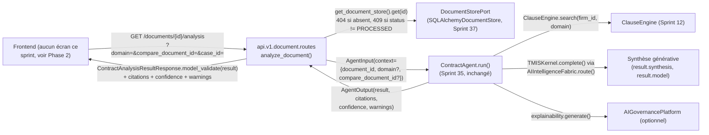

# 166 — Architecture : Exposition de `ContractAgent` dans l'API document (Sprint 39)

Ce document décrit l'exposition de `ContractAgent` (Sprint 35, déjà réel —
voir docs/163-architecture-agent-contrats.md) via une nouvelle route sur
l'API document existante (Sprint 26) : `GET /documents/{document_id}
/analysis`. Voir le rapport d'audit
(`docs/reports/sprint-39-rapport-audit.md`) pour le détail composant par
composant et le rapport d'architecture
(`docs/reports/sprint-39-rapport-architecture.md`) pour le récit complet
des décisions.

## Périmètre strict : un agent, une route, un routeur existant

C'est le deuxième des quatre sprints d'exposition annoncés par la note de
révision Sprint 38 (docs/09-roadmap-30-sprints.md) — et, comme prévu par
cette même note, **pas** la même forme que le premier (Sprint 38,
`JurisprudenceAgent` dans le chat, docs/165). `ContractAgent.run()`
attend un `document_id` (plus, en option, `domain` et
`compare_document_id`) dans son contexte : ce n'est pas une conversation
avec un historique et un tour de parole, c'est une analyse déclenchée sur
un document déjà persisté. Le bon point d'ancrage n'est donc pas le chat
(Sprint 32/38) mais l'API document elle-même (Sprint 26), dont
`ContractAgent` devient une quatrième route.

**Seul `ContractAgent` est touché.** `WatchAgent` et `Orchestrator`
restent hors périmètre (Sprints 40/41 — chacun sa propre forme d'API,
voir la note de révision Sprint 38). `ContractAgent` lui-même,
`ClauseEngine`, `DocumentStorePort` et `get_contract_agent()` ne sont pas
modifiés : ce sprint consomme `get_contract_agent()` (déjà câblé au
Sprint 35 avec le `DocumentStorePort` partagé du Sprint 37) tel quel.

## Vue d'ensemble



## Phase 0 — Ce qui a été confirmé avant tout code

Les sept fichiers désignés par la mission ont été relus sans aucune
supposition ; aucun n'a changé de forme depuis son sprint d'origine (voir
docs/reports/sprint-39-rapport-audit.md pour le détail ligne par ligne).
Un fait supplémentaire, non anticipé par la mission, en a résulté et a
directement informé la Question Ouverte 1 ci-dessous :

**`DocumentIntelligencePipeline.process()` ne produit jamais les statuts
intermédiaires de `ProcessingStatus`.** L'énumération déclare bien
`RECEIVED`, `VALIDATED`, `SCANNED`, `OCR_DONE`, `STRUCTURED`,
`CLASSIFIED`, `METADATA_EXTRACTED`, `ENTITIES_EXTRACTED`,
`TIMELINE_BUILT`, `CHUNKED`, `EMBEDDED`, `KNOWLEDGE_UPDATED`, `STORED`,
`PROCESSED`, `FAILED` (forme attendue, confirmée) — mais une recherche de
chaque `ProcessingStatus.XXX` réellement assigné à un `DocumentRecord`
dans `backend/src/tmis/` ne trouve que deux affectations : `RECEIVED`
(`api/v1/document/routes.py`, à l'upload) et `PROCESSED`
(`document_intelligence/pipeline/document_pipeline.py:271`, à la fin du
pipeline, sur succès). Aucune des treize autres valeurs — dont
`OCR_DONE`, celle citée par la mission — n'est jamais posée sur un
`DocumentRecord` persisté par le code actuel ; en cas d'exception dans
une étape (`stage()`/`stage_async()`), l'erreur est simplement
re-levée, sans qu'aucun statut `FAILED` ne soit écrit non plus — le
document reste alors à `RECEIVED`. Ce n'est pas un écart de forme (les
fichiers correspondent exactement à ce qui était attendu) mais un fait
de comportement qui simplifie la Question Ouverte 1 : dans ce dépôt, la
distinction utile n'est pas « le statut est-il postérieur à `OCR_DONE` »
(question qui ne se pose jamais en pratique, puisque cette valeur n'est
jamais atteinte) mais « le statut est-il `PROCESSED` ». Voir la décision
ci-dessous.

Aucun autre écart trouvé : le reste des sept fichiers (routes/schemas
document, `ContractAgent`, `bootstrap.py`, `case_intelligence/routes.py`,
`LegalDomain`) correspondait exactement au patron annoncé par la
mission — Phase 1 a pu commencer directement sur cette base.

## Questions ouvertes tranchées en Phase 0

### Question 1 — Faut-il exiger un statut minimal avant analyse ?

**Décision : (b) — `409 Conflict` si `document.status != ProcessingStatus.PROCESSED`.**

Raisonnement : la mission posait la question en termes de « statut
antérieur à `OCR_DONE` », une comparaison ordinale qui supposerait soit
un `IntEnum`, soit une table d'ordre construite à la main pour des
valeurs (`VALIDATED`, `SCANNED`, `OCR_DONE`, ...) que le pipeline actuel
n'assigne jamais (voir la trouvaille de Phase 0 ci-dessus). Construire
cette table d'ordre reviendrait à inventer, côté API, une logique de
séquencement que le reste du code ne connaît pas et n'utilise pas
ailleurs — exactement ce que la mission demandait d'éviter (« sans
dupliquer une logique de statut que l'agent ne connaît pas déjà »).

Le fait comportemental observé est plus simple que la question ne le
laissait supposer : un `DocumentRecord` n'a, dans ce dépôt, que deux
statuts réellement observables — `RECEIVED` (pas encore traité, ou
traitement en échec) et `PROCESSED` (`ocr_text` réellement peuplé). Un
test d'égalité contre `PROCESSED` capture donc exactement la même
distinction que « statut antérieur à `OCR_DONE` » aurait capturée si les
statuts intermédiaires existaient en pratique — sans introduire
d'ordre artificiel sur des valeurs mortes.

Ce choix rend aussi l'API plus honnête pour un client frontend que
l'option (a) : sans ce garde-fou, une analyse sur un document encore
`RECEIVED` tournerait sur `ocr_text == ""`, `ClauseEngine.search()`
renverrait quand même la bibliothèque du domaine (non vide), donc
`_confidence_for()` ne renverrait pas forcément `LOW` — un client pourrait
recevoir une confiance `MEDIUM`/`HIGH` et une synthèse générée à partir de
rien, sans qu'aucun signal explicite (juste un `warnings: []` probable,
`ocr_text` vide ne déclenchant aucun avertissement dans
`ContractAgent.run()`) ne l'indique. Un `409` explicite, avec le statut
actuel dans le corps de la réponse, est plus honnête et moins coûteux à
gérer côté frontend qu'un résultat silencieusement creux.

### Question 2 — `GET` ou `POST` pour `/documents/{document_id}/analysis` ?

**Décision : `GET`, confirmant le précédent — pas de divergence trouvée
en Phase 0.**

`GET /cases/{case_id}/summary` (Sprint 19,
`case_intelligence/routes.py:118`) déclenche déjà un calcul réel,
potentiellement génératif (`workflow.summarize()` appelle
`CaseSummaryGenerator` sur `TMISKernel`), sur un verbe `GET`, avec un
404 préalable sur la ressource si absente. C'est exactement la forme
voulue ici : `document_id` est un paramètre de chemin (la ressource),
`domain`/`compare_document_id`/`case_id` des paramètres de requête
optionnels qui affinent le calcul — rien de tout cela n'est un corps de
requête à valider, et l'opération, bien que coûteuse, reste une lecture
du point de vue du client (elle ne modifie aucun état persistant : ni le
`DocumentRecord`, ni aucun autre enregistrement). `POST` aurait suggéré à
tort une mutation ou une file d'attente asynchrone (comme `/upload`, qui
est un vrai `POST` parce qu'il persiste un nouvel enregistrement et
déclenche une tâche Celery) — ce n'est le cas ni pour `/summary` ni pour
`/analysis`.

## Phase 1 — Backend : une quatrième route, aucune réécriture des trois existantes

### `GET /{document_id}/analysis`

Ajoutée dans `api/v1/document/routes.py` (même routeur, même préfixe
`/documents`, aucun second routeur) :

```python
@router.get("/{document_id}/analysis", response_model=ContractAnalysisResponse)
async def analyze_document(
    document_id: str,
    domain: LegalDomain | None = None,
    compare_document_id: str | None = None,
    case_id: str | None = None,
    contract_agent: ContractAgent = Depends(get_contract_agent),
) -> ContractAnalysisResponse:
    record = get_document_store().get(document_id)
    if record is None:
        raise HTTPException(status_code=404, detail=f"No document {document_id!r}")
    if record.status is not ProcessingStatus.PROCESSED:
        raise HTTPException(status_code=409, detail=...)
    ...
    output = await contract_agent.run(AgentInput(...))
    return _to_analysis_response(document_id, output)
```

`get_document_store()` (la même fonction déjà importée par ce module
depuis le Sprint 26/37) sert le contrôle 404/409 préalable ; `get_
contract_agent()` (Sprint 35, `agents/bootstrap.py`, déjà câblé sur le
même `DocumentStorePort` singleton) est injecté via `Depends()` —
aucune des deux fonctions n'est modifiée, seulement consommées.
`/upload`, `GET /{document_id}`, `GET /{document_id}/versions` et
`process_document_task` ne sont touchés par aucune ligne : la
non-régression est garantie par construction (voir aussi les tests dédiés
`test_upload_route_is_unaffected`, `test_get_document_route_is_
unaffected`, `test_versions_route_is_unaffected` dans le nouveau fichier
de test).

### `domain` : validé au niveau de l'API, pas seulement par l'agent

`ContractAgent._resolve_domain()` accepte déjà un `domain` invalide en
silence (retombe sur `LegalDomain.COMMERCIAL` par défaut) — un
comportement adapté à un appelant interne (`Orchestrator`, un futur
graphe multi-agents) qui ne doit jamais planter sur une valeur mal
formée. Une API publique n'a pas la même contrainte : `domain` est donc
typé `LegalDomain | None` directement dans la signature de la route,
et FastAPI/Pydantic rejette nativement une valeur hors énumération par
un `422` — sans qu'aucune logique de validation ne soit dupliquée ici
(c'est la validation de type déjà fournie par le framework à la
frontière de l'API, cohérente avec le principe du dépôt : valider aux
frontières, faire confiance au code interne ensuite).

### `compare_document_id`/`case_id` : aucune validation ajoutée, l'agent gère déjà

Contrairement à `domain`, ni `compare_document_id` ni `case_id` ne sont
vérifiés avant l'appel à `ContractAgent.run()` : l'agent les résout déjà
lui-même et rapporte une absence via `warnings` (`Document {id!r} was not
found...`, `Case {id} was not found...`) plutôt que de lever une
exception. Ajouter un contrôle 404 par-dessus aurait dupliqué ce que
l'agent fait déjà correctement, pour un cas d'usage différent de celui
de `GET /cases/{case_id}/summary` (où `case_id` est la ressource
principale de l'URL, pas un paramètre de comparaison optionnel). `case_id`
suit, pour le passage `str -> uuid.UUID | None`, exactement le même
compromis tolérant que `tmis.api.v1.chat.routes._agent_input` (Sprint
32/38) : un identifiant qui ne parse pas comme UUID est transmis comme
`None` plutôt que de faire échouer la requête, l'agent traitant alors
l'analyse sans dossier associé.

### Mapping de réponse : `ContractAnalysisResponse` fidèle à `AgentOutput`

```python
class ContractAnalysisResponse(BaseModel):
    document_id: str
    result: ContractAnalysisResultResponse  # clauses, version_diff, synthesis, model
    citations: list[CitationResponse]
    confidence: str
    warnings: list[str]
```

La forme reprend exactement celle d'`AgentOutput` (`result` imbriqué,
`citations`/`confidence`/`warnings` au niveau supérieur) — le même
patron que `_agent_event_payload()` dans `chat/routes.py` (Sprint
33/38), qui sérialise `output.result` tel quel plutôt que de l'aplatir.
`ContractAnalysisResultResponse` reprend les quatre clés confirmées en
Phase 0 (`clauses`, `version_diff`, `synthesis`, `model`) sans en
renommer aucune. Le mapping utilise `ContractAnalysisResultResponse.
model_validate(output.result)` plutôt qu'une reconstruction champ par
champ : `output.result` est typé `dict[str, object]` par le contrat
`AgentOutput` commun, mais sa forme réelle pour `ContractAgent` est
exactement celle de ce modèle (y compris le dictionnaire imbriqué de
`version_diff` et la liste de dictionnaires de `clauses`) — `model_
validate` la retrouve sans qu'il soit nécessaire de redéclarer chaque nom
de champ une seconde fois dans la route, tout en gardant `mypy --strict`
vert (`dict[str, object]` ne s'unpackerait pas proprement en mots-clés
typés sans un tel appel).

## Phase 2 — Frontend : décision de rester backend-only

`(app)/documents/page.tsx` est, à ce jour, un unique
`ModulePlaceholder` (« Documents », `sprint={5}`) — il n'existe aucune
vue de fiche document, ni liste de documents, ni aucun composant
d'affichage d'un `document_id` réel à côté duquel brancher un bouton
« Analyser » proprement. Contrairement à `JurisprudenceAgent` (Sprint
38), qui s'est branché sur une page de chat déjà fonctionnelle avec un
patron de bascule de mode existant, il n'y a ici aucun écran réel dont
ce sprint pourrait étendre le patron.

**Décision : ce sprint reste backend-only.** Improviser un écran
document minimal aurait signifié inventer, sans les autres routes
document (`/{document_id}`, `/{document_id}/versions`) déjà affichées
nulle part côté frontend, une première fiche document non rattachée à
un flux d'upload ou de navigation existant — un vrai travail de
conception d'écran, pas une extension triviale. Ce travail revient à un
sprint frontend dédié, après que les quatre sprints d'exposition backend
(38 à 41) auront livré une surface d'API stable pour `Jurisprudence`,
`Contract`, `Watch` et `Orchestrator`.

## Ce qui reste volontairement hors périmètre

- **`WatchAgent`, `Orchestrator`** : ni leurs bootstraps ni leur
  éventuelle exposition ne sont touchés. Chacun a sa propre forme
  d'API (configuration de veille structurée pour l'un, graphe
  multi-agents pour l'autre) qui justifie son propre sprint (40/41) —
  voir la note de révision Sprint 38 dans docs/09-roadmap-30-sprints.md.
- **`ContractAgent` lui-même, `ClauseEngine`, `DocumentStorePort`,
  `get_contract_agent()`** : consommés tels quels, aucune ligne modifiée.
- **`/upload`, `GET /{document_id}`, `GET /{document_id}/versions`,
  `process_document_task`** : non touchés — voir les tests de
  non-régression dédiés.
- **Le chat, `ResearchAgent`, `JurisprudenceAgent`** : non touchés.

## Vérification

- Suite pytest complète (2204 tests : 2192 hérités du Sprint 38 + 12
  nouveaux pour ce sprint) verte — voir
  docs/reports/sprint-39-rapport-audit.md pour le détail.
- `ruff check` et `mypy --strict` verts sur `api/v1/document/`.
- Tests d'intégration dédiés : document existant (200, avec citations et
  warnings) / absent (404) / non encore traité (409) ; `domain` valide
  (200) / invalide (422) ; `compare_document_id` valide (`version_diff`
  peuplé, deux citations) / invalide (`version_diff` nul, warning
  explicite) ; avec/sans `case_id` connu.
- Non-régression : trois tests dédiés confirment que `/upload`, `GET
  /{document_id}` et `GET /{document_id}/versions` renvoient exactement
  le comportement attendu avant ce sprint.
