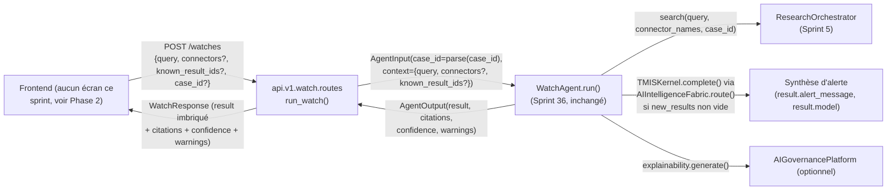

# 167 — Architecture : Exposition de `WatchAgent` (Sprint 40)

Ce document décrit l'exposition de `WatchAgent` (Sprint 36, déjà réel — voir
docs/164-architecture-agent-veille.md) via une nouvelle route,
`POST /watches`. Voir le rapport d'audit
(`docs/reports/sprint-40-rapport-audit.md`) pour le détail composant par
composant et le rapport d'architecture
(`docs/reports/sprint-40-rapport-architecture.md`) pour le récit complet des
décisions.

## Périmètre strict : un agent, une route, un routeur nouveau

C'est le troisième des quatre sprints d'exposition annoncés par la note de
révision Sprint 38 (docs/09-roadmap-30-sprints.md) — et, comme prévu par
cette note, ni la même forme que le Sprint 38 (`JurisprudenceAgent` dans le
chat), ni la même forme que le Sprint 39 (`ContractAgent` sur l'API
document existante). `WatchAgent.run()` attend une configuration de veille
(`query` + `connectors` surveillés + `known_result_ids`, un contrat à
plusieurs champs, deux d'entre eux des listes) : ni une conversation avec
historique, ni une ressource déjà rattachée à un document ou un dossier
persisté. Aucune des deux ressources imbriquées existantes (`/cases/{case_id}
/...`, `/documents/{document_id}/...`) ni le chat ne s'imposait donc
d'eux-mêmes — d'où les deux questions ouvertes ci-dessous, tranchées en
Phase 0, avant tout code.

**Seul `WatchAgent` est touché.** `Orchestrator` reste hors périmètre
(Sprint 41). `WatchAgent` lui-même et `get_watch_agent()` ne sont pas
modifiés : ce sprint consomme `get_watch_agent()` (déjà câblé au Sprint 36)
tel quel, via `Depends()`.

## Vue d'ensemble



## Phase 0 — Ce qui a été confirmé avant tout code

Les six éléments désignés par la mission ont été relus sans aucune
supposition (voir docs/reports/sprint-40-rapport-audit.md pour le détail
ligne par ligne) :

- `backend/src/tmis/agents/watch_agent.py` : contrat confirmé exact —
  `context["query"]` obligatoire (sinon `AgentOutput` dégradé, confiance
  `LOW`, aucune recherche lancée), `context["connectors"]`
  (`list[str] | None`) et `context["known_result_ids"]` (`list[str]`,
  fourni par l'appelant — Sprint 36 a explicitement tranché pour un agent
  sans état, non rouvert ici) optionnels, `AgentInput.case_id` optionnel.
  `result` a exactement la forme `{search_id, query, connectors_used,
  result_ids, new_results, alert_message, model}`.
- `backend/src/tmis/agents/bootstrap.py` : `get_watch_agent()` (`@lru_cache`)
  confirmé déjà câblé sur `ResearchOrchestrator`/`TMISKernel`/
  `AIIntelligenceFabric`/`AIGovernancePlatform` — non modifié, consommé via
  `Depends()`.
- `backend/src/tmis/api/v1/case_intelligence/routes.py` : patron de
  ressource imbriquée sous un dossier (`/cases/{case_id}/...`) confirmé —
  chaque route y suppose un `CaseProfile` déjà créé (404 sinon via
  `_get_profile_or_404`).
- `backend/src/tmis/api/v1/document/routes.py` : patron de ressource
  imbriquée sous un document (`/documents/{document_id}/analysis`, Sprint
  39) confirmé — même mécanique, un document déjà persisté comme ressource
  racine de l'URL.
- `backend/src/tmis/api/v1/chat/routes.py` : patron des modes de chat
  (Sprint 33/38, `mode: Literal["general", "research", "jurisprudence"]`)
  confirmé — chaque mode single-shot lit `context["query"]` depuis
  `ChatMessageRequest.message`, un champ scalaire unique. Aucun mode de
  chat existant ne transporte de paramètre liste dans son payload.
- Recherche exhaustive (`grep -rn "@router\.get"` sur tous les `routes.py`
  du dépôt) : confirmé qu'aucun `GET` existant n'accepte de paramètre de
  requête en forme de liste. Les seuls paramètres de requête `GET`
  observés sont scalaires : `q: str` (`/cases/{case_id}/search`),
  `domain: LegalDomain | None`, `compare_document_id: str | None`,
  `case_id: str | None` (`/documents/{document_id}/analysis`).

Aucun écart trouvé entre le code réel et ce que la mission annonçait — les
deux questions ouvertes ci-dessous ont donc pu être tranchées directement
sur cette base, sans découverte de comportement supplémentaire (contrairement
au Sprint 39, où la Phase 0 avait révélé que les statuts intermédiaires de
`ProcessingStatus` n'étaient jamais posés en pratique).

## Question Ouverte n°1 : rattachement — routeur autonome ou ressource imbriquée sous un dossier ?

### Les deux options posées par la mission

1. **(a) `POST /watches`**, `case_id` optionnel dans le corps de la requête.
2. **(b) `POST /cases/{case_id}/watch`**, qui force un dossier.

### Décision : (a) — routeur autonome `POST /watches`

**Raisonnement.** `WatchAgent.run()` ne fait rien de différent selon que
`case_id` est fourni ou non : il est simplement transmis à
`ResearchOrchestrator.search(case_id=...)` pour le historique, exactement
comme `ResearchAgent`/`JurisprudenceAgent` en mode chat le font déjà avec
`ChatMessageRequest.case_id` (Sprint 33/38, `chat/routes.py:_agent_input`) —
un champ optionnel du payload, jamais un segment obligatoire de l'URL. Les
deux ressources imbriquées existantes du dépôt (`/cases/{case_id}/...`,
`/documents/{document_id}/...`) partagent toutes les deux la même
propriété structurelle : le segment de chemin identifie une ressource
**qui doit déjà exister** avant l'appel (`_get_profile_or_404` pour
`case_intelligence`, `get_document_store().get(document_id)` puis 404/409
pour `document`). Router `/cases/{case_id}/watch` créerait cette même
attente — un dossier `case_id` déjà créé — pour une opération que
`WatchAgent` n'exige pourtant jamais : il n'appelle ni `CaseStorePort.get()`
ni aucune vérification d'existence sur `case_id`, contrairement à
`ContractAgent`/`JurisprudenceAgent` (qui, eux, résolvent réellement un
`CaseProfile` par leur `case_store` injecté). Imposer `/cases/{case_id}
/watch` introduirait donc une contrainte que l'agent ne demande pas —
exactement ce que la mission demande d'éviter, et exactement le
raisonnement qui a mené le Sprint 38 à exposer `ResearchAgent`
(même optionnalité de `case_id`) sans jamais le rattacher à un dossier
dans l'URL.

Le contre-argument produit — « surveiller ce sujet pour ce dossier » est
sans doute l'usage principal envisagé — est réel, mais il concerne un futur
sprint de planification de veilles nommées et persistées (déjà noté hors
périmètre par docs/164, Question Ouverte n°2 de ce sprint-là), pas ce
sprint : ce sprint expose exactement ce que `WatchAgent.run()` fait
aujourd'hui, une exécution ponctuelle à la demande, pas une configuration de
veille nommée attachée durablement à un dossier. Le jour où une telle
configuration persistée existera, elle pourra choisir son propre
rattachement (probablement `/cases/{case_id}/watches` en tant que collection
de configurations, un besoin structurellement différent) sans que ce
sprint-ci ait dû l'anticiper.

**Conséquence pratique** : `WatchRequest.case_id: str | None = None` est un
champ du corps de requête, jamais un segment d'URL. Il suit le même
compromis tolérant de parsing `str -> uuid.UUID | None` déjà utilisé par
`api.v1.document.routes._parse_case_id`/`api.v1.chat.routes._agent_input` :
un identifiant qui ne parse pas comme UUID est transmis comme `None` plutôt
que de faire échouer la requête (`WatchAgent` ne résout `case_id` contre
aucun `CaseStorePort`, il n'y a donc rien à valider de plus ici que le
type attendu par `AgentInput.case_id: uuid.UUID | None`).

## Question Ouverte n°2 : `GET` avec paramètres liste, ou `POST` avec corps de requête ?

### Décision : `POST`, confirmée — pas de divergence trouvée en Phase 0

La Phase 0 confirme exactement ce que la mission anticipait : aucun `GET`
existant dans ce dépôt n'accepte de paramètre de requête en forme de liste
— tous les paramètres `GET` observés (`q`, `domain`, `compare_document_id`,
`case_id`) sont scalaires. `connectors` et `known_result_ids` sont tous deux
des listes (`list[str] | None`) ; FastAPI sait exposer des listes en
paramètres de requête `GET` (`Query(default=None)` avec un type `list[str]`,
répété `?connectors=a&connectors=b` dans l'URL), mais ce dépôt n'a, à ce
jour, jamais eu besoin de ce mécanisme, et l'introduire pour ce seul sprint
créerait le premier précédent de ce genre alors qu'un corps de requête
`POST` (`WatchRequest`) est la façon idiomatique et déjà systématiquement
choisie par ce dépôt pour transporter une structure à plusieurs champs dont
certains sont des listes (voir `ChatMessageRequest`,
`CaseProfileCreateRequest`). Contrairement à
`GET /documents/{document_id}/analysis` (Sprint 39, où le verbe `GET` avait
été retenu précisément parce que l'opération ne modifie aucun état
persistant et que ses paramètres sont tous scalaires), une configuration de
veille à plusieurs champs dont deux sont des listes n'a pas d'équivalent
naturel en paramètres de requête sans dégrader la lisibilité et sans
inventer, pour ce seul endpoint, une convention de sérialisation de liste
que le reste du dépôt n'utilise nulle part ailleurs. `POST` reste par
ailleurs cohérent avec le fait que l'opération, bien que sans effet de bord
persistant (comme `/analysis`), a une entrée structurée à valider — un rôle
que Pydantic/FastAPI remplit nativement pour un corps de requête, pas pour
des paramètres de requête `GET` composés de listes.

**Conséquence pratique** :

```python
@router.post("", response_model=WatchResponse)
async def run_watch(
    payload: WatchRequest,
    watch_agent: WatchAgent = Depends(get_watch_agent),
) -> WatchResponse:
    ...
```

`WatchRequest.query: str` est un champ obligatoire du corps de requête (pas
un défaut vide) : c'est le seul champ de `context` que `WatchAgent.run()`
exige réellement (voir Phase 0), exactement comme `ChatMessageRequest.
message: str` est déjà obligatoire pour le chat. Une requête sans `query`
reçoit donc un `422` natif de FastAPI/Pydantic avant même d'atteindre
`WatchAgent` — même principe de validation à la frontière déjà appliqué à
`domain: LegalDomain | None` au Sprint 39 (docs/166) — plutôt que de
laisser la requête atteindre la branche défensive interne de `WatchAgent.
run()` (`query` manquant → `AgentOutput` dégradé, confiance `LOW`), qui
reste réservée aux appelants internes (un futur `Orchestrator`, par
exemple) dont le contexte peut légitimement ne pas comporter de `query`.

## Phase 1 — Backend : un nouveau routeur, aucune modification des routeurs existants

### `POST /watches`

Nouveau module `api/v1/watch/{routes.py,schemas.py}`, même patron de
composition que les modules `case_intelligence`/`document`/`chat` (chacun
son propre routeur avec préfixe et tags, agrégé dans
`api/v1/router.py`) :

```python
router = APIRouter(prefix="/watches", tags=["watch"])


@router.post("", response_model=WatchResponse)
async def run_watch(
    payload: WatchRequest,
    watch_agent: WatchAgent = Depends(get_watch_agent),
) -> WatchResponse:
    context: dict[str, object] = {"query": payload.query}
    if payload.connectors is not None:
        context["connectors"] = payload.connectors
    if payload.known_result_ids is not None:
        context["known_result_ids"] = payload.known_result_ids

    output = await watch_agent.run(
        AgentInput(
            task_id=uuid.uuid4(),
            case_id=_parse_case_id(payload.case_id),
            context=context,
        )
    )
    return _to_watch_response(output)
```

`connectors`/`known_result_ids` ne sont ajoutés au `context` que lorsqu'ils
sont fournis (`is not None`), plutôt que de toujours poser une clé — fidèle
à `WatchAgent._resolve_connectors`/`_resolve_known_ids`, qui distinguent
déjà « absent du contexte » (`None`, tous connecteurs enregistrés) de
« liste vide fournie » (aucun connecteur ne matchera, un choix explicite de
l'appelant) : ce sprint ne doit pas confondre ces deux cas en posant
toujours une clé, même vide, dans `context`.

`get_watch_agent()` (Sprint 36, `agents/bootstrap.py`) est injecté via
`Depends()` — non modifié, seulement consommé, exactement comme
`get_contract_agent()` au Sprint 39.

### Mapping de réponse : `WatchResponse` fidèle à `AgentOutput`

```python
class WatchResponse(BaseModel):
    result: WatchResultResponse
    citations: list[CitationResponse]
    confidence: str
    warnings: list[str]
```

Même forme que `ContractAnalysisResponse` (Sprint 39) et le payload
d'événement SSE du chat (`_agent_event_payload`, Sprint 33/38) : `result`
imbriqué, `citations`/`confidence`/`warnings` au niveau supérieur.
`WatchResultResponse.model_validate(output.result)` retrouve les six clés
confirmées en Phase 0 (`search_id`, `query`, `connectors_used`,
`result_ids`, `new_results`, `alert_message`, `model`) sans en redéclarer
aucune champ par champ, y compris la liste imbriquée `new_results` — même
usage de `model_validate` que `_to_analysis_response` au Sprint 39.

### `case_id` : aucune validation d'existence ajoutée

Contrairement à `case_intelligence`/`document`, où le `case_id`/`document_id`
de l'URL identifie une ressource dont l'absence est un `404`, `case_id` ici
n'est qu'un paramètre optionnel du corps de requête que `WatchAgent`
transmet tel quel à `ResearchOrchestrator.search()` pour le historique —
aucune vérification d'existence n'est ajoutée par cette route, l'agent n'en
fait lui-même aucune (voir Phase 0).

## Phase 2 — Frontend : décision de rester backend-only

Même décision et même raisonnement qu'au Sprint 39 (docs/166) : aucun écran
de veille n'existe aujourd'hui côté frontend à côté duquel brancher un
bouton « Surveiller ». Ce travail reste pour un sprint frontend dédié,
après que les quatre sprints d'exposition backend (38 à 41) auront livré
une surface d'API stable.

## Ce qui reste volontairement hors périmètre

- **`Orchestrator`** : ni son graphe LangGraph ni son éventuelle exposition
  ne sont touchés — Sprint 41, sa propre forme d'API (agrégat multi-agents).
- **`WatchAgent` lui-même, `get_watch_agent()`** : consommés tels quels,
  aucune ligne modifiée.
- **Persistance de `known_result_ids` (`WatchStorePort`)** : non
  introduite. Le Sprint 36 a explicitement tranché pour un agent sans état
  (docs/164, Question Ouverte n°1 de ce sprint-là) ; ce sprint expose
  `WatchAgent` tel quel, sans rouvrir cette décision. Si un futur sprint de
  planification de veilles récurrentes a besoin de persister des
  configurations nommées (voir raisonnement de la Question Ouverte n°1
  ci-dessus), ce sera une réouverture assumée et documentée comme telle,
  pas une extension silencieuse de ce sprint.
- **Ressource imbriquée sous un dossier (`/cases/{case_id}/watch`)** :
  évaluée et écartée — voir Question Ouverte n°1 ci-dessus.
- **`GET` avec paramètres de requête liste** : évalué et écarté — voir
  Question Ouverte n°2 ci-dessus.
- **`case_intelligence`, `document`, `chat`** : non touchés.
- **`ContractAgent`, `ResearchAgent`, `JurisprudenceAgent`** : non touchés.

## Vérification

- Suite pytest complète : 2210 tests (2204 hérités du Sprint 39 + 6 nouveaux
  pour ce sprint), tous verts, 7 skips inchangés.
- `ruff check` et `mypy --strict` verts sur `api/v1/watch/`.
- Tests d'intégration dédiés : `query` seule ; `connectors` filtré ;
  `known_result_ids` (les résultats déjà connus sont bien exclus, `citations`
  vide, `alert_message` `None`) ; avec/sans `case_id` (transmis à
  `ResearchOrchestrator.history` quand fourni) ; requête sans `query` → `422`.
- Vérification manuelle bout en bout contre un vrai serveur `uvicorn` (voir
  docs/reports/sprint-40-rapport-audit.md) : les six scénarios ci-dessus
  observés directement sur le serveur réel, en plus du cas `case_id`
  transmis avec succès à l'historique de `ResearchOrchestrator`.
