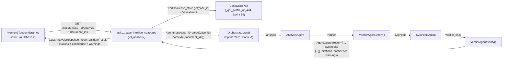

# 168 — Architecture : Exposition de `Orchestrator` (Sprint 41, Partie B)

Ce document décrit l'exposition d'`Orchestrator` (Sprint 29-31, désormais
pleinement câblé sur le composition root partagé — voir Partie A,
docs/169-architecture-consolidation-orchestrateur.md) via une nouvelle
route sur l'API `case_intelligence` existante (Sprint 19) :
`GET /cases/{case_id}/analysis`. Voir le rapport d'audit
(`docs/reports/sprint-41-rapport-audit.md`) pour le détail composant par
composant et le rapport d'architecture
(`docs/reports/sprint-41-rapport-architecture.md`) pour le récit complet
des décisions.

## Périmètre strict : un agrégat multi-agents, une route, un routeur existant

C'est le quatrième et dernier des quatre sprints d'exposition annoncés par
la note de révision Sprint 38 (docs/09-roadmap-30-sprints.md) — et, comme
prévu par cette note, pas la même forme que les trois précédents
(mode de chat pour `JurisprudenceAgent`, Sprint 38 ; route sur l'API
document pour `ContractAgent`, Sprint 39 ; routeur autonome `POST
/watches` pour `WatchAgent`, Sprint 40). `Orchestrator` n'est pas un agent
unique : c'est un graphe LangGraph à quatre nœuds
(analysis -> verifier -> synthesis -> verifier_final) dont la sortie
combine les résultats d'`AnalysisAgent` (context) et de `SynthesisAgent`
(case_id) dans un seul `AgentOutput`. Le bon point d'ancrage n'est donc ni
le chat, ni l'API document, ni un routeur autonome, mais l'API
`case_intelligence` elle-même (Sprint 19), dont `case_id` est déjà la
ressource racine de l'URL — exactement le rôle que joue déjà `case_id`
pour `GET /{case_id}/summary`.

**Seul `Orchestrator` est touché côté exposition.** `agents/bootstrap.py`,
`agents/orchestrator.py` et les trois agents du graphe ne sont pas
modifiés une seconde fois par cette Partie B : elle consomme
`get_orchestrator()` (Partie A) tel quel, via `Depends()`.

## Vue d'ensemble



## Phase 0 — Ce qui a été confirmé avant tout code

- `api/v1/case_intelligence/routes.py` : patron confirmé — chaque route
  suppose un `CaseProfile` déjà créé, 404 sinon (`_get_profile_or_404`) ;
  `GET /{case_id}/summary` (Sprint 19) déclenche déjà un calcul réel,
  potentiellement génératif, sur un verbe `GET`, avec ce même 404
  préalable — exactement la forme voulue ici.
- `agents/contracts.py` (`AgentInput`) : confirmé que
  `Orchestrator.run(agent_input)` alimente à la fois `AnalysisAgent` via
  `agent_input.context["document_id"]` et `SynthesisAgent` via
  `agent_input.case_id` dans un seul appel — `document_id` absent n'est
  pas une erreur (`AnalysisAgent` le gère par un `AgentOutput` vide plus
  un warning, le graphe continue normalement jusqu'à `verifier_final`).

**Découverte supplémentaire, non anticipée par la mission** :
`case_id` sur ce routeur est une chaîne libre — `CaseStorePort.get(case_id:
str)`, et les tests existants de ce module créent des dossiers avec des
identifiants comme `"case-1"`, jamais garantis au format UUID — alors que
`AgentInput.case_id` (contrat partagé par tous les agents,
`tmis.ai.schemas.agent`) est typé `uuid.UUID | None`. Ce n'est pas un écart
de forme sur l'un des fichiers désignés (chacun correspond exactement à ce
qui était annoncé) mais une tension entre deux conventions déjà actées
séparément par des sprints antérieurs : `case_intelligence` (Sprint 19)
traite `case_id` comme un identifiant opaque quelconque ; `AgentInput`
(Sprint 2) le type en UUID parce que tous ses autres appelants
(`chat/routes.py`, `document/routes.py`, `watch/routes.py`) le traitent
comme un paramètre optionnel accessoire, jamais comme la ressource
première de l'URL. Voir la décision ci-dessous.

## Question Ouverte n°1 : `document_id` en paramètre de requête, ou endpoint séparé ?

**Décision : (a) — paramètre de requête scalaire optionnel,
`?document_id=...`**, confirmant la recommandation par défaut de la
mission — aucune découverte de Phase 0 ne la contredit.

`document_id` n'est ni un corps de requête à valider (un seul champ
scalaire, comme `q` sur `GET /{case_id}/search`) ni une seconde ressource
identifiée par l'URL : c'est un paramètre qui affine un calcul déjà
déclenché par `case_id`, exactement le rôle que jouent déjà
`domain`/`compare_document_id`/`case_id` sur `GET /documents/{document_id}
/analysis` (Sprint 39, docs/166). Un endpoint séparé (par exemple `GET
/cases/{case_id}/analysis/{document_id}`) forcerait `document_id` à
exister pour que la route réponde, alors que son absence est un cas géré
normalement par le graphe (`AnalysisAgent` rapporte juste un `AgentOutput`
vide plus un warning, `SynthesisAgent` tourne quand même) — inventer une
contrainte que l'agent ne demande pas, exactement ce que la mission
demande d'éviter, et le même raisonnement qui avait déjà tranché contre
une ressource imbriquée forcée pour `WatchAgent` (Sprint 40, Question
Ouverte n°1, docs/167).

## Question Ouverte n°2 (découverte en Phase 0) : que faire du décalage `case_id: str` / `AgentInput.case_id: uuid.UUID | None` ?

**Décision : suivre le même compromis tolérant déjà établi par
`document/routes.py._parse_case_id`/`chat/routes.py._agent_input`
(Sprint 32/38/39) : `uuid.UUID(case_id)` si possible, `None` sinon, sans
jamais faire échouer la requête.**

Élargir le type d'`AgentInput.case_id` (par exemple `str | uuid.UUID |
None`) aurait résolu le décalage à la racine, mais c'est un contrat
partagé par les sept agents de ce dépôt (`ResearchAgent`,
`JurisprudenceAgent`, `ContractAgent`, `WatchAgent`, `AnalysisAgent`,
`VerifierAgent`, `SynthesisAgent`) et par leurs points d'exposition
respectifs (Sprints 33/38/39/40) — la mission confirme explicitement en
Phase 0 la forme actuelle de `contracts.py` sans demander de la changer,
et un changement de contrat aussi transverse pour un seul routeur
appellerait sa propre revue dédiée plutôt qu'un effet de bord de ce
sprint. Le compromis tolérant déjà en place ailleurs dans ce dépôt pour
cette même conversion reste donc la décision la plus cohérente : un
`case_id` qui ne parse pas comme UUID est transmis comme `None` plutôt que
de faire échouer la requête.

**Conséquence documentée, assumée** : pour un dossier dont le `case_id`
n'est pas au format UUID (le cas le plus courant dans les tests existants
de ce module, par exemple `"case-1"`), le `404` préalable
(`_get_profile_or_404`) confirme bel et bien que le dossier existe, mais
`SynthesisAgent` ne reçoit ensuite aucun `case_id` exploitable
(`agent_input.case_id` reste `None`) et rapporte donc « No case_id
provided... » dans `warnings`, avec un `result["synthesis"]` réduit à sa
forme vide — exactement le même comportement dégradé, gracieux et déjà
documenté qu'`AnalysisAgent` applique à un `document_id` manquant, pas un
bug introduit par ce sprint. `analysis`/`verifier`/`verifier_final`
tournent normalement dans tous les cas ; seule la branche `synthesis`
perd son ancrage sur le dossier. Un cabinet qui veut une synthèse
orchestrée complète via cette route doit utiliser des identifiants de
dossier au format UUID — une recommandation opérationnelle, pas un
changement de code. Voir les tests dédiés (`test_analysis_with_a_uuid_case_
id_populates_the_synthesis` / `test_analysis_with_a_non_uuid_case_id_
still_succeeds`) pour les deux chemins observés.

## Phase 1 — Backend : une sixième route, aucune réécriture des cinq existantes

### `GET /{case_id}/analysis`

```python
@router.get("/{case_id}/analysis", response_model=CaseAnalysisResponse)
async def get_analysis(
    case_id: str,
    document_id: str | None = None,
    workflow: CaseIntelligenceWorkflow = Depends(get_case_intelligence_workflow),
    orchestrator: Orchestrator = Depends(get_orchestrator),
) -> CaseAnalysisResponse:
    _get_profile_or_404(case_id, workflow)

    context: dict[str, object] = {}
    if document_id is not None:
        context["document_id"] = document_id

    output = await orchestrator.run(
        AgentInput(
            task_id=uuid.uuid4(),
            case_id=_parse_case_id_for_agent(case_id),
            context=context,
        )
    )
    return _to_analysis_response(case_id, output)
```

`_get_profile_or_404` (déjà utilisé par les cinq autres routes de ce
fichier) reste la seule fonction de contrôle d'existence — aucune
duplication. `get_case_intelligence_workflow`/`get_orchestrator` sont
injectés via `Depends()`, non modifiés, comme `get_contract_agent()`
(Sprint 39)/`get_watch_agent()` (Sprint 40) le sont déjà pour leurs routes
respectives.

### Mapping de réponse : `CaseAnalysisResponse` fidèle à `AgentOutput`

```python
class CaseAnalysisResultResponse(BaseModel):
    entities: dict[str, list[dict[str, object]]]
    inconsistencies: list[dict[str, object]]
    timeline: list[dict[str, object]]
    narrative: str | None = None
    model: str | None = None
    synthesis: CaseAnalysisSynthesisResponse


class CaseAnalysisResponse(BaseModel):
    case_id: str
    result: CaseAnalysisResultResponse
    citations: list[CitationResponse]
    confidence: str
    warnings: list[str]
```

Même patron que `ContractAnalysisResponse` (Sprint 39)/`WatchResponse`
(Sprint 40) : `result` imbriqué, `citations`/`confidence`/`warnings` au
niveau supérieur, mappé par `CaseAnalysisResultResponse.model_validate
(output.result)` plutôt qu'une reconstruction champ par champ.
`narrative`/`model` sont optionnels côté réponse : `AnalysisAgent` omet
ces deux clés quand aucun `document_id` n'est fourni (voir
`agents/analysis_agent.py:84-91`) — les rendre obligatoires aurait fait
échouer la validation Pydantic sur ce chemin, pourtant explicitement géré
comme non-erreur par la mission. `synthesis` reprend, sans en renommer
aucune, les dix clés confirmées de `SynthesisAgent.run()` (`executive_
summary`, `chronological_summary`, `documentary_summary`, `case_status`,
`open_points`, `table`, `fact_sheet`, `checklist`, `synthesis_note`,
`model`) — la clé que `Orchestrator._fuse_with_synthesis` ajoute sous
`result["synthesis"]`, jamais aplatie dans `result` lui-même.

## Phase 2 — Frontend : décision de rester backend-only

Même décision et même raisonnement qu'aux Sprints 39/40 (docs/166/167) :
aucun écran de dossier affichant un `case_id` réel n'existe aujourd'hui
côté frontend à côté duquel brancher un bouton « Analyser le dossier ». Ce
travail reste pour un sprint frontend dédié, après que les quatre sprints
d'exposition backend (38 à 41) ont livré une surface d'API stable pour les
sept agents réels de ce dépôt.

## Ce qui reste volontairement hors périmètre

- **`agents/bootstrap.py`, `agents/orchestrator.py`, les trois agents du
  graphe** : Partie A (docs/169), non retouchés par cette Partie B.
- **`AgentInput.case_id: uuid.UUID | None`** : évalué et non modifié — voir
  Question Ouverte n°2 ci-dessus.
- **`/watches`, `/documents/*`, `/chat/stream`, les cinq autres routes de
  `case_intelligence/routes.py`** : non touchées.
- **Endpoint séparé pour `document_id`** : évalué et écarté — voir
  Question Ouverte n°1 ci-dessus.

## Vérification

- Tests dédiés (`tests/integration/case_intelligence/
  test_case_analysis_api.py`) : dossier absent (404) ; dossier existant
  sans `document_id` (200, `synthesis` présent, warning explicite) ; avec
  `document_id` valide (entités/narrative/model/citations peuplés) ;
  `document_id` invalide (warning explicite, résultat vide) ; `case_id` au
  format UUID (synthèse réellement peuplée, citation `case_store`
  présente) ; `case_id` non-UUID (synthèse vide, warning explicite) ;
  non-régression sur `/profile`/`/summary` et sur la présence de la
  nouvelle route dans `/openapi.json`.
- Suite pytest complète : voir docs/reports/sprint-41-rapport-audit.md.
- `ruff check` et `mypy --strict` verts sur `api/v1/case_intelligence/`.
- Vérification manuelle bout en bout : menée via le même `TestClient`
  FastAPI que les tests d'intégration ci-dessus plutôt que contre un
  second processus `uvicorn` séparé (contrairement aux Sprints 39/40) —
  cet environnement ne dispose d'aucune instance Postgres, et `Orchestrator`
  (à travers `AnalysisAgent`) lit désormais le `DocumentStorePort` partagé
  (`SQLAlchemyDocumentStore`, Sprint 37), qui a besoin d'une base réelle
  (sqlite de test ici, comme pour `test_document_analysis_api.py`). Le
  `TestClient` exerce le même objet ASGI, le même routage, la même
  injection de dépendances et la même persistance réelle qu'un `uvicorn`
  séparé — la différence est le processus qui l'héberge, pas le
  comportement observé.
