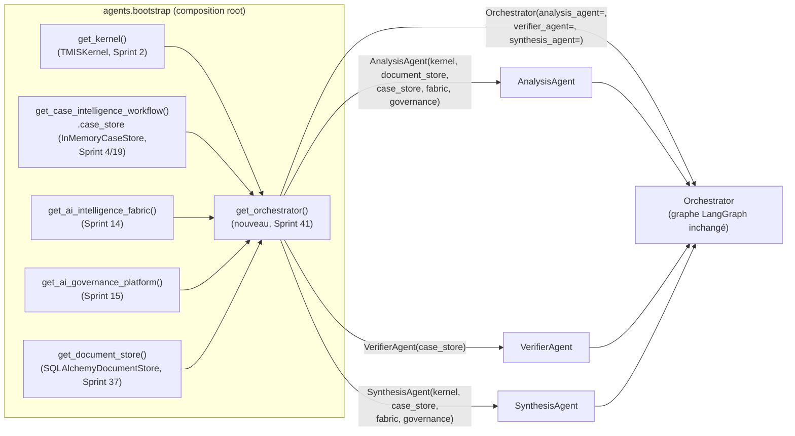

# 169 — Architecture : Consolidation du câblage `Orchestrator` (Sprint 41, Partie A)

Ce document décrit la consolidation du câblage interne d'`Orchestrator`
(LangGraph, Sprints 29-31 — voir docs/157/158/159-architecture-agent-
{analyse,synthese,verificateur}.md) sur le composition root partagé
(`agents/bootstrap.py`), suivant exactement le précédent du
`DocumentStorePort` partagé documenté par docs/151-architecture-
persistance.md (Sprint 37, section « `DocumentStorePort` désormais
partagé »). Voir le rapport d'audit
(`docs/reports/sprint-41-rapport-audit.md`) pour le détail composant par
composant et le rapport d'architecture
(`docs/reports/sprint-41-rapport-architecture.md`) pour le récit complet
des décisions. La Partie B (exposition HTTP) est documentée séparément,
docs/168-architecture-exposition-orchestrator.md — cette Partie A est
bloquante pour elle et doit rester verte avant qu'elle ne commence.

## Pourquoi un document dédié plutôt qu'une section de plus dans docs/151

docs/151 documente la persistance au sens strict : les adaptateurs
`SQLAlchemy*Store` et, pour `DocumentStorePort` spécifiquement, le passage
d'un store non partagé à un singleton `@lru_cache` (Sprint 37). Ce sprint
consolide quatre singletons à la fois (`TMISKernel`, `CaseStorePort`,
`AIIntelligenceFabric`, `AIGovernancePlatform`) sur trois agents en même
temps (`AnalysisAgent`, `VerifierAgent`, `SynthesisAgent`) — une
composition d'ampleur comparable à celle de `get_contract_agent()`/
`get_jurisprudence_agent()`/`get_watch_agent()` (agents ordinaires du même
`agents/bootstrap.py`) plutôt qu'un correctif de persistance isolé. Un
document dédié, sur le modèle de docs/162/163/164 (un document par agent
consolidé), est donc plus fidèle à la nature du changement qu'une section
supplémentaire dans docs/151 — qui garde son périmètre initial inchangé.

## Périmètre strict : un accesseur ajouté, aucun comportement existant changé

**Seul `agents/bootstrap.py` est modifié** : une nouvelle fonction
`get_orchestrator()`, même patron `@lru_cache` que les quatre accesseurs
déjà présents dans ce module. `agents/orchestrator.py`,
`agents/analysis_agent.py`, `agents/synthesis_agent.py`,
`agents/verifier_agent.py` — **aucune ligne modifiée** : les quatre
paramètres consommés (`kernel`, `case_store`, `fabric`, `governance`)
existent déjà dans les constructeurs des trois agents depuis leurs sprints
d'origine (29/30/31), il ne s'agissait que de les alimenter depuis un
nouveau composition root, jamais de changer une signature.

`Orchestrator()` construit sans arguments — le constructeur que
`tests/unit/test_orchestrator.py` (Sprint 1/29) instancie directement —
garde exactement son comportement actuel : `AnalysisAgent(document_store=
get_document_store())` (kernel et case_store toujours privés à cette
instance, `TMISKernel()`/`InMemoryCaseStore()` propres, fabric/governance
toujours `None`), `VerifierAgent()` (case_store toujours privé),
`SynthesisAgent()` (kernel et case_store toujours privés, fabric/
governance toujours `None`). Seul un appelant qui passe par
`get_orchestrator()` reçoit désormais la version pleinement câblée.

## Vue d'ensemble



## Phase 0 — Ce qui a été confirmé avant tout code

Les six fichiers désignés par la mission ont été relus sans aucune
supposition (voir docs/reports/sprint-41-rapport-audit.md pour le détail
ligne par ligne) :

- `agents/orchestrator.py` : `Orchestrator.__init__` construit
  aujourd'hui, sans agent injecté, `AnalysisAgent(document_store=
  get_document_store())` — kernel (`TMISKernel()`) et case_store
  (`InMemoryCaseStore()`) **non partagés**, fabric/governance à `None` ;
  `VerifierAgent()` — case_store **non partagé** ; `SynthesisAgent()` —
  kernel et case_store **non partagés**, fabric/governance à `None`.
  Confirmé exact, aucun écart.
- `agents/analysis_agent.py`, `agents/synthesis_agent.py`,
  `agents/verifier_agent.py` : les trois constructeurs acceptent déjà
  `kernel`/`case_store`/`fabric`/`governance` (`VerifierAgent` : seulement
  `case_store`, plus `conflict_detector`/`hallucination_engine`/
  `bias_engine`, aucun de ces trois consommé par ce sprint) en paramètres
  optionnels nommés (`kwonly`), tous par défaut à `None` puis retombant
  sur une instance privée. Confirmé exact — **aucune ligne modifiée dans
  ces trois fichiers**.
- `agents/bootstrap.py` : patron de référence confirmé —
  `get_contract_agent()`/`get_jurisprudence_agent()` alimentent déjà
  `get_kernel()`, `get_case_intelligence_workflow().case_store`,
  `get_ai_intelligence_fabric()`, `get_ai_governance_platform()`, chacun
  un singleton `@lru_cache` process-wide. `get_orchestrator()` suit
  exactement ce même patron.

Aucun écart trouvé entre le code réel et ce que la mission annonçait —
Phase 1 a pu commencer directement sur cette base, sans qu'aucun arrêt ne
soit nécessaire.

## Phase 1 — `get_orchestrator()`

```python
@lru_cache
def get_orchestrator() -> Orchestrator:
    kernel = get_kernel()
    case_store = get_case_intelligence_workflow().case_store
    fabric = get_ai_intelligence_fabric()
    governance = get_ai_governance_platform()

    analysis_agent = AnalysisAgent(
        kernel=kernel,
        document_store=get_document_store(),
        case_store=case_store,
        fabric=fabric,
        governance=governance,
    )
    verifier_agent = VerifierAgent(case_store=case_store)
    synthesis_agent = SynthesisAgent(
        kernel=kernel,
        case_store=case_store,
        fabric=fabric,
        governance=governance,
    )
    return Orchestrator(
        analysis_agent=analysis_agent,
        verifier_agent=verifier_agent,
        synthesis_agent=synthesis_agent,
    )
```

Les quatre singletons sont résolus une seule fois par appel (avant
`@lru_cache` mémoïse tout l'accesseur, une seule fois par process) puis
distribués aux trois constructeurs — même séquence que
`get_jurisprudence_agent()`/`get_contract_agent()`. `VerifierAgent` ne
reçoit que `case_store` : c'est le seul des quatre singletons que son
constructeur accepte (`conflict_detector`/`hallucination_engine`/
`bias_engine` gardent leurs défauts réels, aucun composition root
existant ne les substitue non plus).

## Ce qui reste volontairement hors périmètre

- **`Orchestrator()` sans arguments** : comportement inchangé — voir
  ci-dessus et les tests dédiés.
- **`agents/orchestrator.py`, `agents/analysis_agent.py`,
  `agents/synthesis_agent.py`, `agents/verifier_agent.py`** : aucune ligne
  modifiée, seulement consommés depuis le nouveau `get_orchestrator()`.
- **Exposition HTTP** : Partie B, docs/168-architecture-exposition-
  orchestrator.md.

## Vérification

- Tests dédiés (`tests/unit/agents/test_agents_bootstrap.py`) :
  `get_orchestrator()` est un singleton process-wide (comparaison
  d'identité, comme le test ajouté au Sprint 37 pour
  `get_document_store()`), et ses trois agents partagent bien
  `kernel`/`case_store`/`fabric`/`governance` (`AnalysisAgent`, en plus,
  `document_store`) avec le reste du composition root — comparaisons
  d'identité (`is`), jamais d'égalité de valeur. Un test dédié confirme
  aussi qu'`Orchestrator()` sans arguments garde ses propres agents non
  partagés (`is not`) et ses défauts `fabric`/`governance` à `None`.
- Suite pytest complète : voir docs/reports/sprint-41-rapport-audit.md.
- `ruff check` et `mypy --strict` verts sur `agents/bootstrap.py` et le
  nouveau fichier de test.
