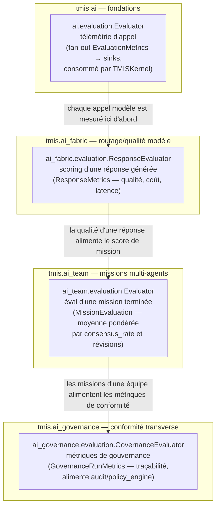
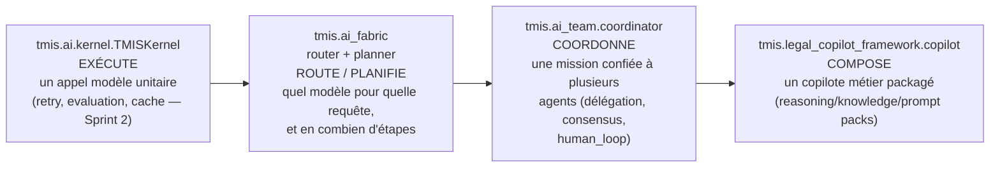
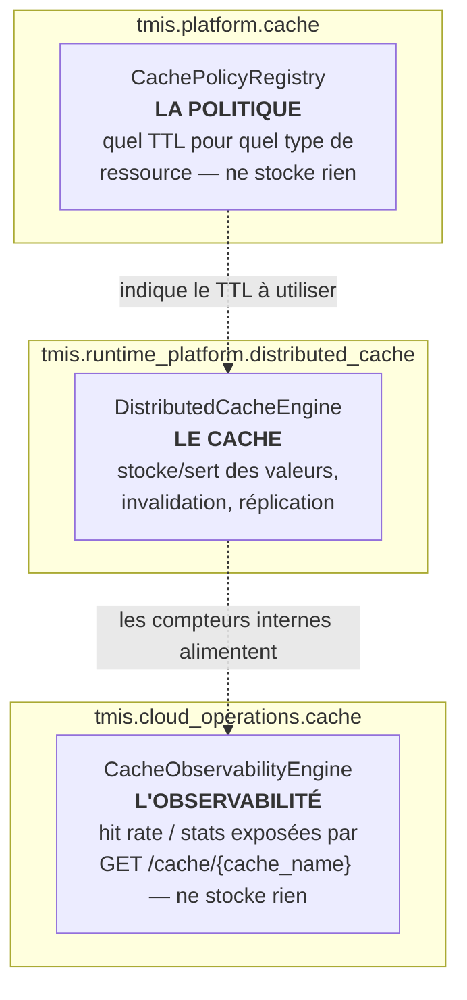

# ADR-ARCH-01 — Carte des couches : pile IA et famille plateforme

> Sprint 46 (Axe B-1 — réduction de surface). Voir
> `docs/reports/sprint-46-rapport-audit.md` pour la méthodologie complète
> et le tableau d'audit d'usage dont ce document est la synthèse
> pédagogique. **Ce document ne renomme et ne fusionne rien** : c'est
> l'antidote documentaire au piège de découvrabilité décrit ci-dessous,
> pas un plan de refactor.

## 1. Le piège

Sept paquets partagent une famille de noms (`evaluation`, `cache`,
`router`/`planner`/`coordinator`, `audit`, `metrics`, `health`...) à
travers `ai`, `ai_fabric`, `ai_team`, `ai_governance`, `platform`,
`runtime_platform`, `cloud_operations`, `platform_sdk` et au-delà. Lu vite
ou par `grep -r class Evaluator`, ça ressemble à des moteurs concurrents
qu'il faudrait fusionner. Vérifié par lecture directe (ce sprint et les
précédents, voir `docs/171-audit-marketplace.md` pour un audit du même
type sur le triptyque marketplace), **ce n'est presque jamais le cas** :
ce sont des concerns différents à des couches différentes, qui
partagent un mot parce qu'il est le mot juste dans chaque contexte —
pas parce que l'un recopie l'autre.

Ce document désambiguïse les trois familles de noms explicitement visées
par le sprint : `evaluation`, l'orchestration (`kernel`/`router`/
`planner`/`coordinator`/`copilots`), et `cache`.

## 2. `evaluation` : quatre concerns, quatre couches

| Paquet | Classe | Objet évalué | Unité | Consommateurs externes¹ |
|---|---|---|---|---|
| `tmis.ai` | `Evaluator` (`evaluation/evaluator.py`) | un appel modèle individuel | `EvaluationMetrics` | `ai.kernel.TMISKernel` — hors périmètre de ce sprint |
| `tmis.ai_fabric` | `ResponseEvaluator` (`evaluation/engine.py`) | une réponse générée | `ResponseMetrics` | 9 (bootstrap, router, quality_optimizer, tests…) |
| `tmis.ai_team` | `Evaluator` (`evaluation/engine.py`) | une mission achevée | `MissionEvaluation` | 1 (`ai_team.bootstrap` uniquement) |
| `tmis.ai_governance` | `GovernanceEvaluator` (`evaluation/engine.py`) | un run de gouvernance | `GovernanceRunMetrics` | 1 (`ai_governance.bootstrap`) |

¹ Voir `docs/reports/sprint-46-rapport-audit.md` pour la méthode de
comptage (imports absolus, hors le sous-module lui-même).

**Collision de nom brute confirmée :** `tmis.ai.evaluation.Evaluator` et
`tmis.ai_team.evaluation.Evaluator` portent le **même nom de classe**.
`tmis.ai` est hors périmètre de ce sprint (pas dans la famille
plateforme/IA transverse auditée) — non touché. `tmis.ai_team.evaluation.
Evaluator` est interne (1 seul consommateur, `ai_team.bootstrap`, aucun
consommateur hors du paquet) : renommé par ce sprint en
`MissionQualityScorer` (voir §5 et le rapport d'audit, T4). Les deux
autres (`ResponseEvaluator`, `GovernanceEvaluator`) portaient déjà un
préfixe désambiguïsant et sont, de toute façon, publics (consommés
ailleurs) — non touchés, conformément à la règle de compatibilité
ascendante du sprint.

## 3. Orchestration : qui exécute, qui route, qui coordonne, qui compose

Ce n'est pas une chaîne d'appel directe obligatoire dans le code (chaque
couche peut être consommée indépendamment — `ai_fabric.router` n'appelle
pas forcément `ai_team.coordinator`) : c'est une **échelle de
responsabilité**. Plus on descend la liste, plus le concern est
générique et bas niveau ; plus on monte, plus il est spécifique au
produit :

| Couche | Paquet | Classe clé | Répond à la question |
|---|---|---|---|
| Exécution | `tmis.ai.kernel` | `TMISKernel` | « comment appeler un modèle une fois, correctement ? » |
| Routage/plan | `tmis.ai_fabric.router` / `.planner` | `RouterEngine`, `TaskPlanner` | « quel modèle, et en combien d'étapes, pour cette requête ? » |
| Coordination | `tmis.ai_team.coordinator` | `CoordinatorEngine` | « comment plusieurs agents mènent-ils une mission à terme ensemble ? » |
| Composition | `tmis.legal_copilot_framework.copilot` | `CopilotEngine` | « quel paquet de raisonnement/connaissance/prompts sert un besoin métier (contentieux, société...) ? » |

`legal_copilot_framework` est documenté (`docs/139-architecture-legal-
copilot-framework.md`, §1) comme « cette couche d'orchestration — jamais
une réimplémentation de ce qui existe déjà » : il compose des packs,
il ne redéveloppe ni le routage ni la coordination.

## 4. `cache` : trois paquets, trois concerns distincts

| Paquet | Classe | Rôle | Stocke une valeur ? |
|---|---|---|---|
| `tmis.runtime_platform.distributed_cache` | `DistributedCacheEngine` | le cache lui-même | oui |
| `tmis.platform.cache` | `CachePolicyRegistry` | quel TTL appliquer, par type de ressource — une couche de politique *au-dessus* de `tmis.ai.cache.CachePort` (voir `docs/50-guide-performance.md`) | non |
| `tmis.cloud_operations.cache` | `CacheObservabilityEngine` | statistiques/hit-rate exposées côté opérations (`GET /cache/{cache_name}`) | non |

**Correction d'une prémisse du brief :** `cloud_operations.cache` était
donné comme « point de départ confirmé, 0 consommateur ». Vérifié par ce
sprint (grep + lecture) : **faux dans l'état actuel du dépôt**. Il est
importé par `cloud_operations/bootstrap.py` et `cloud_operations/api/
routes.py`, et sert la route réelle `GET /cache/{cache_name}`
(`cache_stats`), plus un test dédié
(`tests/unit/cloud_operations/test_cache_queue_errors.py`). Non
supprimé — voir `docs/reports/sprint-46-rapport-audit.md` §2 pour le
détail et la démarche de vérification.

## 5. Conséquences

- Aucune fusion, aucun renommage public. Un seul renommage interne
  effectué (`ai_team.evaluation.Evaluator` → `MissionQualityScorer`,
  0 consommateur externe au paquet, voir rapport d'audit §4).
- Cette carte est la référence à citer avant toute proposition future de
  « fusionner deux moteurs qui se ressemblent » dans cette famille : si
  la ressemblance est un nom, pas un concern, ce document explique
  pourquoi ce n'est pas un doublon.
- Toute duplication *réelle* (même concern, même couche, deux
  implémentations) reste à traiter séparément et n'a pas été trouvée par
  ce sprint dans le périmètre audité — voir rapport d'audit §5.
