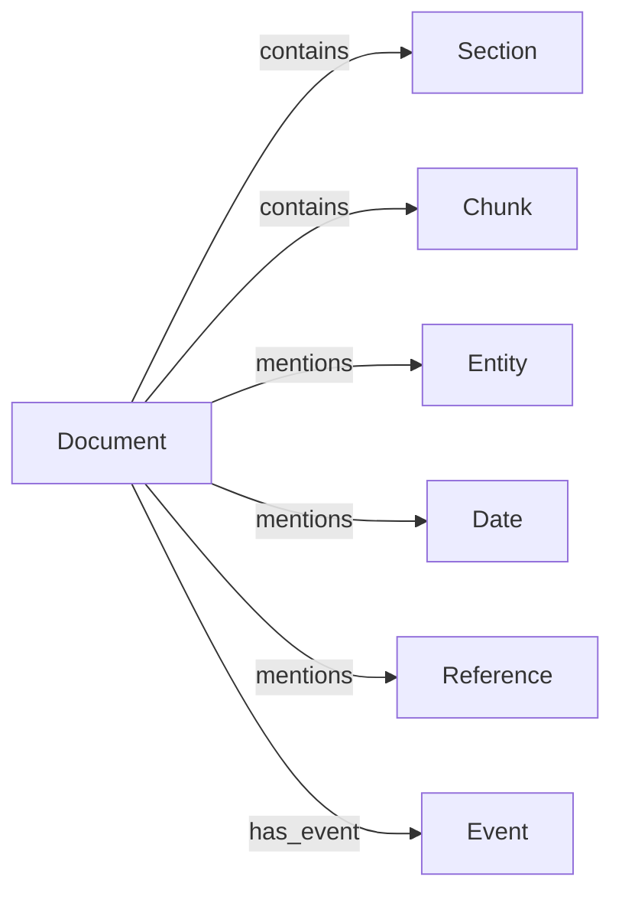

# Guide : le Knowledge Graph (V1)

## Modèle de nœuds et relations

`tmis.document_intelligence.schemas.knowledge` définit sept types de
nœuds (`NodeType`) : `DOCUMENT`, `SECTION`, `ENTITY`, `DATE`, `EVENT`,
`REFERENCE`, `CHUNK`. `KnowledgeNode` porte un id, un type, un label et
des propriétés libres ; `KnowledgeEdge` relie deux nœuds par une relation
nommée (`contains`, `mentions`, `has_event`, ...).

## Pourquoi indépendant du vector store

Le graphe de connaissances répond à une question différente de celle du
RAG (Sprint 2, `tmis.ai.rag`) : *"qu'est-ce qui est relié à quoi"* plutôt
que *"qu'est-ce qui est sémantiquement proche"*. `KnowledgeGraphPort`
(`knowledge/ports.py`) n'a donc aucune dépendance vers
`tmis.ai.rag.indexing` — seul `KnowledgeGraphBuilder` lit les chunks
produits par le chunking pour créer des nœuds `CHUNK`, sans jamais
manipuler leurs vecteurs.

## Comment le graphe est peuplé

`KnowledgeGraphBuilder.update()` (`knowledge/builder.py`) est appelé par
le pipeline après le chunking et les embeddings (voir
docs/14-document-intelligence.md) :

1. un nœud `DOCUMENT` pour le document lui-même ;
2. un nœud `SECTION` (+ relation `contains`) pour chaque bloc de mise en
   page de type `TITLE`/`SUBTITLE` (voir docs/14 — module `layout`) ;
3. un nœud `ENTITY`, `DATE` ou `REFERENCE` (+ relation `mentions`) pour
   chaque entité extraite — le type du nœud dépend du type d'entité
   (`EntityType.DATE` → `NodeType.DATE`, `EntityType.LAW_ARTICLE` /
   `EntityType.DECISION_REFERENCE` / `EntityType.REFERENCE` →
   `NodeType.REFERENCE`, tout le reste → `NodeType.ENTITY`) ;
4. un nœud `EVENT` (+ relation `has_event`) pour chaque événement de la
   chronologie (voir docs/14 — module `timeline`) ;
5. un nœud `CHUNK` (+ relation `contains`) pour chaque chunk indexé.

## Ajouter un nouveau backend de graphe

`InMemoryKnowledgeGraph` (`knowledge/in_memory_graph.py`) est
l'implémentation Sprint 3 de `KnowledgeGraphPort` : une liste d'adjacence
en mémoire. Pour brancher un vrai moteur de graphe (Neo4j ou équivalent) :

1. Créer une classe implémentant `KnowledgeGraphPort`
   (`add_node`, `add_edge`, `get_node`, `get_neighbors`).
2. La passer à `DocumentIntelligencePipeline(knowledge_graph=MonGraphe())`.
3. `KnowledgeGraphBuilder` n'a besoin d'aucune modification : il ne
   dépend que du port.

## Ce qui n'est pas fait au Sprint 3

- Pas de requêtage avancé (parcours multi-sauts, requêtes Cypher) : seul
  `get_neighbors()` (voisinage direct) est exposé.
- Pas de déduplication d'entités inter-documents (une société citée dans
  deux dossiers crée aujourd'hui deux nœuds distincts) — prévu pour un
  sprint ultérieur une fois le module `case` (Sprint 5) disponible pour
  scoper le graphe par dossier.
