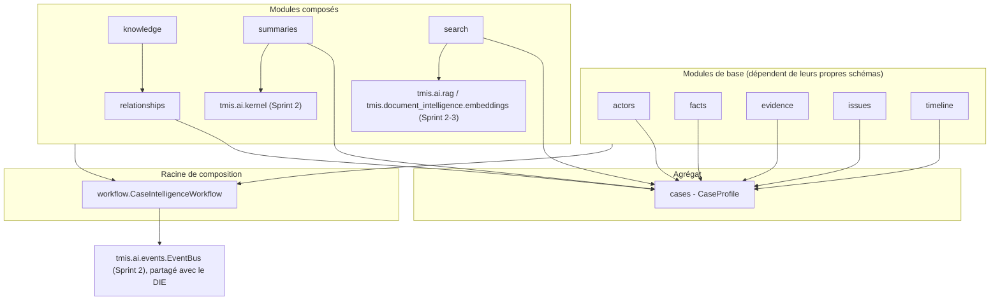
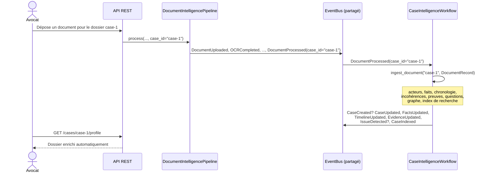
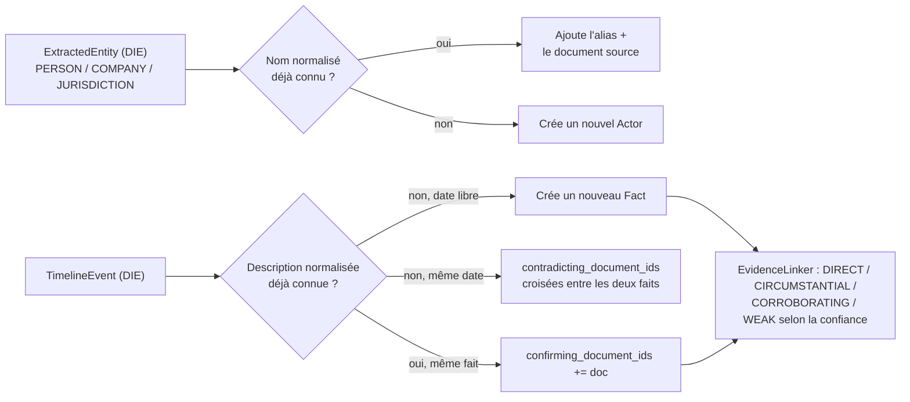
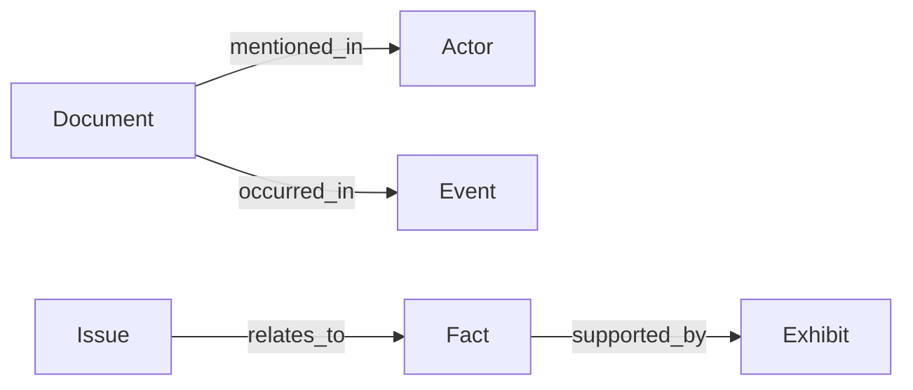
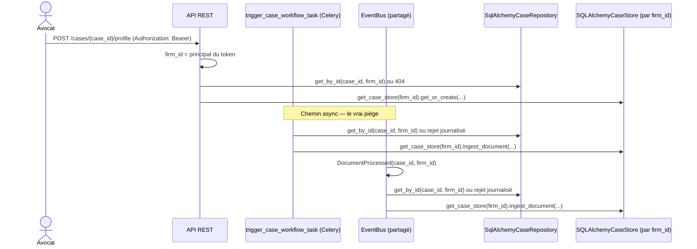

# Case Intelligence Engine (CIE) — architecture (Sprint 4)

## Du document au dossier

Le Document Intelligence Engine (Sprint 3) comprend **un document**. Le
Case Intelligence Engine (`backend/src/tmis/case_intelligence/`) comprend
**un dossier** : à partir de ce sprint, TMIS raisonne au niveau du dossier
complet, en agrégeant automatiquement tout ce que le DIE produit pour
chacun de ses documents dans un objet vivant, le `CaseProfile`.

Comme le AI Kernel (Sprint 2) et le DIE (Sprint 3), le CIE ne connecte
aucun LLM directement : la seule capacité qui bénéficie d'un modèle (le
résumé exécutif) passe par `TMISKernel.complete()`.

## Vue d'ensemble des modules

`CaseProfile` (`cases/schemas.py`) est l'agrégat central : clients,
parties adverses, avocats, juridictions (via `actors` + un rôle par
dossier), documents, chronologie, questions juridiques, tâches et
historique IA. Il est keyé par le même `case_id` que la ligne `Case`
persistée (Sprint 1, `tmis.domain.case`) — voir le docstring de
`tmis.case_intelligence.cases` pour la relation exacte entre les deux.

## Le dossier vivant : un document traité, un dossier enrichi

`CaseIntelligenceWorkflow` s'abonne à `DocumentProcessed` sur
l'`EventBus` **partagé** avec `DocumentIntelligencePipeline` (voir
`tmis.ai.kernel.bootstrap.get_kernel` et
`tmis.document_intelligence.bootstrap.get_document_pipeline`) : un
document traité pour un `case_id` donné déclenche automatiquement, sans
appel explicite :

1. mise à jour des **acteurs** (`actors.ActorMerger`) — fusion des
   doublons, conservation des alias ;
2. mise à jour des **faits** (`facts.FactEngine`) — origine
   documentaire, confirmation, contradiction ;
3. mise à jour de la **chronologie consolidée**
   (`timeline.CaseTimelineEngine`) — fusion multi-documents, détection
   d'incohérences temporelles ;
4. mise à jour des **preuves** (`evidence.EvidenceLinker`) — niveau de
   confiance par pièce ;
5. détection des **questions juridiques potentielles**
   (`issues.HeuristicIssueDetector`) ;
6. mise à jour du **graphe de relations**
   (`knowledge.CaseKnowledgeAggregator` → `relationships.CaseGraphPort`) ;
7. réindexation de la **recherche unifiée** (`search.CaseSearchEngine`) ;
8. journalisation dans l'**historique IA** du dossier
   (`CaseProfile.ai_history`).

Chaque étape est chronométrée, journalisée (log structuré) et son
résultat enregistré dans `CaseEvaluator` — voir Observabilité ci-dessous.

## Acteurs, faits et preuves : la logique de fusion

`ActorMerger.normalize_name()` retire les civilités courantes ("Maître",
"M.", "Mme"...) avant comparaison, si bien que "Maître Jean Dupont" et
"M. Jean Dupont" fusionnent en un seul `Actor`. `FactEngine` compare les
descriptions normalisées : une correspondance exacte à une date
différente aurait été un nouveau fait ; une correspondance sur la **même
date** avec une description **différente** déclenche une contradiction
croisée entre les deux faits, qui remonte ensuite comme question
juridique potentielle via `HeuristicIssueDetector`.

## Relations et Legal Knowledge Graph (V1)

`relationships.CaseGraphPort` (six types de nœuds : `ACTOR`, `DOCUMENT`,
`EVENT`, `FACT`, `EXHIBIT`, `ISSUE`) est **indépendant** à la fois du
graphe par document du DIE (`tmis.document_intelligence.knowledge`,
Sprint 3) et de la base vectorielle (`tmis.ai.rag`) : il répond à "qu'est-ce
qui est relié à quoi" à l'échelle du dossier entier, la brique de base
d'un futur Legal Knowledge Graph. `knowledge.CaseKnowledgeAggregator`
peuple ce graphe à partir du `CaseProfile` — voir
docs/20-guide-nouveau-moteur-analyse.md pour l'ajout d'un nouveau type de
nœud ou d'une nouvelle relation.

## Recherche unifiée compatible RAG

`search.CaseSearchEngine` réutilise directement le pont Sprint 2/3
(`tmis.document_intelligence.embeddings.bridge.DocumentEmbeddingBridge`)
pour indexer acteurs, faits, événements et documents comme des pseudo-
chunks taggés par nature (`SearchResultKind`). Une recherche renvoie donc
indifféremment un fait, un acteur, un événement ou un document, chacun
avec un score de similarité — la même infrastructure RAG que le DIE,
sans jamais dupliquer le pipeline d'embeddings.

## Résumé de dossier — le seul point d'entrée LLM

`summaries.CaseSummaryGenerator` produit quatre éléments : résumé
chronologique, résumé documentaire, statut du dossier et points restant
à éclaircir sont des **agrégations déterministes** (aucun appel modèle) ;
seul le **résumé exécutif** appelle `TMISKernel.complete()`, via le port
`SummaryKernelPort` (même pattern que `KernelFacadePort`, voir
docs/11-langgraph-architecture.md) — jamais un fournisseur directement.

## Observabilité

Chaque mise à jour de dossier produit un `CaseUpdateMetrics`
(`evaluation/metrics.py`) : durée totale, durée par étape, erreurs
éventuelles — collecté par `CaseEvaluator`, sur le même schéma que
`tmis.document_intelligence.evaluation.PipelineEvaluator` (Sprint 3).
Chaque étape émet aussi un log structuré
(`case_intelligence_step_completed` / `_failed`) avec le `case_id` et la
durée.

## Persistance & isolation multi-tenant (tranche `case_intelligence`)

Sprint 43 rendait `CaseProfile` persistant (`SQLAlchemyCaseStore`,
`case_profiles`) mais pas isolé : un `firm_id`, oui, mais surtout
**trois points d'entrée** écrivant le même profil de dossier — une
route web, une tâche Celery (`trigger_case_workflow_task`) et un
handler d'événement de domaine (`DocumentProcessed`) — et un seul
d'entre eux passait par une requête HTTP. Cette tranche généralise à
`case_intelligence` le pattern déjà prouvé sur `cases -> drafting`
(ADR-SLICE-01/02/03, docs/28-legal-drafting.md) et `legal_research`
(ADR-RESEARCH-01/02, docs/21-legal-research.md), avec un écart propre à
ce module : faire traverser `firm_id` **hors de la requête HTTP**, une
première dans cette roadmap.

**ADR-CASEINT-01 — Le `firm_id` traverse les trois points d'entrée.**
`SQLAlchemyCaseStore` exige `firm_id` à la construction (comme
`ResearchCache`) ; il n'existe plus de `SQLAlchemyCaseStore` agnostique
— `case_intelligence.bootstrap.get_case_store()` est devenu `get_case_
store(firm_id)`. La tâche Celery (`trigger_case_workflow_task(firm_id,
case_id, document_id)`) et l'événement déclencheur
(`DocumentProcessed.firm_id`, propagé par `DocumentIntelligencePipeline.
process(firm_id=...)` et `process_document_task`) portent désormais
`firm_id` en plus de `case_id`. Toute lecture/écriture de profil est
scopée ; un événement ou une tâche sans `firm_id` est rejeté et journalisé
(`case_workflow_event_rejected_no_firm_id`), jamais traité pour un
cabinet devinable.

**ADR-CASEINT-02 — Réconciliation avec l'entité `cases` isolée.**
`case_id` n'est plus un identifiant libre : c'est l'id d'un dossier
**existant du cabinet appelant**. Les trois points d'entrée vérifient
l'appartenance via le repo `cases` déjà firm-scopé
(`SqlAlchemyCaseRepository.get_by_id(case_id, firm_id)`) avant toute
création ou lecture de profil — `404` côté web
(`api/v1/case_intelligence/routes.py::_resolve_owned_case_id`, même
forme que `legal_drafting`/`legal_research`), rejet journalisé côté
tâche/événement. Un `case_id` qui ne résout à aucun dossier du cabinet
(malformé, inexistant, ou appartenant à un autre cabinet) ne crée
jamais de profil.

**ADR-CASEINT-03 — Ne pas copier aveuglément le pattern `research`.**
`research`/`drafting` injectent la **session de la requête** dans leurs
stores. `SQLAlchemyCaseStore` garde au contraire le `session_factory`
du Sprint 43 (`SQLAlchemyCaseStore(session_factory, *, firm_id)`) : la
tâche Celery et le handler d'événement n'ont pas de requête HTTP dont
emprunter une `Session` — seulement leur propre `firm_id`. Chaque
méthode continue d'ouvrir et fermer sa propre session, exactement comme
avant cette tranche.

**Fin du singleton porteur d'état.** `get_case_intelligence_workflow()`
n'est plus un singleton `lru_cache` partagé par tout le processus et
abonné à l'`EventBus` dès sa construction. `get_case_intelligence_
workflow(firm_id)` assemble un `CaseIntelligenceWorkflow` jetable à
chaque appel, scopé au `firm_id` appelant ; l'abonnement à
`DocumentProcessed` est désormais un handler autonome
(`_handle_document_processed`), enregistré une seule fois sur
l'`EventBus` du Kernel partagé (`_register_document_processed_handler`,
motif déjà utilisé par `legal_research.bootstrap.get_search_engine`
pour l'enregistrement des connecteurs), qui résout `firm_id`/`case_id`
**depuis l'événement lui-même** plutôt que depuis un état fixé à la
construction — un même processus peut ainsi traiter des documents de
plusieurs cabinets sans qu'aucun ne voie l'état d'un autre.

`relationships.CaseGraphPort` (T3) et `search.CaseSearchEngine` sont
tous deux partitionnés par `firm_id` via `get_case_graph(firm_id)`/
`get_case_search_engine(firm_id)`, deux accesseurs `lru_cache` keyés par
`firm_id` : contrairement au store (état en base, une instance jetable
par appel suffit), le graphe et l'index de recherche gardent leur état
**dans l'objet Python lui-même** (adjacence en mémoire pour l'un, un
`InMemoryVectorIndex` frais par instance pour l'autre) — une instance
jetable par appel leur ferait tout oublier entre deux requêtes. Un seul
graphe/index par cabinet, jamais un graphe global partagé.

**Dette technique assumée (documentée, pas silencieuse) :**
`legal_reasoning`, les accesseurs `tmis.agents` sans requête
(`get_jurisprudence_agent`, `get_contract_agent`) et `tmis.api.v1.chat.
routes` composent `CaseIntelligenceWorkflow` en dehors de toute requête
HTTP avec un `firm_id` résolvable — ils continuent d'utiliser `case_
intelligence.bootstrap.get_shared_case_intelligence_workflow()`, un
singleton `lru_cache` préservé délibérément (`InMemoryCaseStore`/
`InMemoryCaseGraph`, jamais les stores firm-scopés) : leur propre passage
à l'isolation par cabinet est un chantier séparé, plus large, que cette
tranche n'entreprend pas — même position que `legal_research` sur
`legal_reasoning`/`tmis.agents` (voir docs/21-legal-research.md).
`agents.bootstrap.get_orchestrator` fait exception : il ne sert que la
route `/analysis` de ce module, donc **il est** firm-scopé
(`get_orchestrator(firm_id)`), pour ne jamais désynchroniser l'analyse
du reste des routes `case_intelligence` sur le même `case_id`. Le graphe
de relations reste volatile (perdu au redémarrage du processus) —
persister `CaseNode`/`CaseEdge` est une décision différée (T3), pas
oubliée.

> **Mise à jour ultérieure** : au moment de cette tranche,
> `document_intelligence` restait hors périmètre — `DocumentProcessed.
> firm_id` n'était qu'une métadonnée additive optionnelle transportée
> sans que ce module soit lui-même isolé. La tranche `document_
> intelligence` persistante & isolée (docs/14-document-intelligence.md §
> "Persistance & isolation multi-tenant", ADR-DOCINT-01), dernière
> conversion de l'Axe A, a depuis fermé ce dernier écart : `firm_id` y
> est désormais obligatoire pour `process_document_task` et pour chaque
> route `/documents/*`, et `SQLAlchemyDocumentStore` exige `firm_id` à la
> construction — le paragraphe ci-dessus reste correct pour comprendre
> l'état de cette tranche-ci ; pour l'état actuel de `document_
> intelligence`, voir docs/14.

**Règle de migration sur table déjà peuplée** (nouvelle règle du gabarit
vertical-slice, alembic `0012_case_profiles_firm_id`) : `case_profiles`
est le premier module de ce gabarit dont la table contient déjà des
lignes réelles au moment d'ajouter `firm_id` — un `ADD COLUMN firm_id
NOT NULL` nu y échouerait, et même s'il réussissait, chaque ligne
existante a besoin d'un vrai `firm_id`, pas d'une valeur inventée.
Migration en trois temps : colonne `nullable=True` ; rétro-remplissage
en dérivant le `firm_id` de chaque ligne depuis la ligne `cases` que son
`case_id` nomme (`cases.firm_id` — `cases` est déjà firm-scopée) ; une
ligne dont le `case_id` ne résout à aucune ligne `cases` (id malformé,
dossier depuis supprimé) est journalisée puis purgée plutôt que laissée
avec un `firm_id` nul ou deviné ; colonne repassée `nullable=False` +
index. Le passage à `nullable=False` utilise `op.batch_alter_table`, pas
un `op.alter_column` nu : SQLite n'a pas d'`ALTER COLUMN ... SET NOT
NULL`, et le mode batch est un no-op inoffensif sur Postgres — la seule
forme qui fonctionne sur les deux moteurs que ce dépôt cible. Voir
`tests/integration/case_intelligence/test_migration_case_profiles_firm_id.py`
pour la vérification `upgrade`/`downgrade` sur une base déjà peuplée
(lignes possédées, orphelines par id malformé, orphelines par id bien
formé mais sans dossier propriétaire). Cette recette devient la règle
standard du gabarit pour toute future table déjà peuplée qui gagne
`firm_id`.

## API REST

| Méthode | Route | Rôle |
|---|---|---|
| `POST` | `/api/v1/cases/{case_id}/profile` | Création explicite du profil enrichi (`case_id` doit nommer un dossier possédé par le cabinet appelant, sinon `404`) |
| `GET` | `/api/v1/cases/{case_id}/profile` | Consultation (404 si non créé ou non possédé) |
| `PATCH` | `/api/v1/cases/{case_id}/profile` | Mise à jour (ex. titre) |
| `DELETE` | `/api/v1/cases/{case_id}/profile` | Suppression logique (`is_deleted`) |
| `GET` | `/api/v1/cases/{case_id}/timeline` | Chronologie consolidée |
| `GET` | `/api/v1/cases/{case_id}/summary` | Résumé (exécutif, chronologique, documentaire, points ouverts) |
| `GET` | `/api/v1/cases/{case_id}/search?q=` | Recherche unifiée |
| `GET` | `/api/v1/cases/{case_id}/analysis?document_id=` | Analyse complète via `agents.Orchestrator` (firm-scopé) |

Documenté automatiquement via OpenAPI (`/openapi.json`, `/docs`). La
création d'un dossier au sens administratif (`firm_id`, titre, statut
facturable) reste `POST /api/v1/cases` (Sprint 1,
`tmis.domain.case`) — le profil CIE est la couche d'enrichissement,
voir le docstring de `tmis.case_intelligence.cases`.

## Portée du Sprint 4 (historique)

- Aucune rédaction juridique avancée : le CIE comprend et structure le
  dossier, il ne produit pas encore de brouillon de conclusions ou de
  consultation (Sprint 18 et suivants, voir
  docs/09-roadmap-30-sprints.md).
- Stockage en mémoire (`InMemoryCaseStore`) à l'origine ; la tranche
  persistante & isolée `case_intelligence` (voir ci-dessus) l'a
  remplacé par `SQLAlchemyCaseStore` en production —
  `InMemoryCaseStore` reste utilisé pour les tests unitaires et la
  composition partagée non isolée (`legal_reasoning`, `tmis.agents`,
  `chat`).
- La détection de questions juridiques reste heuristique
  (incohérences temporelles, faits contestés) ; un détecteur plus
  sophistiqué (règles métier, ou appelant `TMISKernel.complete()`) peut
  remplacer `HeuristicIssueDetector` derrière le même port sans changer
  le reste du CIE.
