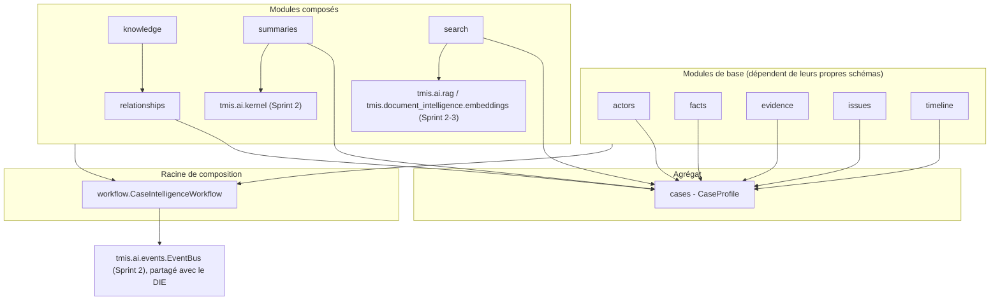
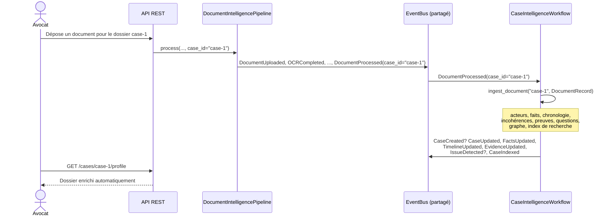
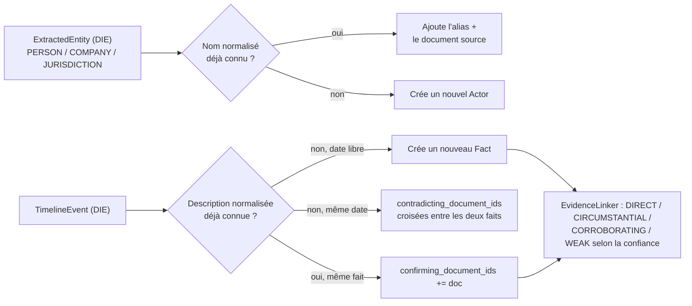
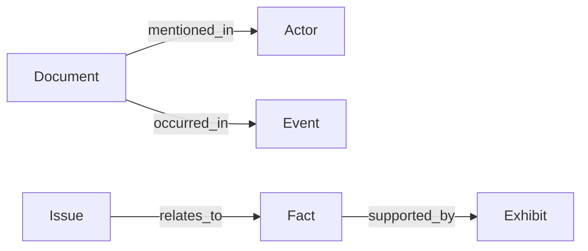

# Case Intelligence Engine (CIE) — architecture (Sprint 4)

## Du document au dossier

Le Document Intelligence Engine (Sprint 3) comprend **un document**. Le
Case Intelligence Engine (`backend/src/tmis/case_intelligence/`) comprend
**un dossier** : à partir de ce sprint, TMIS raisonne au niveau du dossier
complet, en agrégeant automatiquement tout ce que le DIE produit pour
chacun de ses documents dans un objet vivant, le `CaseProfile`.

Comme le AI Kernel (Sprint 2) et le DIE (Sprint 3), le CIE ne connecte
aucun LLM directement : la seule capacité qui bénéficie d'un modèle (le
résumé exécutif) passe par `TMISKernel.complete()`.

## Vue d'ensemble des modules

`CaseProfile` (`cases/schemas.py`) est l'agrégat central : clients,
parties adverses, avocats, juridictions (via `actors` + un rôle par
dossier), documents, chronologie, questions juridiques, tâches et
historique IA. Il est keyé par le même `case_id` que la ligne `Case`
persistée (Sprint 1, `tmis.domain.case`) — voir le docstring de
`tmis.case_intelligence.cases` pour la relation exacte entre les deux.

## Le dossier vivant : un document traité, un dossier enrichi

`CaseIntelligenceWorkflow` s'abonne à `DocumentProcessed` sur
l'`EventBus` **partagé** avec `DocumentIntelligencePipeline` (voir
`tmis.ai.kernel.bootstrap.get_kernel` et
`tmis.document_intelligence.bootstrap.get_document_pipeline`) : un
document traité pour un `case_id` donné déclenche automatiquement, sans
appel explicite :

1. mise à jour des **acteurs** (`actors.ActorMerger`) — fusion des
   doublons, conservation des alias ;
2. mise à jour des **faits** (`facts.FactEngine`) — origine
   documentaire, confirmation, contradiction ;
3. mise à jour de la **chronologie consolidée**
   (`timeline.CaseTimelineEngine`) — fusion multi-documents, détection
   d'incohérences temporelles ;
4. mise à jour des **preuves** (`evidence.EvidenceLinker`) — niveau de
   confiance par pièce ;
5. détection des **questions juridiques potentielles**
   (`issues.HeuristicIssueDetector`) ;
6. mise à jour du **graphe de relations**
   (`knowledge.CaseKnowledgeAggregator` → `relationships.CaseGraphPort`) ;
7. réindexation de la **recherche unifiée** (`search.CaseSearchEngine`) ;
8. journalisation dans l'**historique IA** du dossier
   (`CaseProfile.ai_history`).

Chaque étape est chronométrée, journalisée (log structuré) et son
résultat enregistré dans `CaseEvaluator` — voir Observabilité ci-dessous.

## Acteurs, faits et preuves : la logique de fusion

`ActorMerger.normalize_name()` retire les civilités courantes ("Maître",
"M.", "Mme"...) avant comparaison, si bien que "Maître Jean Dupont" et
"M. Jean Dupont" fusionnent en un seul `Actor`. `FactEngine` compare les
descriptions normalisées : une correspondance exacte à une date
différente aurait été un nouveau fait ; une correspondance sur la **même
date** avec une description **différente** déclenche une contradiction
croisée entre les deux faits, qui remonte ensuite comme question
juridique potentielle via `HeuristicIssueDetector`.

## Relations et Legal Knowledge Graph (V1)

`relationships.CaseGraphPort` (six types de nœuds : `ACTOR`, `DOCUMENT`,
`EVENT`, `FACT`, `EXHIBIT`, `ISSUE`) est **indépendant** à la fois du
graphe par document du DIE (`tmis.document_intelligence.knowledge`,
Sprint 3) et de la base vectorielle (`tmis.ai.rag`) : il répond à "qu'est-ce
qui est relié à quoi" à l'échelle du dossier entier, la brique de base
d'un futur Legal Knowledge Graph. `knowledge.CaseKnowledgeAggregator`
peuple ce graphe à partir du `CaseProfile` — voir
docs/20-guide-nouveau-moteur-analyse.md pour l'ajout d'un nouveau type de
nœud ou d'une nouvelle relation.

## Recherche unifiée compatible RAG

`search.CaseSearchEngine` réutilise directement le pont Sprint 2/3
(`tmis.document_intelligence.embeddings.bridge.DocumentEmbeddingBridge`)
pour indexer acteurs, faits, événements et documents comme des pseudo-
chunks taggés par nature (`SearchResultKind`). Une recherche renvoie donc
indifféremment un fait, un acteur, un événement ou un document, chacun
avec un score de similarité — la même infrastructure RAG que le DIE,
sans jamais dupliquer le pipeline d'embeddings.

## Résumé de dossier — le seul point d'entrée LLM

`summaries.CaseSummaryGenerator` produit quatre éléments : résumé
chronologique, résumé documentaire, statut du dossier et points restant
à éclaircir sont des **agrégations déterministes** (aucun appel modèle) ;
seul le **résumé exécutif** appelle `TMISKernel.complete()`, via le port
`SummaryKernelPort` (même pattern que `KernelFacadePort`, voir
docs/11-langgraph-architecture.md) — jamais un fournisseur directement.

## Observabilité

Chaque mise à jour de dossier produit un `CaseUpdateMetrics`
(`evaluation/metrics.py`) : durée totale, durée par étape, erreurs
éventuelles — collecté par `CaseEvaluator`, sur le même schéma que
`tmis.document_intelligence.evaluation.PipelineEvaluator` (Sprint 3).
Chaque étape émet aussi un log structuré
(`case_intelligence_step_completed` / `_failed`) avec le `case_id` et la
durée.

## API REST

| Méthode | Route | Rôle |
|---|---|---|
| `POST` | `/api/v1/cases/{case_id}/profile` | Création explicite du profil enrichi |
| `GET` | `/api/v1/cases/{case_id}/profile` | Consultation (404 si non créé) |
| `PATCH` | `/api/v1/cases/{case_id}/profile` | Mise à jour (ex. titre) |
| `DELETE` | `/api/v1/cases/{case_id}/profile` | Suppression logique (`is_deleted`) |
| `GET` | `/api/v1/cases/{case_id}/timeline` | Chronologie consolidée |
| `GET` | `/api/v1/cases/{case_id}/summary` | Résumé (exécutif, chronologique, documentaire, points ouverts) |
| `GET` | `/api/v1/cases/{case_id}/search?q=` | Recherche unifiée |

Documenté automatiquement via OpenAPI (`/openapi.json`, `/docs`). La
création d'un dossier au sens administratif (`firm_id`, titre, statut
facturable) reste `POST /api/v1/cases` (Sprint 1,
`tmis.domain.case`) — le profil CIE est la couche d'enrichissement,
voir le docstring de `tmis.case_intelligence.cases`.

## Portée du Sprint 4

- Aucune rédaction juridique avancée : le CIE comprend et structure le
  dossier, il ne produit pas encore de brouillon de conclusions ou de
  consultation (Sprint 18 et suivants, voir
  docs/09-roadmap-30-sprints.md).
- Stockage en mémoire (`InMemoryCaseStore`), comme le DIE en Sprint 3 ;
  la persistance SQLAlchemy suit le même calendrier que
  `DocumentRecord` (Sprint 6-7).
- La détection de questions juridiques reste heuristique
  (incohérences temporelles, faits contestés) ; un détecteur plus
  sophistiqué (règles métier, ou appelant `TMISKernel.complete()`) peut
  remplacer `HeuristicIssueDetector` derrière le même port sans changer
  le reste du CIE.
