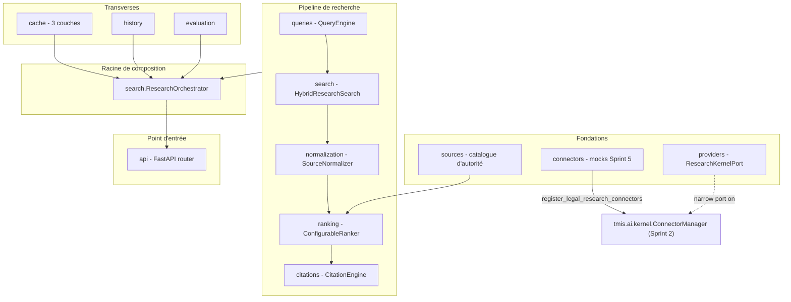
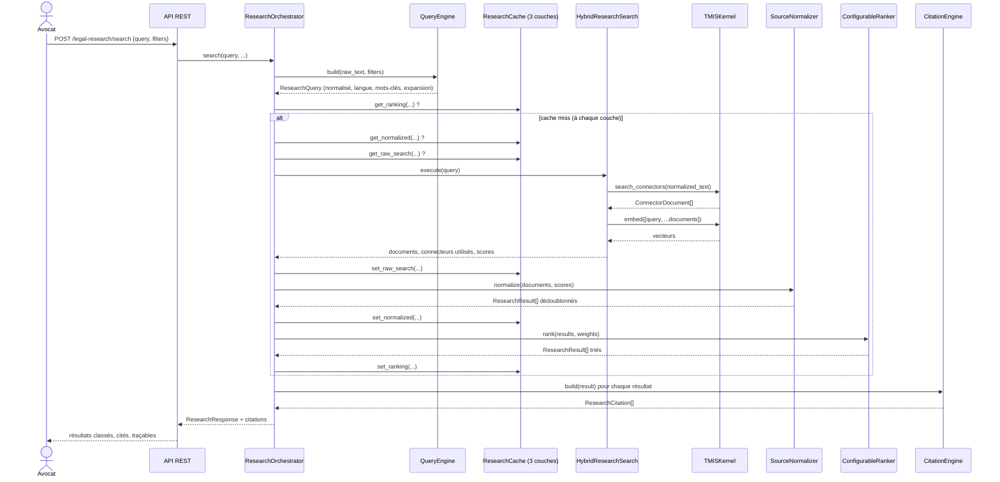
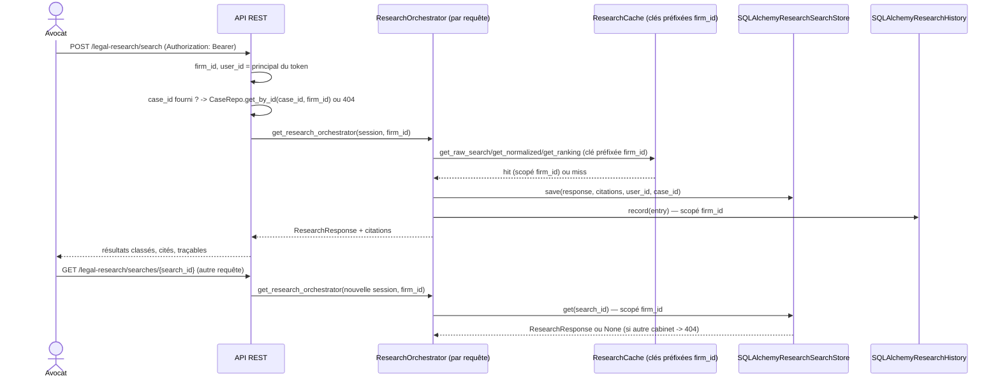

# Legal Research Engine (LRE) — architecture (Sprint 5)

## Rôle du moteur

Le Legal Research Engine (`backend/src/tmis/legal_research/`) est le
moteur de recherche documentaire et juridique de TMIS : à partir d'une
question, il sélectionne les bons connecteurs, exécute la recherche,
fusionne/dédoublonne/normalise les résultats, les classe, et attache une
citation traçable à chacun. **Il ne produit jamais d'avis juridique** —
il prépare des éléments structurés et référencés que les agents IA
(Sprint 11 et suivants) utiliseront pour raisonner.

Comme le AI Kernel (Sprint 2), le Document Intelligence Engine
(Sprint 3) et le Case Intelligence Engine (Sprint 4), le LRE ne connecte
aucune source réelle dans ce sprint : deux connecteurs simulés
(documentation interne du cabinet, base privée sous licence) étendent
le `ConnectorManager` du Kernel aux côtés des connecteurs codes/
jurisprudence/doctrine du Sprint 2, et toute capacité IA (embeddings)
passe exclusivement par `TMISKernel`.

## Vue d'ensemble des modules

`providers/ports.py` définit `ResearchKernelPort`, le sous-ensemble du
Kernel dont le LRE a besoin (`embed`, `search_connectors`) — même patron
que `SummaryKernelPort` (Sprint 4, voir
docs/20-guide-nouveau-moteur-analyse.md) : aucun module du LRE
n'importe jamais `tmis.ai.providers` ou `tmis.ai.connectors` directement.

## Du texte libre au résultat classé et cité

Le `ResearchOrchestrator` (`search/orchestrator.py`) est la racine de
composition : il ne parle jamais à un fournisseur de modèle ou un
connecteur — uniquement aux ports qu'on lui injecte. Chaque recherche
vérifie le cache **couche par couche**, du plus agrégé (classement) au
plus brut (résultats de connecteurs), pour court-circuiter le travail
dès que possible.

## Query Engine : normaliser sans casser la recherche lexicale

`queries.HeuristicQueryEngine` normalise les espaces, détecte la langue
(fréquence de mots vides FR/EN, autonome — pas de dépendance vers
`tmis.document_intelligence`, pour garder le LRE indépendant), extrait
des mots-clés, et étend la requête via un petit dictionnaire de
synonymes juridiques (`queries/synonyms.py`).

Point d'architecture important : `ResearchQuery.search_text` (texte +
termes d'expansion) sert uniquement au **re-score vectoriel** ; l'appel
réel aux connecteurs utilise `ResearchQuery.normalized_text` seul. Les
connecteurs simulés font une correspondance par sous-chaîne naïve
(`_fixture_search`, Sprint 2) : envoyer une requête gonflée de synonymes
concaténés ne matcherait plus rien. Le score vectoriel, lui, profite de
l'expansion sémantique sans ce problème.

## Recherche hybride sans index vectoriel pré-calculé

`search.HybridResearchSearch` implémente `ResearchSearchPort`. Les
connecteurs ne renvoient pas de score : la recherche hybride calcule
donc elle-même deux signaux bruts par document —

- **lexical** : taux de recouvrement entre les mots-clés de la requête
  et le contenu du document ;
- **vectoriel** : similarité cosinus (`tmis.ai.embeddings.similarity`)
  entre l'embedding de la requête et celui du document, calculés à la
  volée via `TMISKernel.embed()` (aucun store vectoriel dédié pour le
  LRE dans ce sprint — la RAG du Kernel reste le store de référence,
  voir docs/12-rag-architecture.md).

## Normalisation et dédoublonnage

`normalization.SourceNormalizer` unifie les métadonnées ad-hoc de
chaque connecteur (`article`, `jurisdiction`, `date`, `year`...) vers
les champs communs de `ResearchResult` (`document_type`, `reference`,
`date`), supprime les doublons d'id exact, et — pour deux documents au
contenu identique atteints par des ids différents — ne conserve que la
**version la plus récente** (champ `date`).

## Ranking Engine

Voir docs/23-guide-ranking-engine.md pour le détail des poids
configurables (`RankingWeights`) et comment ajouter un nouveau signal.

## Citation Engine

Voir docs/24-guide-citation-system.md. Chaque résultat conserve les six
champs promis par le sprint : id de la source, titre, date, type de
document, référence, extrait utilisé (`ResearchCitation`).

## Cache — trois couches

`cache.ResearchCache` étend le `CachePort` du Kernel avec trois couches
explicites, chacune (dé)sérialisée manuellement plutôt que par un
sérialiseur générique récursif (les trois formes de payload diffèrent
trop pour qu'un désérialiseur générique sache quelle dataclass
reconstruire) :

| Couche | Contenu | TTL par défaut |
|---|---|---|
| `raw` | `ConnectorDocument[]` + connecteurs utilisés + scores bruts | 600 s |
| `normalized` | `ResearchResult[]` dédoublonnés | 300 s |
| `ranking` | `ResearchResult[]` triés, clé incluant les poids | 120 s |

Depuis la tranche `legal_research` persistante & isolée (voir
"Persistance & isolation multi-tenant" ci-dessous), `firm_id` est
préfixé à **chaque** clé, aux trois couches (ADR-RESEARCH-01) : un
connecteur comme `private_database` peut renvoyer des résultats propres
à l'abonnement d'un cabinet, donc une entrée de cache non scopée
servirait les résultats privés d'un cabinet à un autre sur la requête
suivante identique.

## Historique et évaluation

`history` enregistre chaque recherche (id, utilisateur, dossier,
requête, date, connecteurs utilisés, durée, nombre de résultats) —
persisté et scopé par cabinet en production
(`SQLAlchemyResearchHistory`, voir ADR-RESEARCH-02 ci-dessous),
`InMemoryResearchHistory` restant réservé aux tests unitaires et à la
composition partagée non isolée (voir la même section).
`evaluation.ResearchEvaluator` collecte un `ResearchMetrics` par
recherche (durée, nombre de sources, nombre de résultats, taux de
doublons, utilisation du cache) — même patron que `CaseEvaluator`
(Sprint 4) ; sa propre persistance et son isolation par cabinet restent
hors périmètre (voir "Dette technique assumée").

## Persistance & isolation multi-tenant (tranche `legal_research`)

Le Sprint 5 stockait tout en mémoire derrière un singleton `lru_cache`
partagé par tout le processus (voir l'historique de "Portée du
Sprint 5" ci-dessous) ; la tranche `legal_research` généralise à ce
module le pattern déjà prouvé sur `case` puis sur `legal_drafting.
documents` (tranche `cases -> drafting`, voir docs/28-legal-drafting.md
ADR-SLICE-01/02/03) : `firm_id` dérivé du token, stores construits par
requête, orchestrateur non mis en cache. Trois écarts propres à ce
module par rapport au gabarit drafting :

**ADR-RESEARCH-01 — Le `firm_id` entre dans toutes les clés de cache**
(détaillé ci-dessus, § Cache). Une entrée de cache appartient à un
cabinet dès qu'un connecteur peut renvoyer des sources privées à ce
cabinet — un cache partagé cross-firm sur ces sources est une fuite,
pas une optimisation. Test dédié :
`tests/security/test_research_isolation.py::
test_cache_does_not_leak_a_private_connectors_results_across_firms`.

**ADR-RESEARCH-02 — L'état de recherche devient persistant, scopé
`firm_id`.** `research_history_entries` gagne une colonne `firm_id`
indexée, jamais dans le payload (migration `0010`, même reconciliation
que `0008` sur `drafting_documents`). Une nouvelle table,
`research_searches` (migration `0011`), remplace les dicts `_responses`/
`_citations` que `ResearchOrchestrator` gardait sur lui-même quand il
était un singleton : un `GET /searches/{search_id}` ultérieur (une
requête différente, donc un orchestrateur différent) ne peut retrouver
ce qu'un `POST /search` a produit que si cet état survit ailleurs que
sur l'objet qui l'a créé. `search/sqlalchemy_store.
SQLAlchemyResearchSearchStore` et `history/adapters/sqlalchemy_store.
SQLAlchemyResearchHistory` suivent tous les deux la forme de
`SQLAlchemyDraftDocumentStore` : construits sur la `Session` de la
requête et le `firm_id` du `Principal`, fixés à la construction (jamais
un paramètre de méthode), chaque lecture/écriture passant par
`core.tenancy.scoped_query`.

`bootstrap.get_research_orchestrator(session, firm_id)` n'est plus un
singleton `lru_cache` : c'est la dépendance FastAPI dont dépendent
`legal_research.api.routes` et — depuis cette tranche —
`legal_drafting.bootstrap.get_document_orchestrator`, qui lui transmet
sa propre `session`/`firm_id` de requête (une recherche déclenchée
depuis un brouillon est isolée exactement comme un appel direct à
`/legal-research/search`). Restent en `lru_cache` process-wide
uniquement les collaborateurs sans état : `HeuristicQueryEngine`,
`SourceNormalizer`, `ConfigurableRanker`, `CitationEngine`,
`ResearchEvaluator`, `SourceRegistry`, et `HybridResearchSearch` (dont
la construction enregistre une fois pour toutes les connecteurs propres
au LRE sur le Kernel partagé).

**Généralisation d'ADR-SLICE-03 (docs/28-legal-drafting.md) — l'identité
vient du token, pas du payload.**
`POST /legal-research/search` ne prend plus de champ `user_id` dans son
payload : `user_id` est dérivé de `Principal.user_id`. `case_id`, s'il
est fourni (dans le payload de recherche ou en paramètre de
`GET /history`), est vérifié via `SqlAlchemyCaseRepository.get_by_id
(case_id, firm_id)` avant tout usage — `404` sinon, jamais une
recherche ou un historique rattaché au dossier d'un autre cabinet
(`legal_research/api/routes.py::_resolve_owned_case_id`, même forme que
`legal_drafting`'s). `GET /searches/{search_id}` n'a besoin d'aucune
vérification d'appartenance dédiée : le store scopé `firm_id` garantit
déjà qu'un `search_id` d'un autre cabinet renvoie `None` (donc `404`).

**Dette technique assumée (documentée, pas silencieuse) :**
`legal_reasoning` et `tmis.agents` (`research_agent`, `jurisprudence_
agent`, `watch_agent`, `agents.bootstrap`) composent `ResearchOrchestrator`
en dehors de toute requête HTTP — il n'y a pas de `Session`/`firm_id` à
leur donner. Ils continuent d'utiliser `bootstrap.
get_shared_research_orchestrator()`, le singleton `lru_cache` pré-
existant (historique et recherches en mémoire, cache sous un espace de
noms non-tenant constant) : leur propre passage à l'isolation par
cabinet est un chantier séparé, plus large, que cette tranche
n'entreprend pas (voir "Ne pas élargir" dans le brief de sprint —
`legal_research` est la cible, pas une généralisation aveugle).
`evaluation.ResearchEvaluator` reste lui aussi un singleton process-wide
non scopé, ses métriques n'étant exposées par aucune route (l'Axe B de
la roadmap consolide les quatre sous-systèmes `evaluation` répartis
dans le code — celui-ci y compris — dans un chantier dédié).
Intégration réelle des connecteurs externes (Légifrance/PISTE) : hors
périmètre, sprint dédié.

## API REST

| Méthode | Route | Rôle |
|---|---|---|
| `POST` | `/api/v1/legal-research/search` | Lance une recherche, retourne résultats classés + citations |
| `GET` | `/api/v1/legal-research/searches/{search_id}` | Reconsulte une recherche passée (résultats normalisés + citations) |
| `GET` | `/api/v1/legal-research/history?case_id=` | Historique des recherches de l'utilisateur courant (ou du dossier, s'il est fourni et possédé) |

Documenté automatiquement via OpenAPI (`/openapi.json`, `/docs`).

## Portée du Sprint 5 (historique)

- Aucune source réelle connectée : `internal_documentation` et
  `private_database` sont des fixtures en mémoire, au même titre que
  `codes`/`jurisprudence`/`doctrine` (Sprint 2) — le branchement de
  vraies sources reste hors périmètre (voir "Dette technique assumée"
  ci-dessus).
- Historique en mémoire (`InMemoryResearchHistory`) à l'origine ; la
  tranche `legal_research` persistante & isolée (voir ci-dessus) l'a
  remplacé par `SQLAlchemyResearchHistory` en production —
  `InMemoryResearchHistory` reste utilisé pour les tests unitaires et
  la composition partagée non isolée (`legal_reasoning`, `tmis.agents`).
- Le LRE ne raisonne pas : il ne fait qu'apporter des éléments
  structurés et cités — le raisonnement (synthèse, comparaison de
  jurisprudence) revient aux agents IA des sprints 15-16.
