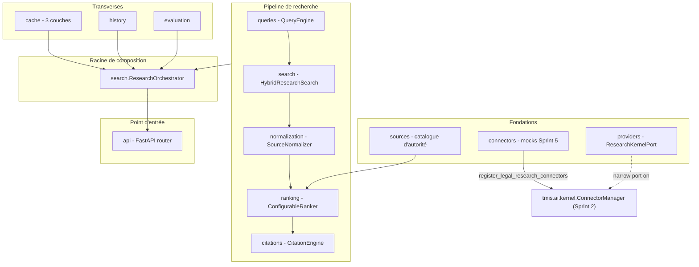
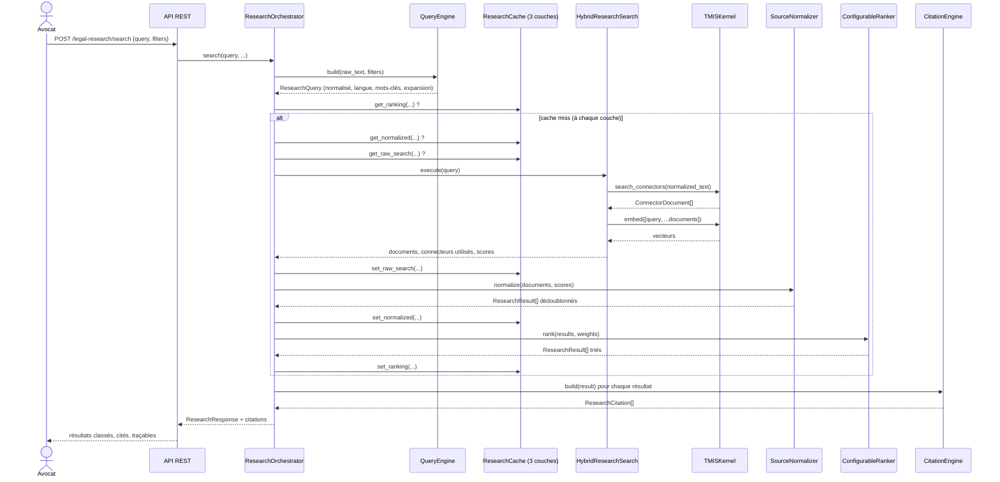

# Legal Research Engine (LRE) — architecture (Sprint 5)

## Rôle du moteur

Le Legal Research Engine (`backend/src/tmis/legal_research/`) est le
moteur de recherche documentaire et juridique de TMIS : à partir d'une
question, il sélectionne les bons connecteurs, exécute la recherche,
fusionne/dédoublonne/normalise les résultats, les classe, et attache une
citation traçable à chacun. **Il ne produit jamais d'avis juridique** —
il prépare des éléments structurés et référencés que les agents IA
(Sprint 11 et suivants) utiliseront pour raisonner.

Comme le AI Kernel (Sprint 2), le Document Intelligence Engine
(Sprint 3) et le Case Intelligence Engine (Sprint 4), le LRE ne connecte
aucune source réelle dans ce sprint : deux connecteurs simulés
(documentation interne du cabinet, base privée sous licence) étendent
le `ConnectorManager` du Kernel aux côtés des connecteurs codes/
jurisprudence/doctrine du Sprint 2, et toute capacité IA (embeddings)
passe exclusivement par `TMISKernel`.

## Vue d'ensemble des modules

`providers/ports.py` définit `ResearchKernelPort`, le sous-ensemble du
Kernel dont le LRE a besoin (`embed`, `search_connectors`) — même patron
que `SummaryKernelPort` (Sprint 4, voir
docs/20-guide-nouveau-moteur-analyse.md) : aucun module du LRE
n'importe jamais `tmis.ai.providers` ou `tmis.ai.connectors` directement.

## Du texte libre au résultat classé et cité

Le `ResearchOrchestrator` (`search/orchestrator.py`) est la racine de
composition : il ne parle jamais à un fournisseur de modèle ou un
connecteur — uniquement aux ports qu'on lui injecte. Chaque recherche
vérifie le cache **couche par couche**, du plus agrégé (classement) au
plus brut (résultats de connecteurs), pour court-circuiter le travail
dès que possible.

## Query Engine : normaliser sans casser la recherche lexicale

`queries.HeuristicQueryEngine` normalise les espaces, détecte la langue
(fréquence de mots vides FR/EN, autonome — pas de dépendance vers
`tmis.document_intelligence`, pour garder le LRE indépendant), extrait
des mots-clés, et étend la requête via un petit dictionnaire de
synonymes juridiques (`queries/synonyms.py`).

Point d'architecture important : `ResearchQuery.search_text` (texte +
termes d'expansion) sert uniquement au **re-score vectoriel** ; l'appel
réel aux connecteurs utilise `ResearchQuery.normalized_text` seul. Les
connecteurs simulés font une correspondance par sous-chaîne naïve
(`_fixture_search`, Sprint 2) : envoyer une requête gonflée de synonymes
concaténés ne matcherait plus rien. Le score vectoriel, lui, profite de
l'expansion sémantique sans ce problème.

## Recherche hybride sans index vectoriel pré-calculé

`search.HybridResearchSearch` implémente `ResearchSearchPort`. Les
connecteurs ne renvoient pas de score : la recherche hybride calcule
donc elle-même deux signaux bruts par document —

- **lexical** : taux de recouvrement entre les mots-clés de la requête
  et le contenu du document ;
- **vectoriel** : similarité cosinus (`tmis.ai.embeddings.similarity`)
  entre l'embedding de la requête et celui du document, calculés à la
  volée via `TMISKernel.embed()` (aucun store vectoriel dédié pour le
  LRE dans ce sprint — la RAG du Kernel reste le store de référence,
  voir docs/12-rag-architecture.md).

## Normalisation et dédoublonnage

`normalization.SourceNormalizer` unifie les métadonnées ad-hoc de
chaque connecteur (`article`, `jurisdiction`, `date`, `year`...) vers
les champs communs de `ResearchResult` (`document_type`, `reference`,
`date`), supprime les doublons d'id exact, et — pour deux documents au
contenu identique atteints par des ids différents — ne conserve que la
**version la plus récente** (champ `date`).

## Ranking Engine

Voir docs/23-guide-ranking-engine.md pour le détail des poids
configurables (`RankingWeights`) et comment ajouter un nouveau signal.

## Citation Engine

Voir docs/24-guide-citation-system.md. Chaque résultat conserve les six
champs promis par le sprint : id de la source, titre, date, type de
document, référence, extrait utilisé (`ResearchCitation`).

## Cache — trois couches

`cache.ResearchCache` étend le `CachePort` du Kernel avec trois couches
explicites, chacune (dé)sérialisée manuellement plutôt que par un
sérialiseur générique récursif (les trois formes de payload diffèrent
trop pour qu'un désérialiseur générique sache quelle dataclass
reconstruire) :

| Couche | Contenu | TTL par défaut |
|---|---|---|
| `raw` | `ConnectorDocument[]` + connecteurs utilisés + scores bruts | 600 s |
| `normalized` | `ResearchResult[]` dédoublonnés | 300 s |
| `ranking` | `ResearchResult[]` triés, clé incluant les poids | 120 s |

## Historique et évaluation

`history.InMemoryResearchHistory` enregistre chaque recherche (id,
utilisateur, dossier, requête, date, connecteurs utilisés, durée,
nombre de résultats). `evaluation.ResearchEvaluator` collecte un
`ResearchMetrics` par recherche (durée, nombre de sources, nombre de
résultats, taux de doublons, utilisation du cache) — même patron que
`CaseEvaluator` (Sprint 4).

## API REST

| Méthode | Route | Rôle |
|---|---|---|
| `POST` | `/api/v1/legal-research/search` | Lance une recherche, retourne résultats classés + citations |
| `GET` | `/api/v1/legal-research/searches/{search_id}` | Reconsulte une recherche passée (résultats normalisés + citations) |
| `GET` | `/api/v1/legal-research/history?user_id=&case_id=` | Historique des recherches |

Documenté automatiquement via OpenAPI (`/openapi.json`, `/docs`).

## Portée du Sprint 5

- Aucune source réelle connectée : `internal_documentation` et
  `private_database` sont des fixtures en mémoire, au même titre que
  `codes`/`jurisprudence`/`doctrine` (Sprint 2) — le branchement de
  vraies sources est le Sprint 9 (voir docs/09-roadmap-30-sprints.md).
- Historique en mémoire (`InMemoryResearchHistory`), comme
  `InMemoryCaseStore` (Sprint 4) ; la persistance suit le même
  calendrier (Sprint 6-7).
- Le LRE ne raisonne pas : il ne fait qu'apporter des éléments
  structurés et cités — le raisonnement (synthèse, comparaison de
  jurisprudence) revient aux agents IA des sprints 15-16.
