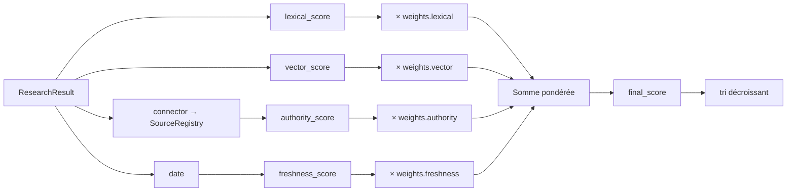

# Guide : le Ranking Engine du Legal Research Engine

`ranking.ConfigurableRanker` (implémente `RankingPort`) classe les
`ResearchResult` produits par `SourceNormalizer` selon quatre signaux
pondérés :

| Signal | Champ | Source |
|---|---|---|
| Pertinence lexicale | `lexical_score` | recouvrement mots-clés ↔ contenu (`HybridResearchSearch`) |
| Pertinence vectorielle | `vector_score` | similarité cosinus embeddings (`TMISKernel.embed`) |
| Autorité de la source | `authority_score` | `SourceRegistry.authority_score(connector)` |
| Fraîcheur | `freshness_score` | dérivé du champ `date` du résultat |



## Pourquoi pas un cinquième poids "pertinence" ?

Le sprint mentionne cinq signaux (pertinence, fraîcheur, autorité,
score vectoriel, score lexical). `RankingWeights` n'en a que quatre :
la "pertinence textuelle" **est** la combinaison pondérée de
`lexical_score` et `vector_score` — lui donner un poids séparé aurait
compté deux fois le même signal sous-jacent. Fraîcheur et autorité
restent des axes indépendants.

## Poids par défaut

```python
RankingWeights(lexical=0.30, vector=0.30, authority=0.25, freshness=0.15)
```

`RankingWeights.normalized()` renormalise toujours la somme à 1.0 avant
utilisation (y compris si l'appelant passe des poids qui ne totalisent
pas 1.0), donc les poids relatifs comptent, pas leur somme absolue.

## Calcul de la fraîcheur

`ConfigurableRanker._freshness_score` lit les quatre premiers
caractères du champ `date` (`AAAA-MM-JJ` ou une simple année) : plus le
document est ancien, plus le score décroît linéairement jusqu'à 0 au
bout de 50 ans. Un résultat sans date reçoit un score neutre (0.3),
pour ne le pénaliser ni l'avantager face aux résultats datés.

## Personnaliser le classement pour un appel donné

`RankingWeights` se passe directement à `ResearchOrchestrator.search()` :

```python
await orchestrator.search(
    "clause de non-concurrence",
    weights=RankingWeights(lexical=0.2, vector=0.2, authority=0.5, freshness=0.1),
)
```

Utile par exemple pour un agent qui veut privilégier la jurisprudence
la plus autoritative plutôt que la meilleure correspondance textuelle.
La couche de cache "ranking" est **elle-même clée par les poids
utilisés** (voir docs/21-legal-research.md — Cache), donc deux appels
avec des poids différents sur la même requête ne se marchent jamais
dessus.

## Ajouter un nouveau moteur de classement

1. Implémenter `RankingPort` (`ranking/ports.py`) : une méthode `rank`.
2. L'injecter dans `ResearchOrchestrator(ranker=...)` (ou dans
   `tmis.legal_research.bootstrap.get_research_orchestrator` pour le
   déploiement par défaut).
3. Aucune autre modification : citations, cache et API consomment déjà
   la liste de `ResearchResult` triée renvoyée par le port, quel que
   soit l'algorithme derrière.
