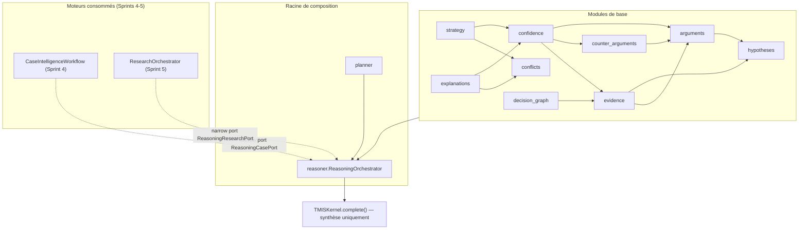
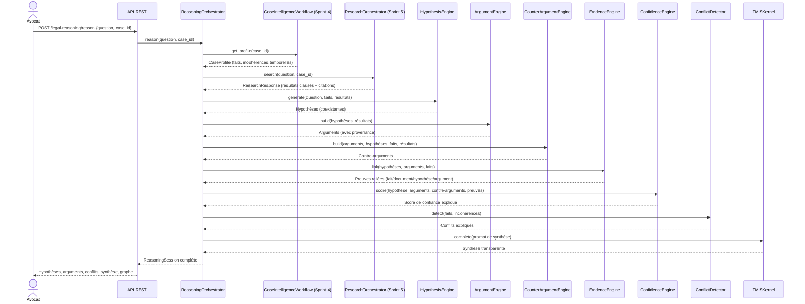
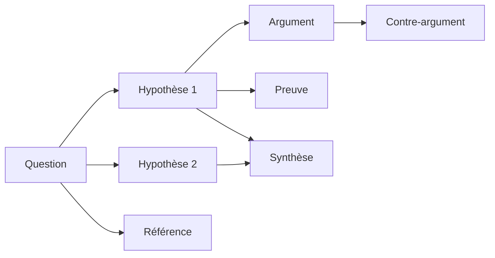

# Legal Reasoning Engine (LRE²) — architecture (Sprint 6)

## Rôle du moteur

Le Legal Reasoning Engine (`backend/src/tmis/legal_reasoning/`) est le
cerveau décisionnel de TMIS : à partir d'une question, il analyse le
dossier, interroge le moteur de recherche juridique, construit
plusieurs hypothèses qui coexistent, rassemble des arguments et des
contre-arguments avec leur provenance, détecte les contradictions,
calcule un score de confiance expliqué, et produit une synthèse
transparente — jamais une conclusion juridique automatique.

**Il ne remplace jamais l'avocat.** Aucune stratégie n'est choisie à sa
place, aucune hypothèse validée sans son intervention explicite, et
aucun document juridique final n'est produit par ce moteur.

Comme le AI Kernel (Sprint 2), le Document Intelligence Engine
(Sprint 3), le Case Intelligence Engine (Sprint 4) et le Legal Research
Engine (Sprint 5), le LRE² ne connecte aucun fournisseur de modèle
directement : le seul appel à un LLM de tout le moteur est la synthèse
finale, via `TMISKernel.complete()`.

## Vue d'ensemble des modules

`reasoner/ports.py` définit trois ports étroits — `ReasoningKernelPort`
(uniquement `complete()`), `ReasoningCasePort` (lecture seule d'un
`CaseProfile`) et `ReasoningResearchPort` (lecture seule d'une
recherche) — même principe que `SummaryKernelPort` (Sprint 4) : aucun
module du LRE² n'importe un fournisseur de modèle, un connecteur, ou le
détail interne du CIE/LRE.

## Du texte libre au raisonnement transparent

Le `ReasoningOrchestrator` (`reasoner/orchestrator.py`) est la racine de
composition, dans l'esprit de `CaseIntelligenceWorkflow`
(Sprint 4) : chaque dépendance est injectée derrière un port avec une
implémentation heuristique par défaut. Il ne parle jamais à un
fournisseur de modèle, à un connecteur, ou à une source directement.

L'étape "preuves" (`evidence`) n'apparaît pas explicitement dans le
workflow minimal du sprint, mais elle doit être calculée avant le score
de confiance (qui en a besoin) : elle a donc été insérée entre les
contre-arguments et la confiance — décision d'architecture documentée
ici plutôt que silencieuse.

## Hypothesis Engine : coexistence, jamais d'écrasement

`hypotheses.HeuristicHypothesisEngine` propose toujours au moins deux
hypothèses — une lecture favorable de la question, une lecture
contraire — chacune reliée aux faits du dossier qui partagent des
mots-clés avec la question, et citée face aux meilleurs résultats de
recherche. `Hypothesis` est une dataclass **mutable** (`confidence` et
`status` évoluent en place), mais aucune hypothèse n'est jamais
supprimée ou remplacée : `validation.HypothesisValidationService` ne
fait que faire transiter le `status` d'une hypothèse vers `VALIDATED`
ou `REJECTED`, en laissant toutes les autres — y compris une hypothèse
contradictoire — parfaitement intactes. TMIS ne résout jamais cette
tension à la place de l'avocat.

## Arguments, contre-arguments, preuves : toujours la provenance

`arguments.HeuristicArgumentEngine` relie chaque hypothèse aux
résultats de `ResearchOrchestrator` dont le contenu recoupe sa
description, en conservant systématiquement connecteur, référence et
extrait (`Argument.source_connector`/`source_reference`/`excerpt`).

`counter_arguments.HeuristicCounterArgumentEngine` cherche d'abord un
fait du dossier qui contredit déjà l'un des faits soutenant
l'hypothèse — en réutilisant directement
`Fact.contradicting_document_ids`, déjà calculé par le `FactEngine` du
CIE (Sprint 4) — puis, à défaut, un résultat de recherche issu d'un
connecteur différent comme point de vue à confronter. Le système
présente ainsi toujours les deux côtés du raisonnement.

`evidence.HeuristicEvidenceEngine` relie chaque fait soutenant une
hypothèse à ses documents sources, à l'hypothèse elle-même et au
premier argument qui en découle, avec un score de fiabilité dérivé du
rapport confirmations/contradictions déjà suivi par le CIE.

## Conflict Detector : réutiliser plutôt que redétecter

`conflicts.HeuristicConflictDetector` ne redétecte pas les
contradictions depuis zéro : il s'appuie sur ce que le CIE (Sprint 4) a
déjà calculé — `Fact.contradicting_document_ids` (→
`fact_inconsistency`, et sa vue par paire de documents →
`document_contradiction`) et `TimelineInconsistency` (→
`temporal_contradiction`) — et n'ajoute qu'une détection réellement
nouvelle : les faits en double (`duplicate`, même description
normalisée sous des ids différents). Chaque conflit reste expliqué en
langage naturel.

## Confidence Engine

Voir docs/27-guide-scores-confiance.md pour le détail des poids
configurables et le calcul complet.

## Strategy Engine : jamais de choix à la place de l'avocat

`strategy.HeuristicStrategyEngine` propose une `StrategyOption` par
hypothèse (objectif, points favorables tirés des arguments, risques
tirés des contre-arguments et des conflits touchant ses faits, éléments
manquants si la confiance est faible ou qu'aucun argument n'a été
trouvé) — sans jamais en recommander une seule : la liste complète est
toujours retournée.

## Decision Graph

`decision_graph.ChainDecisionGraphBuilder` construit un graphe
exploitable par une future interface, suivant la chaîne demandée :

Chaque nœud porte un type (`DecisionNodeType`) et un libellé ; chaque
arête porte une relation (`considers`, `supported_by`,
`challenged_by`, `grounded_by`, `cites`, `feeds_into`). Les résultats
normalisés de recherche ne réapparaissent pas nœud par nœud : seules
leurs références (dédupliquées) sont représentées, pour garder le
graphe lisible.

## Explanations

`explanations.ReasoningExplanationEngine` assemble, sans nouveau calcul,
une trace en langage naturel : étapes suivies, composants utilisés,
références mobilisées, hypothèses considérées, et limites de l'analyse
— toujours au minimum le rappel que l'analyse n'est pas un avis
juridique et doit être validée par un avocat, complété par les
hypothèses à faible confiance et les conflits non résolus.

## Observabilité

Chaque exécution produit un `ReasoningMetrics`
(`evaluation/metrics.py`) : durée totale, modules exercés, confiance
moyenne, nombre d'hypothèses/arguments/contre-arguments/conflits —
collecté par `ReasoningEvaluator`, même patron que
`tmis.legal_research.evaluation.ResearchEvaluator` (Sprint 5). Un log
structuré (`reasoning_completed`) reprend les mêmes indicateurs.

## API REST

| Méthode | Route | Rôle |
|---|---|---|
| `POST` | `/api/v1/legal-reasoning/reason` | Lance un raisonnement, retourne la session complète |
| `GET` | `/api/v1/legal-reasoning/sessions/{id}` | Reconsulte une session passée |
| `GET` | `/api/v1/legal-reasoning/sessions/{id}/hypotheses` | Hypothèses de la session |
| `GET` | `/api/v1/legal-reasoning/sessions/{id}/arguments` | Arguments de la session |
| `GET` | `/api/v1/legal-reasoning/sessions/{id}/conflicts` | Conflits détectés |
| `GET` | `/api/v1/legal-reasoning/sessions/{id}/synthesis` | Synthèse seule |

Documenté automatiquement via OpenAPI (`/openapi.json`, `/docs`).

## Portée du Sprint 6

- Aucun document juridique final n'est produit : `synthesis` est un
  résumé transparent du raisonnement, jamais une conclusion juridique
  opposable — la rédaction de documents reste le Sprint 18 (voir
  docs/09-roadmap-30-sprints.md).
- Sessions en mémoire (`ReasoningOrchestrator._sessions`), comme
  l'historique du LRE (Sprint 5) ; la persistance suit le même
  calendrier (Sprint 6-7... voir la note de révision de la roadmap).
- Les moteurs restent heuristiques (mots-clés, réutilisation des
  contradictions déjà détectées par le CIE) ; un moteur plus
  sophistiqué (embeddings, appel à `TMISKernel.complete()` pour générer
  de nouvelles hypothèses) peut remplacer n'importe lequel derrière son
  port sans toucher `ReasoningOrchestrator` — voir
  docs/26-guide-nouveau-moteur-raisonnement.md.
