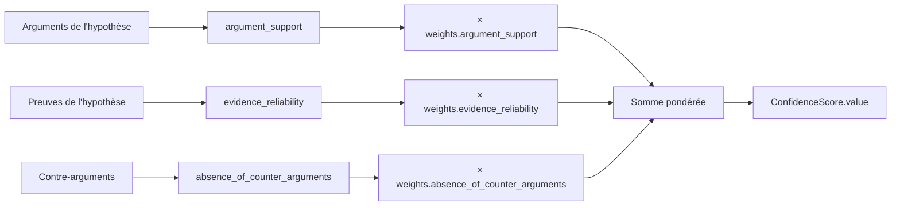

# Guide : les scores de confiance du Legal Reasoning Engine

`confidence.ConfigurableConfidenceEngine` (implémente
`ConfidenceEnginePort`) note chaque hypothèse selon trois signaux
pondérés :

| Signal | Champ | Source |
|---|---|---|
| Soutien argumentaire | `argument_support` | nombre d'arguments rattachés à l'hypothèse (plafonné à 3) |
| Fiabilité des preuves | `evidence_reliability` | moyenne des `ReasoningEvidenceLink.reliability_score` de l'hypothèse |
| Absence de contre-arguments | `absence_of_counter_arguments` | proportion d'arguments non contestés |



## Le cas d'une hypothèse totalement non étayée

Une hypothèse sans le moindre argument reçoit `argument_support = 0.0`
et `evidence_reliability = 0.0`. Le troisième facteur,
`absence_of_counter_arguments`, est **également** ramené à `0.0` dans ce
cas précis : un contre-argument n'a rien à contredire s'il n'existe
aucun argument, donc "l'absence de contre-argument" ne doit pas devenir
un signal positif artificiel. Une hypothèse sans aucun soutien obtient
donc un score de `0.0`, pas un score gonflé par un facteur qui n'a pas
de sens dans son cas. Dès qu'un argument existe, `absence_of_counter_arguments`
retrouve son rôle normal : `1.0` si aucun contre-argument ne le
conteste, dégressif sinon.

## Poids par défaut

```python
ConfidenceWeights(
    argument_support=0.40,
    evidence_reliability=0.35,
    absence_of_counter_arguments=0.25,
)
```

`ConfidenceWeights.normalized()` renormalise toujours la somme à 1.0
avant utilisation, donc seuls les poids relatifs comptent — un appelant
peut passer `ConfidenceWeights(argument_support=10, ...)` sans se
soucier de la somme totale.

## Toujours expliqué

Chaque `ConfidenceScore` porte une `explanation` en langage naturel
(nombre d'arguments favorables, fiabilité moyenne des preuves, nombre
de contre-arguments recensés) et un dictionnaire `factors` exposant
chaque signal individuellement — utile pour l'interface ou pour un
futur audit du raisonnement, sans devoir recalculer quoi que ce soit.

## Personnaliser les poids pour un raisonnement donné

`ConfidenceWeights` se passe directement au constructeur de
`ReasoningOrchestrator` (`confidence_weights=...`), sur le même
principe que `RankingWeights` pour le Legal Research Engine (voir
docs/23-guide-ranking-engine.md) :

```python
ReasoningOrchestrator(
    ...,
    confidence_weights=ConfidenceWeights(
        argument_support=0.2, evidence_reliability=0.6, absence_of_counter_arguments=0.2
    ),
)
```

Utile par exemple pour un dossier où la fiabilité documentaire prime
sur le simple volume d'arguments trouvés.

## Architecture extensible : ajouter un quatrième facteur

1. Ajouter le champ à `ConfidenceWeights` (avec sa part par défaut) et
   l'inclure dans `normalized()`.
2. Calculer le nouveau facteur dans
   `ConfigurableConfidenceEngine.score()` et l'ajouter à la somme
   pondérée et au dictionnaire `factors`.
3. Aucune autre modification : l'orchestrateur, l'API et les tests
   existants continuent de fonctionner, `ConfidenceScore` restant la
   même forme (`value`, `explanation`, `factors`).

Un moteur entièrement différent (par exemple un modèle appris plutôt
qu'une formule pondérée) peut aussi remplacer
`ConfigurableConfidenceEngine` derrière `ConfidenceEnginePort` sans
toucher `ReasoningOrchestrator` — voir
docs/26-guide-nouveau-moteur-raisonnement.md.
