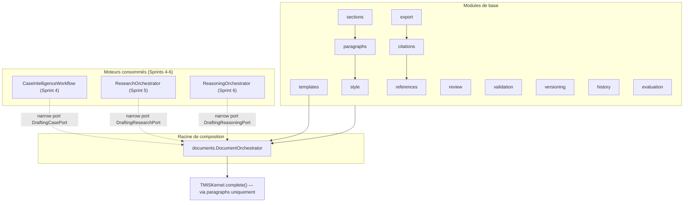
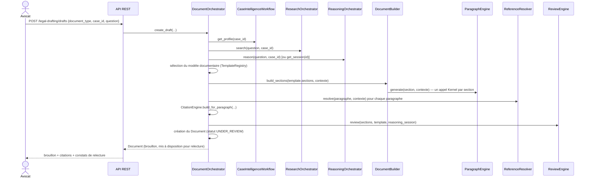

# Legal Drafting Studio (LDS) — architecture (Sprint 7)

## Rôle du moteur

Le Legal Drafting Studio (`backend/src/tmis/legal_drafting/`) transforme
ce que les quatre moteurs précédents ont produit — le Document
Intelligence Engine (Sprint 3), le Case Intelligence Engine (Sprint 4),
le Legal Research Engine (Sprint 5) et le Legal Reasoning Engine
(Sprint 6) — en un projet de document prêt à être relu, modifié et
validé par l'avocat.

**Il ne rédige jamais seul.** Tout document produit est, et reste, un
brouillon : `Document.is_draft` est une propriété qui renvoie toujours
`True`, sans aucun code capable de la modifier. Le workflow interne
(`DraftWorkflowStatus`) suit une relecture — générée, en relecture,
approuvée par l'avocat, rejetée — mais même `LAWYER_APPROVED` ne
signifie qu'une validation interne du contenu par l'avocat dans TMIS,
jamais un acte juridique.

Comme les Sprints 2-6, le seul appel à un fournisseur de modèle de tout
le moteur passe par `TMISKernel.complete()` — un unique point d'entrée,
dans le Paragraph Engine.

## Vue d'ensemble des modules

`documents/ports.py` définit trois ports étroits —
`DraftingCasePort`, `DraftingResearchPort`, `DraftingReasoningPort` —
mêmes principes que `tmis.legal_reasoning.reasoner.ports` (Sprint 6) :
le LDS ne réimplémente jamais l'analyse de dossier, la recherche
documentaire ou le raisonnement juridique, il compose ce qui existe
déjà via de fins adaptateurs (`documents/adapters.py`).

## De la demande au brouillon publié

`DocumentOrchestrator` (`documents/orchestrator.py`) est la racine de
composition : chaque dépendance est injectée derrière un port avec une
implémentation par défaut, sur le même principe que
`ReasoningOrchestrator`/`ResearchOrchestrator` (Sprints 5-6). L'étape
"Preuves" du Legal Reasoning Engine n'est pas rejouée : le LDS lit
directement `ReasoningSession.evidence_links` déjà calculés.

## Template Engine : neuf modèles, tous versionnés

`templates.TemplateRegistry` catalogue les neuf types de documents
demandés (`consultation`, `note_interne`, `courrier`,
`mise_en_demeure`, `requete`, `assignation`, `conclusions`, `memoire`,
`synthese`), chacun sous la forme d'un `DocumentTemplate` immuable :
structure (`sections` ordonnées avec dépendances), `variables`,
`rules`, `controls`. Une nouvelle version s'ajoute sans jamais
remplacer l'ancienne (`register()` ne fait qu'ajouter) — voir
docs/29-guide-nouveau-modele-documentaire.md.

Les sections partagent un ensemble de rôles génériques
(`SectionRole` : `HEADER`, `CONTEXT`, `FACTS`, `LEGAL_DISCUSSION`,
`ARGUMENTS`, `RECOMMENDATIONS`, `CONCLUSION`, `SIGNATURE`), pour que le
Paragraph Engine sache générer un contenu sans connaître le type de
document — seule la table `_TEMPLATE_OUTLINES` du `TemplateRegistry`
varie d'un modèle à l'autre.

## Document Builder : sections indépendamment régénérables

`sections.DocumentBuilder` assemble les sections dans l'ordre du
modèle. `depends_on` est informatif à ce stade (l'ordre du modèle
respecte déjà toutes les dépendances) — il permettra à un futur
planificateur de paralléliser des sections indépendantes sans changer
`DocumentBuilder`. Régénérer une section (`regenerate_section`) ne
reconstruit qu'elle : `DocumentOrchestrator` conserve ensuite l'id de
la section et, position par position, l'id de chaque paragraphe déjà
présent, pour que le versioning voie une **modification** plutôt qu'une
suppression suivie d'un ajout.

## Paragraph Engine : traçabilité stricte

`paragraphs.HeuristicParagraphEngine` génère un paragraphe par rôle de
section. `header` et `signature` sont du texte déterministe (aucun
appel Kernel) ; tous les autres rôles passent par
`TMISKernel.complete()` — le seul point d'appel LLM de tout le moteur.
Chaque paragraphe ne déclare comme traçabilité (`fact_ids`,
`reference_ids`, `evidence_ids`, `hypothesis_ids`) que ce qui a
réellement nourri son prompt : une section "faits" ne cite que les
faits effectivement inclus, une section "discussion juridique" que les
hypothèses et références effectivement citées. `regenerate_one()`
régénère un paragraphe isolément en conservant son id et son ordre.

## Citation Engine et Reference Resolver

`references.HeuristicReferenceResolver` transforme les ids bruts d'un
paragraphe en `ReferenceLink` lisibles, en consultant directement les
données des moteurs amont (faits, résultats de recherche, preuves et
hypothèses du raisonnement) — jamais de recalcul.
`citations.CitationEngine` transforme ensuite ces `ReferenceLink` en
`DraftCitation` ancrées au document, à la section et au paragraphe
précis, avec plusieurs formats de sortie (`PlainTextCitationFormatter`,
`FootnoteCitationFormatter`).

## Style Engine

`style.StyleEngine` traduit un `StyleProfile` (ton, niveau de détail,
longueur, registre) en instructions explicites pour le prompt du
Paragraph Engine, et fournit la formule de politesse déterministe de la
section signature. `style.StyleProfileRegistry` permet à chaque cabinet
d'enregistrer sa propre charte — voir docs/30-guide-moteur-style.md.

## Review Engine : ne corrige jamais

`review.HeuristicReviewEngine` détecte cinq catégories de problèmes
(répétitions, contradictions — en réutilisant les `Conflict` du
Sprint 6 —, sections incomplètes, références absentes, paragraphes non
justifiés) et se contente de les **signaler** : aucune correction
automatique n'est appliquée sans validation humaine.

## Human In The Loop

`validation.HumanInTheLoopService` enregistre chaque décision
(approuver / rejeter / commenter) sans jamais en écraser une
précédente, et sans jamais toucher à `Document.is_draft`. Le workflow
n'est donc jamais "terminé" au sens juridique : il attend toujours
l'avocat.

## Versioning et historique

`versioning.InMemoryVersioningService` conserve un instantané
(deep-copy) à chaque création ou régénération — voir
docs/31-guide-versioning.md pour la comparaison et la restauration.
`history.InMemoryDraftHistory` journalise séparément **toute** action
(création, régénération de section/paragraphe, relecture, validation,
restauration, export), humaine ou automatique — l'historique est un
journal d'audit, le versioning un mécanisme de restauration de
contenu.

## Export

Trois formats, chacun préservant la structure et les citations — voir
docs/32-guide-exports.md : DOCX (`python-docx`), HTML (auto-suffisant),
et PDF (un writer minimal fait main, `export/pdf_writer.py`, faute de
bibliothèque d'écriture PDF dans les dépendances existantes — validé
par relecture via `pypdf`, déjà une dépendance du projet depuis le
Sprint 3).

## Observabilité

Chaque génération produit un `DraftMetrics` (durée, composants
utilisés, nombre de paragraphes, nombre de références, coût estimé via
`tmis.ai.evaluation.metrics.estimate_cost`, version de modèle utilisée)
— collecté par `DraftEvaluator`, même patron que
`tmis.legal_reasoning.evaluation.ReasoningEvaluator` (Sprint 6).

## API REST

| Méthode | Route | Rôle |
|---|---|---|
| `POST` | `/api/v1/legal-drafting/drafts` | Crée un brouillon |
| `GET` | `/api/v1/legal-drafting/drafts/{id}` | Récupère un brouillon |
| `POST` | `.../sections/{key}/regenerate` | Régénère une section |
| `POST` | `.../sections/{key}/paragraphs/{id}/regenerate` | Régénère un paragraphe |
| `GET` | `.../versions` | Liste les versions |
| `GET` | `.../versions/compare?version_a=&version_b=` | Compare deux versions |
| `POST` | `.../versions/{n}/restore` | Restaure une version |
| `POST` | `.../validate` | Enregistre une décision humaine |
| `GET` | `.../review` | Constats de relecture |
| `GET` | `.../history` | Historique complet |
| `GET` | `.../export?format=docx\|pdf\|html` | Exporte le brouillon |

Documenté automatiquement via OpenAPI (`/openapi.json`, `/docs`).

## Portée du Sprint 7

- Chaque section produit aujourd'hui un seul paragraphe généré par le
  Kernel (sauf en-tête/signature, déterministes) — l'architecture
  (`Section.paragraphs: list[Paragraph]`) supporte déjà plusieurs
  paragraphes par section pour un futur sprint.
- Stockage en mémoire (`InMemoryDocumentStore`, historique,
  versioning), comme les moteurs précédents ; la persistance suit le
  même calendrier (Sprint 9, voir docs/09-roadmap-30-sprints.md).
- Le Review Engine reste heuristique ; un moteur plus sophistiqué peut
  le remplacer derrière `ReviewEnginePort` sans toucher
  `DocumentOrchestrator`.
