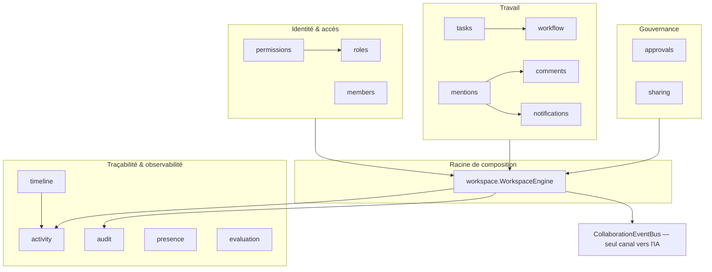

# Legal Collaboration Engine (LCE) — architecture (Sprint 8)

## Rôle du moteur

Le Legal Collaboration Engine (`backend/src/tmis/collaboration/`)
transforme TMIS en espace de travail juridique partagé : plusieurs
avocats, juristes et collaborateurs travaillent simultanément sur un
même dossier, avec une équipe, des tâches, des commentaires, des
validations, des notifications et un historique traçable.

**Le moteur est indépendant de l'IA.** Aucun module sous
`tmis.collaboration` n'importe `tmis.ai` — ni fournisseur de modèle, ni
connecteur, ni `TMISKernel`. Ce n'est pas une contrainte de façade :
`tests/unit/collaboration/test_collaboration_ai_independence.py`
parcourt statiquement (AST) chaque fichier du package et échoue si un
seul import de `tmis.ai` apparaît. Toute interaction avec l'IA passe
par les événements publiés sur `CollaborationEventBus` — un futur
module d'IA s'y abonne, le LCE ne le connaît jamais.

## Pourquoi un event bus dédié plutôt que celui de `tmis.ai` ?

`tmis.ai.events.bus.EventBus` et `tmis.collaboration.event_bus.
CollaborationEventBus` ont la même forme (publish/subscribe
asynchrone, historique en mémoire) mais sont deux implémentations
totalement indépendantes. C'est une duplication assumée : partager le
bus du Kernel aurait signifié importer `tmis.ai`, exactement ce que le
sprint interdit. `CollaborationEvent` (dataclass de base, `workspace_id`
+ `event_id` + `occurred_at` + `event_type`) est la seule dépendance
commune à tous les événements du moteur (`events.py` : `WorkspaceCreated`,
`MemberInvited`, `MemberStatusChanged`, `RoleAssigned`, `TaskCreated`,
`TaskStatusChanged`, `CommentAdded`, `MentionCreated`,
`ApprovalRequested`, `ApprovalDecided`, `NotificationDispatched`,
`ActivityRecorded`, `ShareLinkCreated`, `ShareLinkRevoked`).

## Vue d'ensemble des modules

`workspace.WorkspaceEngine` est la racine de composition (même
principe que `DocumentOrchestrator` au Sprint 7 ou
`ReasoningOrchestrator` au Sprint 6) : elle ne réimplémente aucune
règle déjà possédée par un module (transitions de workflow,
préséance des permissions, historique des membres...), elle séquence
les appels, puis journalise (activité + audit) et publie un événement.

## Workspace : la frontière logique du SaaS

`Workspace` (`workspace/schemas.py`) est le périmètre principal :
un cabinet (`firm_id`) peut posséder plusieurs espaces, chacun
regroupant dossiers, utilisateurs, équipes, documents et tâches. Comme
pour toutes les frontières entre moteurs TMIS, `Workspace` ne stocke
que des **ids** (`member_ids`, `case_ids`, `team_ids`, `document_ids`,
`task_ids`) — jamais les agrégats d'autres moteurs (`CaseProfile`,
`Document`...), qui restent dans leurs bounded contexts respectifs
(Sprints 3-7).

## RBAC : rôles + permissions granulaires

`roles.Role` fixe six rôles (`ADMINISTRATOR`, `ASSOCIATE`,
`COLLABORATOR`, `JURIST`, `ASSISTANT`, `CLIENT`), un par membre et par
workspace (`InMemoryRoleAssignmentStore` — une nouvelle affectation
remplace la précédente, les rôles ne sont pas additifs).
`permissions.ConfigurablePermissionEngine` calcule l'accès à partir
d'une matrice rôle → permissions par défaut, entièrement reconfigurable
(`set_role_permissions`), plus des dérogations par membre
(`grant_override` / `revoke_override`). **Précédence : une révocation
explicite l'emporte toujours sur un octroi et sur la matrice** —
voir docs/35-guide-permissions.md.

## Members : cycle de vie traçable

`members.MemberService` gère invitation → activation → suspension →
désactivation → réactivation via une table `_ALLOWED_TRANSITIONS`
explicite. Chaque transition est **ajoutée** à `Member.history`, jamais
réécrite — même principe que la validation des hypothèses (Sprint 6)
et le versioning de brouillons (Sprint 7). `DEACTIVATED` est terminal.

## Task Engine et Workflow Engine

`workflow.WorkflowStatus` (`TODO`, `IN_PROGRESS`, `IN_REVIEW`,
`TO_VALIDATE`, `VALIDATED`, `ARCHIVED`) vit dans son propre module,
séparé de `tasks/`, car il modélise un concept générique et
reconfigurable (`ConfigurableWorkflowEngine` accepte une table de
transitions personnalisée) — potentiellement réutilisable au-delà des
tâches. `tasks.TaskService` délègue chaque changement de statut au
moteur de workflow ; `depends_on` reste **informatif** : `can_start()`
indique si toutes les dépendances sont `VALIDATED`/`ARCHIVED`, mais
`update_status()` n'impose rien — un workspace peut prioriser une
tâche urgente sans que le moteur ne s'y oppose.

## Comment Engine et Mentions

`comments.CommentService` attache un commentaire à n'importe quelle
cible (`CommentTargetType` : `CASE`, `DOCUMENT`, `SECTION`,
`PARAGRAPH`, `TASK`), avec réponses formant un fil
(`parent_id`). `mentions.MentionParser` extrait `@user:<id>`,
`@team:<id>`, `@firm:<id>` par une regex dédiée ;
`mentions.MentionEngine` transforme chaque mention détectée en
notification via le port `NotificationEnginePort` injecté. **Limite
connue** : aucun registre d'équipe ou de cabinet n'existe encore comme
concept de première classe ce sprint, donc `@team:` et `@firm:`
sont enregistrées mais ne notifient personne par défaut — un
`recipient_resolver` injectable permet de les résoudre dès qu'un tel
registre existera, sans changer `MentionEngine`.

## Approval Engine : jamais de vainqueur imposé par le moteur

`approvals.ApprovalEngine` implémente validation simple
(`ApprovalMode.SINGLE` — un seul APPROVE suffit), validation multiple
(`MULTIPLE` — chaque approbateur désigné doit avoir APPROVE comme
dernière décision), refus et demande de modification. Chaque décision
est **ajoutée** à `ApprovalRequest.history`, jamais écrasée ; le statut
est recalculé à chaque décision à partir de la dernière décision de
chaque approbateur : un refus ou une demande de modification l'emporte
toujours, quel que soit le mode — voir
docs/38-guide-validations.md.

## Notification Engine : extensible par canal

`notifications.NotificationEngine` dispatch un événement vers un ou
plusieurs canaux (`NotificationChannel` : `IN_APP`, `EMAIL`,
`WEBHOOK`), chacun derrière `NotificationChannelPort`. `InAppChannel`
ne fait rien (la notification est déjà persistée) ; `EmailChannel` et
`WebhookChannel` sont des **interfaces** au sens du brief — elles
enregistrent ce qui serait envoyé sans effectuer d'E/S réelle,
conformément à « email (interface) ». Ajouter un canal ne touche pas
`NotificationEngine` — voir docs/37-guide-notifications.md.

## Activity Feed vs Audit Trail : deux journaux, deux usages

`activity.ActivityFeed` est le journal chronologique **lisible** —
imports, modifications, commentaires, validations, tâches, recherches
et générations IA — filtrable par type, acteur, cible ou période.
`audit.AuditTrail` est le registre **de conformité** : acteur,
horodatage, adresse IP (si disponible), action, état avant/après. Les
deux sont volontairement distincts : la feed raconte une histoire à un
humain, l'audit prouve un changement d'état à un auditeur.
`timeline.TimelineService` est une simple projection en lecture de
l'`ActivityFeed`, filtrée par cible (un dossier, un document, une
tâche) — elle ne stocke rien de son côté.

## Presence Engine : architecture seulement

Conformément au brief (« architecture seulement... aucune
implémentation temps réel complète demandée »),
`presence.InMemoryPresenceTracker` et
`presence.InMemoryOptimisticLockService` posent la forme qu'un futur
transport WebSocket/pubsub remplirait : heartbeat, liste des
utilisateurs en ligne, indicateurs de présence par cible, verrouillage
optimiste avec expiration. Le verrou est **consultatif** : il permet de
détecter un conflit d'édition, il ne peut pas empêcher une écriture
concurrente côté client.

## Sharing Engine

`sharing.SharingEngine` couvre le partage interne
(`share_internally` — accès direct à un autre membre, permissions
limitées à `READ`/`COMMENT` via `SharePermission`) et les liens
sécurisés (`create_link` — jeton `secrets.token_urlsafe`, expiration
optionnelle, révocation immédiate via `revoke_link`).
`resolve_link` renvoie `None` pour un jeton révoqué ou expiré, sans
jamais lever d'exception côté consommateur du lien.

## Observabilité

`evaluation.WorkspaceMetricsCollector` compose les ports de comptage de
chaque module (`MemberStorePort`, `TaskStorePort`, `CommentStorePort`,
`ApprovalStorePort`, `NotificationEnginePort`) pour produire un
`WorkspaceActivityMetrics` — nombre de tâches, de validations, de
commentaires, de notifications, de membres actifs — sans jamais
dépendre d'un store concret. `evaluation.OperationTimer` est un
context manager qui mesure la durée d'une opération et l'enregistre
dans `CollaborationEvaluator`, même patron que les évaluateurs des
Sprints 4-7.

## API REST

| Méthode | Route | Rôle |
|---|---|---|
| `POST` | `/api/v1/collaboration/workspaces` | Crée un espace de travail |
| `GET` | `.../workspaces/{id}` | Récupère un espace de travail |
| `POST` | `.../workspaces/{id}/members` | Invite un membre |
| `POST` | `/api/v1/collaboration/members/{id}/status` | Change le statut d'un membre |
| `POST` | `.../workspaces/{id}/members/{id}/role` | Assigne un rôle |
| `POST` | `.../workspaces/{id}/tasks` | Crée une tâche |
| `GET` \| `POST` | `/api/v1/collaboration/tasks/{id}` \| `.../status` | Consulte/change le statut d'une tâche |
| `POST` \| `GET` | `/api/v1/collaboration/comments` | Ajoute/liste des commentaires |
| `POST` \| `GET` | `/api/v1/collaboration/approvals` | Demande/consulte une validation |
| `POST` | `.../approvals/{id}/decide` | Décide d'une validation |
| `GET` \| `POST` | `/api/v1/collaboration/notifications/{recipient_id}` \| `.../{id}/read` | Consulte/marque une notification lue |
| `GET` | `.../workspaces/{id}/activity` | Consulte le journal d'activité (filtrable) |

Documenté automatiquement via OpenAPI (`/openapi.json`, `/docs`).

## Portée du Sprint 8

- Stockage en mémoire partout (`InMemory*Store`), comme tous les
  moteurs précédents ; la persistance suit le même calendrier
  (Sprint 9, voir docs/09-roadmap-30-sprints.md).
- Le Presence Engine est délibérément une architecture sans transport
  temps réel — un futur module WebSocket peut s'y brancher sans
  changer `PresencePort`/`OptimisticLockPort`.
- `@team:`/`@firm:` ne résolvent aucun destinataire par défaut, faute
  de registre d'équipe/cabinet ce sprint (voir « Comment Engine et
  Mentions » ci-dessus) — un résolveur injectable comble ce manque dès
  qu'un tel registre existera.
- Chaque module reste testable et remplaçable isolément derrière son
  port ; `WorkspaceEngine` ne connaît que des interfaces, jamais une
  implémentation concrète.
