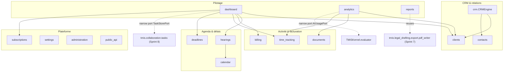

# Cabinet Operating System (COS) — architecture (Sprint 9)

## Rôle du moteur

Le Cabinet Operating System (`backend/src/tmis/cabinet_os/`) transforme
TMIS en plateforme métier complète : chaque cabinet y gère ses clients,
ses dossiers, ses collaborateurs, son calendrier, ses audiences, ses
tâches, son temps passé, sa facturation, ses abonnements et ses
tableaux de bord. Ce n'est plus seulement un assistant juridique — c'est
le système d'exploitation quotidien du cabinet.

**Le COS est multi-tenant dès sa conception** : chaque agrégat porte un
`firm_id`, la même clé de tenant déjà posée par
`tmis.collaboration.workspace.Workspace.firm_id` au Sprint 8. Il n'y a
donc pas de nouveau concept de tenant à réconcilier — collaboration et
COS partagent la même frontière.

**Le COS ne dépend d'aucun fournisseur d'IA directement.** La seule
fonctionnalité liée à l'IA — la mesure de consommation dans
`analytics`/`dashboard` — passe par un port étroit
(`AIUsagePort`) vers `TMISKernel.evaluator`, jamais vers un provider ou
un connecteur. C'est une contrainte différente de celle du Sprint 8 :
`collaboration` ne pouvait *rien* importer de `tmis.ai` ; `cabinet_os`
peut consommer l'IA, mais uniquement **via le Kernel**.

## Vue d'ensemble des modules

## CRM : `clients` + `contacts` + `crm`

`clients.Client` couvre personnes physiques et personnes morales
(`ClientType`), avec un cycle de vie explicite
(`ClientStatus` : prospect → actif → archivé, réversible), un journal
de notes append-only et des liens *par id* vers dossiers, documents et
factures — jamais d'agrégat embarqué, la même discipline que
`tmis.collaboration.workspace.Workspace`. `contacts.Contact` couvre les
six catégories du brief (dirigeants, représentants, experts, témoins,
administrations, partenaires) et supporte des relations dirigées entre
contacts (`ContactRelation`). `crm.CRMEngine` est la racine de
composition : sa méthode `get_profile()` résout les
`contact_ids` d'un client en objets `Contact` pour produire la vue à
360° — voir docs/40-guide-crm.md.

## Calendrier, audiences et délais

`calendar.ConfigurableCalendarEngine` porte un seul calendrier métier
pour tous les types d'événements (audiences, rendez-vous, appels,
échéances, rappels), avec quatre vues calculées à la lecture — jour,
semaine, mois, agenda — sans stockage séparé par vue.
`hearings.HearingEngine` ne maintient pas sa propre notion de date :
planifier une audience crée automatiquement l'événement de calendrier
correspondant (et, par défaut, un rappel un jour avant) via le port
`CalendarEnginePort` injecté — voir docs/41-guide-calendrier.md.
`deadlines.ConfigurableDeadlineEngine` calcule des échéances à partir
d'événements déclencheurs, mais **ne livre aucune règle par défaut** :
un type de procédure sans règle enregistrée (`DeadlineRulePort`) ne
produit simplement aucune échéance, plutôt que d'échouer — l'extension
à de nouvelles procédures/juridictions se fait sans toucher au moteur.

## Suivi du temps et facturation

`time_tracking.TimeTrackingService` couvre les trois méthodes de
saisie du brief : manuelle (après coup), minuteur en direct
(`start_timer`/`stop_timer`), et présaisie rapide — toutes produisent
la même forme de `TimeEntry`. `billing.BillingEngine` couvre devis,
honoraires (taux horaire, forfait, success fee via `FeeType`),
remises, factures, avoirs et paiements ; chaque ligne recalcule
toujours son propre total (`LineItem.total`), jamais stocké séparément.
La collecte de paiement (`PaymentGatewayPort`) et l'export comptable
(`AccountingExportPort`) sont des interfaces aujourd'hui — la
référence livrée (`ManualPaymentGateway`, `NoOpAccountingExport`)
enregistre ce qui serait fait, sans E/S réelle, exactement comme
`tmis.collaboration.notifications.channels.EmailChannel` au Sprint 8 —
voir docs/42-guide-facturation.md.

## Documents (niveau cabinet)

`documents.CabinetDocumentService` est un registre volontairement fin :
propriétaire (client/dossier), catégorie, pointeur de stockage. Il ne
réanalyse jamais le contenu — c'est le rôle du **Document Intelligence
Engine** (`tmis.document_intelligence`, Sprint 3) ; `die_record_id`
relie les deux par id quand une analyse existe.

## Abonnements

`subscriptions.ConfigurableSubscriptionEngine` étend le moteur SaaS
avec trois plans (Solo, Cabinet, Entreprise), chacun avec un `Quota`
par défaut (utilisateurs, requêtes IA/mois, stockage, options)
entièrement reconfigurable. Les compteurs de consommation
(`UsageCounters`) sont séparés de l'abonnement lui-même, pour qu'un
changement de plan ne réinitialise jamais l'usage déjà consommé.

## Tableaux de bord et analytique

`dashboard.DashboardEngine` compose les ports de lecture d'autres
modules — y compris `tmis.collaboration.tasks` (Sprint 8) pour la vue
collaborateur — sans jamais dupliquer leur stockage. Trois vues :
cabinet (chiffre d'affaires, dossiers ouverts, audiences, temps
facturable, activité IA), collaborateur (tâches, dossiers, échéances,
temps), administrateur (licences, stockage, consommation IA).
`analytics.AnalyticsEngine` calcule des métriques d'activité/
productivité à partir des mêmes ports, plus `AIUsagePort` pour l'usage
IA.

## Rapports

`reports.ReportEngine` génère PDF, Excel, CSV et HTML à partir d'une
`ReportTable` générique — n'importe quel moteur du COS peut en produire
une sans connaître le format de sortie. PDF réutilise directement
`tmis.legal_drafting.export.pdf_writer` (Sprint 7, un writer PDF minimal
fait main) ; Excel est un writer XLSX minimal fait main sur le même
principe (`reports/xlsx_writer.py`), pour éviter d'ajouter une
dépendance d'authoring d'un tableur — voir docs/43-guide-rapports.md.

## Paramètres et administration

`settings.SettingsEngine` est un magasin clé/valeur scopé par cabinet
et par catégorie (cabinet, utilisateurs, IA, notifications, sécurité,
intégrations, facturation) — une nouvelle option n'exige jamais de
migration de schéma. `administration.AdministrationEngine` est le
portail plateforme : registre des cabinets (`FirmRecord` — une version
minimale, l'agrégat `Firm` complet reste au futur sprint Identity &
Firm), catalogue des connecteurs, configuration globale, et un
instantané de monitoring qui est aujourd'hui une architecture pure
(valeurs à zéro, en attendant un exportateur réel au Sprint 28) — voir
docs/45-guide-administration.md.

## API publique

`public_api.PublicApiEngine` couvre clés API (jamais stockées en clair,
seulement leur hash SHA-256), un flux OAuth2 client-credentials, des
scopes grossiers (`ApiScope`), une limitation de débit à fenêtre fixe
(`InMemoryRateLimiter`) et un versionnage porté par le routage
(`/api/v1/public-api/v1/...`) plutôt que par le moteur — voir
docs/44-guide-api-publique.md.

## API REST

44 routes au total, montées sous `/api/v1/cabinet-os/...` et
`/api/v1/public-api/v1/...`, documentées automatiquement via OpenAPI
(`/docs`).

## Portée du Sprint 9

- Stockage en mémoire partout, comme tous les moteurs précédents.
- `FirmRecord` (administration) n'est pas l'agrégat `Firm` complet —
  celui-ci (adresse de facturation, entité juridique, image de marque)
  reste au futur sprint Identity & Firm.
- Le Deadline Engine ne livre aucune règle de calcul par défaut — les
  règles par procédure/juridiction sont un travail d'intégration
  ultérieur derrière `DeadlineRulePort`, déjà extensible.
- Le flux OAuth2 ne couvre que le grant client-credentials (accès
  machine-à-machine) ; un flux délégué par l'utilisateur (authorization
  code) reste à ajouter.
- Le Monitoring Engine est une architecture sans exportateur réel — se
  branche sur Sprint 28 "Observabilité complète".
- `AIUsagePort.total_requests()` retourne un compteur global du
  processus, pas encore attribué par cabinet — le Kernel n'est pas
  encore multi-tenant-aware (voir `analytics/adapters.py`).
