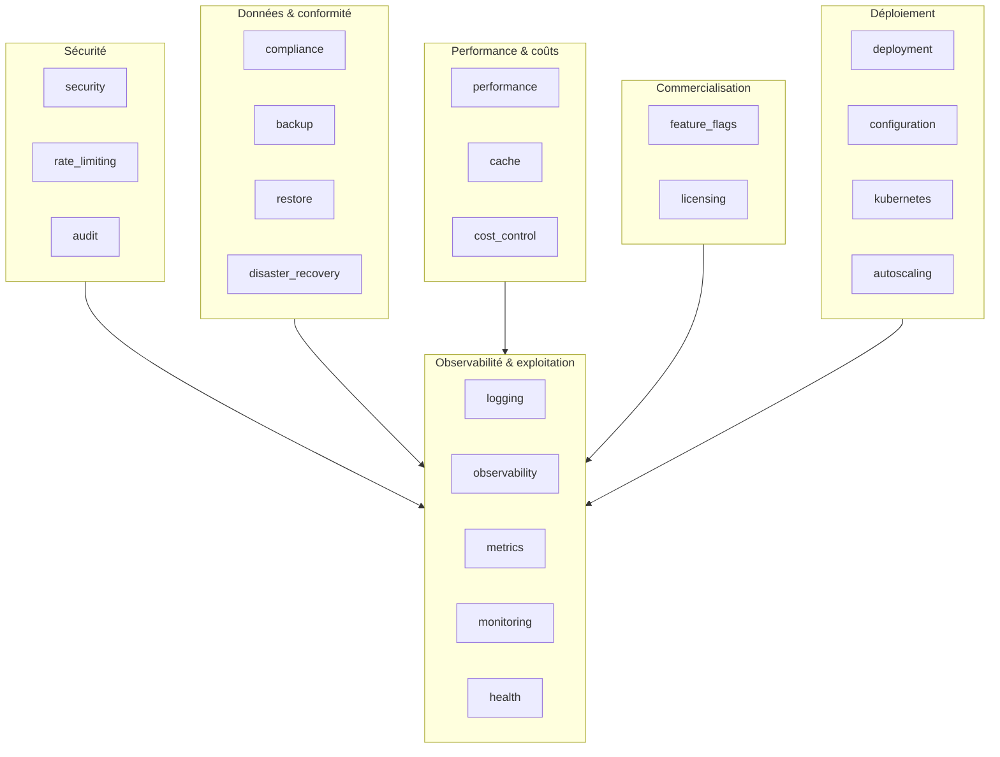
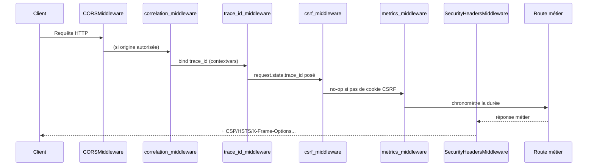
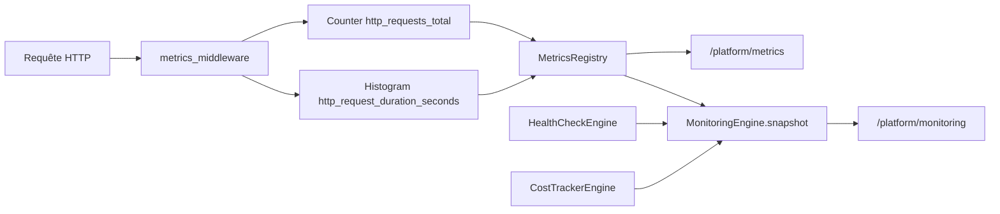

# Architecture Enterprise Platform (Sprint 10)

## Rôle de la couche

`backend/src/tmis/platform/` ne livre **aucune fonctionnalité métier** :
c'est la couche transverse qui rend TMIS déployable, sûr, observable et
exploitable en dehors d'un poste de développement — chez un avocat
individuel comme chez une direction juridique de 100 utilisateurs. Elle
s'ajoute au-dessus des neuf moteurs métier (Sprints 2-9) sans les
modifier : aucun de leurs schémas, ports ou moteurs n'a changé.

**Principe directeur** : chaque module de `platform/` suit la même
discipline Clean Architecture que les Sprints précédents — `schemas.py`
(dataclasses sans dépendance), `ports.py` (`Protocol`), une ou plusieurs
implémentations, un `bootstrap.py` en singleton `functools.lru_cache`
quand un état process-wide a du sens.

## Vue d'ensemble des 21 modules

## Multi-tier : une seule architecture, quatre profils de déploiement

La vision du sprint impose que TMIS serve un avocat individuel, un
cabinet de 10 personnes, un cabinet de 100 utilisateurs et une
direction juridique d'entreprise **sans refonte majeure**. La réponse
n'est pas un code différent par palier, mais une **configuration**
différente de la même architecture :

| Palier | Réplicas | CPU (req/lim) | Mémoire (req/lim) | Concurrence IA max |
|---|---|---|---|---|
| `solo` | 1 | 250m / 500m | 256Mi / 512Mi | 2 |
| `cabinet_small` (≈10) | 2 | 500m / 1 | 512Mi / 1Gi | 5 |
| `cabinet_large` (≈100) | 4 | 1 / 2 | 1Gi / 2Gi | 15 |
| `enterprise` | 8 | 2 / 4 | 2Gi / 4Gi | 40 |

Ces profils (`tmis.platform.deployment.presets`) et les politiques
d'autoscaling associées (`tmis.platform.autoscaling.presets`) alimentent
directement la génération des manifests Kubernetes
(`tmis.platform.kubernetes.render`) — changer de palier revient à
changer un paramètre de configuration, jamais une ligne de code métier.

## Flux d'une requête (chaîne de middlewares)

Note d'implémentation : dans Starlette, le dernier middleware ajouté via
`app.middleware("http")(...)` est le premier exécuté sur la requête
(le plus externe). L'ordre d'ajout dans `main.py` est donc l'inverse de
l'ordre d'exécution logique ci-dessus — documenté en commentaire à
l'endroit exact où l'ordre est fixé.

## Isolation multi-tenant

Chaque agrégat métier porte un `firm_id` depuis le Sprint 8
(`Workspace.firm_id`) et le Sprint 9 (tous les agrégats `cabinet_os`).
Le Sprint 10 ajoute la **vérification systématique** de cette frontière :

- `tmis.platform.security.tenant_isolation.require_same_firm` — le point
  de contrôle unique que tout accès inter-tenant doit appeler ; échoue
  bruyamment (`TenantAccessError`) plutôt que de renvoyer silencieusement
  une liste vide.
- `assert_tenant_isolated` — l'aide de test ("tests d'étanchéité")
  appelée depuis `tests/integration/platform/test_platform_tenant_isolation_integration.py`
  contre les requêtes `list_for_firm` de `cabinet_os.clients` et
  `collaboration.workspace`, avec un test négatif de contrôle prouvant
  que l'aide détecte bien une fuite délibérée.
- `tmis.platform.audit.PermissionAuditEngine` — audite chaque
  workspace et signale toute anomalie (aujourd'hui : un rôle `CLIENT`
  ayant reçu des permissions au-delà de la lecture via un override).

## Observabilité

`MetricsRegistry` est un exposeur Prometheus texte hand-roulé
(aucune dépendance ajoutée — même choix que l'écriture PDF/XLSX des
Sprints 7 et 9), câblé dans `MonitoringEngine` qui compose
`HealthCheckEnginePort`, `MetricsRegistry` et un `CostSummaryPort` étroit
sans jamais posséder ces données lui-même.

## Ce que ce sprint ne fait pas

- Aucune nouvelle fonctionnalité métier (contrainte explicite du
  sprint) : ni nouveau workflow IA, ni nouvel agrégat de domaine.
- Aucune intégration réelle avec un fournisseur d'observabilité,
  de secrets ou de SSO externe — chaque module expose un port prêt à
  recevoir un adaptateur réel (voir le rapport de dette technique).
- Aucune modification des Sprints 1-9 : uniquement des ajouts et,
  ponctuellement, un branchement (`core/logging.py`, `main.py`).
