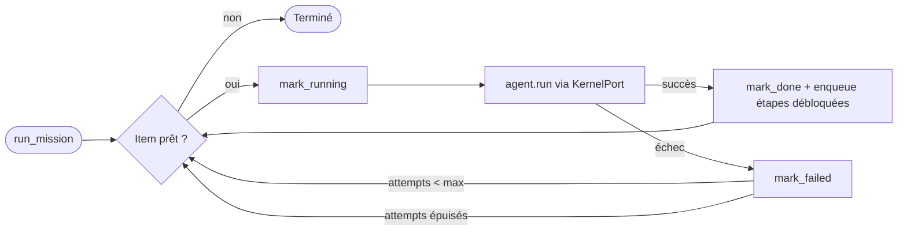

# Guide du Coordinateur (Sprint 11)

## Rôle

`CoordinatorEngine` découpe le travail (`Planner`), attribue chaque
sous-tâche (`DelegationEngine`), suit la progression
(`WorkQueuePort`), relance un agent en échec (politique de retry de la
file), agrège les résultats et produit la synthèse. **Le Coordinateur
ne réalise aucune analyse lui-même** — `_build_synthesis` concatène
uniquement ce que les agents ont produit, sans jamais appeler
`TMISKernel`.

## Planner : décomposition en sous-tâches

`Planner.decompose(domain, case_type)` lit
`tmis.ai_team.capabilities.mission_templates` (voir
docs/54-guide-creation-equipe.md) et construit une chaîne linéaire de
`SubTask`, chacune dépendant de la précédente. Si le domaine appelle un
expert, une étape `RISK_ANALYSIS` est **greffée** juste après la
dernière étape de recherche — `_splice_after` réinsère le chaînon dans
la chaîne de dépendances plutôt que de le laisser en dehors du graphe.

## Delegation : résoudre un rôle en agent

`DelegationEngine.assign_agent(mission_id, sub_task, team)` cherche,
parmi les membres de l'équipe, celui dont le rôle correspond à
`sub_task.assigned_role`. Aucune correspondance → `None`, journalisé
dans `DelegationRecord` (append-only, consultable par mission).

## Work Queue : suivi de progression

`WorkQueuePort` (voir `tmis.ai_team.work_queue`) : priorité, annulation,
reprise, retry, timeout. `dequeue_next()` ne *mute* jamais l'état d'un
item — chaque transition (`mark_running`/`mark_done`/`mark_failed`)
est un appel explicite du Coordinateur, ce qui rend la progression
traçable sans ambiguïté, y compris pendant les retries.

**Point d'implémentation important** : le Coordinateur ne délègue
jamais la sélection du prochain item à `WorkQueuePort.dequeue_next()`
directement — cette méthode scanne *toute* la file, alors qu'une file
est généralement partagée par plusieurs missions concurrentes.
`CoordinatorEngine._next_runnable_item` sélectionne uniquement parmi
les items appartenant à la mission courante.

## Boucle d'exécution



Une mission se termine `COMPLETED` seulement si **toutes** les
sous-tâches ont un résultat ; sinon `FAILED` — jamais un état
intermédiaire silencieux.

## Human in the Loop

`HumanLoopEngine` enregistre chaque décision humaine
(`approve`, `request_new_analysis`, `exclude_agent`, `add_agent`,
`modify_plan`, `rerun_steps`) dans un historique append-only.
`CoordinatorEngine.apply_human_decision` transforme cette intention en
effet réel :

- `exclude_agent`/`add_agent` mutent `Team.member_agent_ids` ;
- `request_new_analysis`/`rerun_steps` effacent le résultat de la/les
  sous-tâche(s) visée(s) et la/les réenfilent — un nouveau
  `WorkItem` est créé, l'ancien reste dans l'historique de la file ;
- `approve`/`modify_plan` ne déclenchent aucune mutation structurelle
  ce sprint (extension naturelle du Sprint 12).

## Métriques et évaluation

`MetricsCollector` enregistre, pour chaque exécution d'agent : durée,
coût, score de qualité déclaré. `Evaluator.evaluate_mission` combine
qualité moyenne, taux de consensus et nombre de révisions en un score
de mission unique (`MissionEvaluation`).

## API REST

```
POST /api/v1/ai-team/missions                          { firm_id, request_description, team_id, case_type }
POST /api/v1/ai-team/missions/{id}/run
GET  /api/v1/ai-team/missions/{id}
GET  /api/v1/ai-team/missions/{id}/results
GET  /api/v1/ai-team/missions/{id}/metrics
POST /api/v1/ai-team/missions/{id}/human-decisions      { actor_id, decision_type, ... }
GET  /api/v1/ai-team/dashboard
```

## Observabilité

Voir docs/58-architecture-ai-team-platform.md — chaque délégation,
démarrage/fin d'agent et décision humaine émet un log structuré et
alimente `tmis.platform.metrics.MetricsRegistry`.
