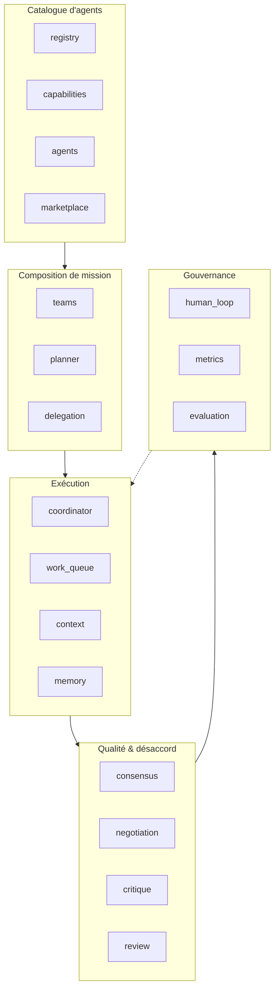
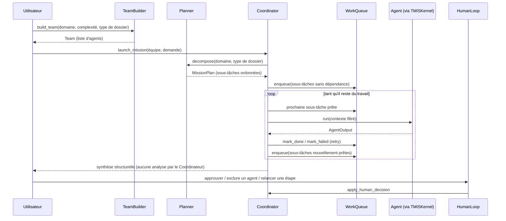

# Architecture AI Team Platform (Sprint 11)

## Rôle de la couche

`backend/src/tmis/ai_team/` transforme TMIS d'un assistant unique en une
**équipe d'agents spécialisés** capables de collaborer sur un même
dossier. L'utilisateur choisit une équipe prédéfinie ou laisse TMIS en
composer une automatiquement ; un Coordinateur découpe le travail,
délègue chaque sous-tâche à l'agent compétent, suit sa progression, et
agrège les résultats en une synthèse. **Toutes les productions restent
des brouillons soumis à validation humaine** — aucune ne franchit le
statut de proposition.

## Les 18 modules

## Cycle de vie d'une mission

## Composition automatique d'une équipe

`tmis.ai_team.capabilities.mission_templates` est la **source de
vérité unique** partagée par `TeamBuilder` (quels agents inclure) et
`Planner` (à quel agent assigner chaque sous-tâche). Les deux lisaient
initialement des tables séparées — un déséquilibre a été détecté
pendant le développement (une équipe "standard_analysis" ne contenait
pas d'agent Expert Jurisprudence alors que le plan par défaut en
demandait un), corrigé en unifiant la source. Un test de non-régression
dédié (`test_every_predefined_case_type_produces_a_team_matching_planner_roles`)
garantit que ce déséquilibre ne peut plus se reproduire.

## Aucun accès direct à un fournisseur LLM

Chaque agent implémente `TeamAgentPort` et ne dépend que de
`KernelPort` — une interface étroite (`async def complete(prompt) -> str`)
satisfaite en production par `KernelAgentAdapter`, seul fichier du
module à importer `TMISKernel` directement. Un agent de test peut donc
être substitué sans jamais toucher `TMISKernel` ni un fournisseur.

## Contexte partagé et mémoire

`ContextEngine` ne transmet à chaque agent que les clés de contexte
pertinentes à son rôle (table `_RELEVANT_KEY_PREFIXES`), limitant la
consommation de tokens, et conserve une trace complète
(`ContextTraceEntry`) de ce qui a été transmis à qui, pour chaque
mission. `AgentMemoryPort` sépare mémoire courte (bornée, par mission)
et mémoire longue (non bornée, taguée), avec une architecture prête à
évoluer vers une persistance réelle.

## Observabilité

Chaque délégation, démarrage/fin d'agent et décision humaine émet un
log structuré (`structlog`, corrélé par `trace_id` — Sprint 10) et
alimente `tmis.platform.metrics.MetricsRegistry` (compteurs
`ai_team_agent_runs_total`, `ai_team_coordinator_decisions_total`,
histogramme `ai_team_agent_run_duration_seconds`) — exposés sur
`/platform/metrics` aux côtés de toutes les autres métriques TMIS.
`GET /ai-team/dashboard` offre en complément une vue curatée
cross-mission (voir docs/55-guide-coordinateur.md).

## Ce que ce sprint ne fait pas

- Aucune négociation multi-tours réellement adversariale entre agents
  (`NegotiationEngine` enregistre les positions divergentes et le
  désaccord persistant, mais ne relance pas encore un dialogue vivant
  entre agents — voir le rapport de dette technique).
- Aucun agent marketplace tiers réel n'est publié — seule
  l'architecture de découverte/versionnement/dépendances/activation
  par abonnement existe.
- Aucune mémoire persistante entre redémarrages de processus.
