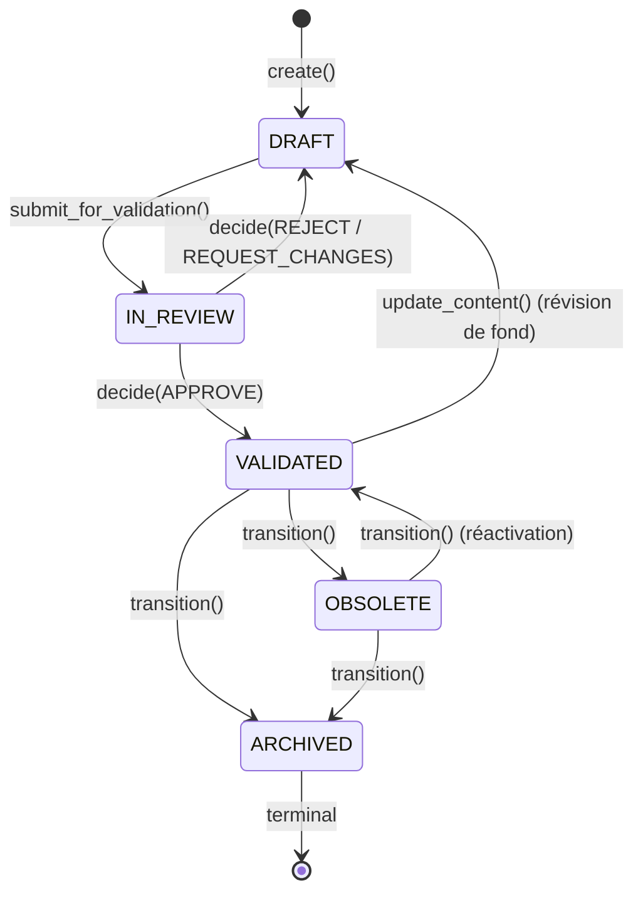
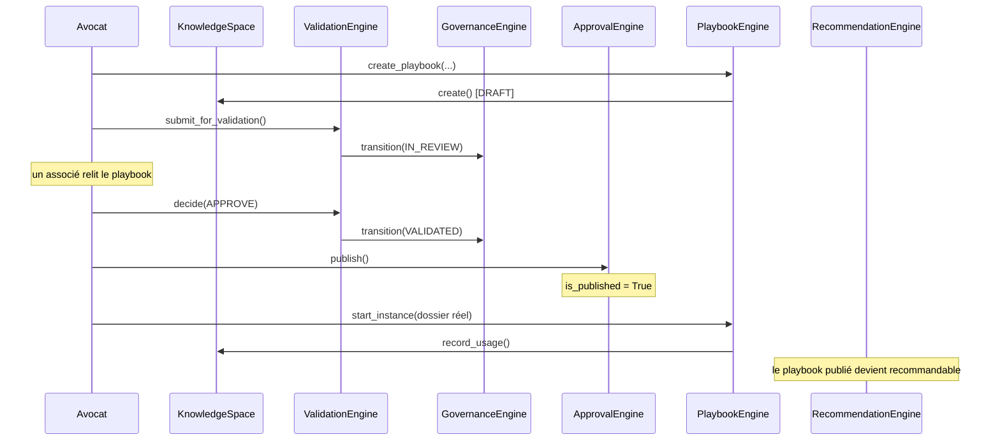

# Architecture — Cabinet Knowledge Engine (Sprint 12)

## Objectif

Le Cabinet Knowledge Engine (`tmis.cabinet_knowledge`) permet à TMIS
d'apprendre progressivement du fonctionnement de chaque cabinet —
doctrine interne, modèles, stratégies, clauses, habitudes de
rédaction, méthodes de classement, règles métier — et de transformer
ces connaissances implicites en une base structurée, exploitable par
les agents IA (`tmis.ai_team`, Sprint 11) **sans jamais** modifier une
connaissance sans validation humaine explicite.

## Les 18 sous-modules + la couche API

```
backend/src/tmis/cabinet_knowledge/
├── knowledge/            # KnowledgeObject générique + KnowledgeSpace (le socle partagé)
├── ontology/              # graphe de relations entre connaissances
├── taxonomy/              # arbre de classification par domaine juridique
├── playbooks/             # Playbook Engine + instances suivies par dossier
├── templates/              # modèles de documents propres au cabinet
├── clauses/                # bibliothèque de clauses + recherche avancée
├── reasoning_patterns/     # schémas de raisonnement réutilisables
├── writing_style/          # style rédactionnel du cabinet
├── best_practices/         # bonnes pratiques
├── lessons_learned/        # retours d'expérience
├── feedback/                # Feedback Engine (accepter/modifier/rejeter/annoter/expliquer)
├── validation/              # workflow humain draft → in_review → validated
├── governance/              # machine à états + audit trail
├── lineage/                 # traçabilité (origine, versions, validations)
├── approval/                 # publication (VALIDATED → visible des agents)
├── quality/                   # score de qualité (fraîcheur, complétude, usage, validation, cohérence)
├── search/                     # recherche avancée cross-type
├── recommendations/            # recommandations explicables
├── evaluation/                  # statistiques agrégées par cabinet
└── api/                          # 25 endpoints REST
```

Chaque sous-module respecte le même patron que tous les sprints
précédents : `schemas.py` → `ports.py` (quand une persistance dédiée
est nécessaire) → implémentation(s) → composition dans
`cabinet_knowledge/bootstrap.py`.

## Décision structurante : un modèle générique, pas 12 tables

Le sprint demande un `KNOWLEDGE OBJECT` "extensible". Plutôt que de
donner à chaque type de connaissance (playbook, clause, template,
pattern de raisonnement, bonne pratique, retour d'expérience...) son
propre agrégat et son propre store, `tmis.cabinet_knowledge.knowledge`
définit **un seul** agrégat, `KnowledgeObject` (id, firm_id, type,
titre, `content: dict` libre, auteur, version, statut, score qualité,
tags, publication, compteur d'usage), et **un seul** store,
`InMemoryKnowledgeStore`.

Chaque sous-module spécialisé (`playbooks`, `clauses`, `templates`,
`reasoning_patterns`, `writing_style`, `best_practices`,
`lessons_learned`) ajoute :

- un type de vue fortement typé (`Playbook`, `Clause`, ...) ;
- des fonctions de sérialisation `xxx_to_content()` /
  `xxx_from_knowledge_object()` ;
- de la logique métier réelle par-dessus le socle commun (par exemple
  `PlaybookEngine.start_instance()` + suivi de checklist, ou
  `ClauseEngine.search()` avec filtrage domaine/type/mot-clé) —
  jamais du simple CRUD dupliqué sept fois.

Toute la mécanique de versionnement, de gouvernance, d'isolation par
cabinet et de traçabilité est donc écrite **une fois**, dans
`knowledge/`, `governance/`, `validation/` et `lineage/`, et héritée
par les sept types de connaissance.

## Décision structurante : la validation humaine est architecturalement obligatoire

Rien dans `KnowledgeSpace.create()` ne permet de créer un objet
au-delà du statut `DRAFT`. Le seul chemin vers `VALIDATED` passe par
`tmis.cabinet_knowledge.validation.ValidationEngine.decide(APPROVE,
...)`, appelé par un humain (`reviewer`). Toute modification
substantielle de contenu (`KnowledgeSpace.update_content`) — y
compris une révision issue d'un retour utilisateur
(`FeedbackEngine.apply_feedback_as_revision`) — repasse
automatiquement l'objet en `DRAFT`, jamais en conservant silencieusement
un statut `VALIDATED` obsolète. C'est la traduction directe de la
contrainte du sprint : *"Aucune connaissance ne peut être ajoutée
automatiquement sans validation humaine."*

La publication (`approval/`) est une décision humaine **distincte** de
la validation (`validation/`) : un objet `VALIDATED` n'est visible des
agents (`search`/`recommendations`, filtre `published_only`) qu'après
un appel explicite à `ApprovalEngine.publish()`.

## Isolation stricte par cabinet

Chaque `KnowledgeObject` porte un `firm_id`. `KnowledgeSpace` est
l'unique point d'accès au store — comme le `KernelPort` du Sprint 11
est l'unique point d'accès au fournisseur LLM — et réutilise le
mécanisme `tmis.platform.security.tenant_isolation`
(`TenantContext`/`require_same_firm`, Sprint 10) : une tentative de
lecture d'un objet appartenant à un autre cabinet lève
`TenantAccessError` plutôt que de retourner silencieusement `None`.
Toutes les listes (`list_for_firm`) sont scopées dès la requête.
Vérifié par un test d'intégration dédié
(`test_tenant_isolation_across_two_firms`).

## Le cycle de vie d'une connaissance



`publish()`/`is_published` n'apparaît pas dans ce diagramme d'états
délibérément — c'est un attribut orthogonal (visibilité), pas un
statut de gouvernance ; il repasse automatiquement à `False` dès que
l'objet quitte `VALIDATED` (voir `KnowledgeSpace.set_status`).

## Le pipeline complet (playbook, exemple type du sprint)



## Réutilisation explicite des sprints précédents

- `tmis.platform.security.tenant_isolation` (Sprint 10) — isolation
  multi-cabinet.
- `tmis.platform.metrics`/`structlog` (Sprint 10) — observabilité
  (voir ci-dessous).
- `tmis.legal_drafting.templates.schemas.DocumentType` (Sprint 7) —
  `templates/` référence les 9 types de documents existants plutôt que
  de les redéfinir.
- `tmis.cabinet_os.subscriptions.schemas.PlanTier` n'est **pas**
  réutilisé ici (contrairement au marketplace du Sprint 11) : le
  Cabinet Knowledge Engine n'a pas de dimension commerciale ce sprint.

## Ce que ce sprint ne fait pas (dette assumée)

- `reasoning_patterns/` ne branche **pas** ses patterns validés dans
  `tmis.legal_reasoning.ReasoningOrchestrator` (Sprint 6) — la
  bibliothèque existe et est interrogeable, mais son injection réelle
  dans un raisonnement est un point d'intégration futur documenté dans
  le rapport d'axes d'amélioration.
- `writing_style.apply_style()` est une transformation déterministe
  (ajout de la signature validée), pas une réécriture par un modèle —
  adapter la voix d'un agent au style du cabinet reste un sujet Legal
  Drafting Studio (Sprint 7) pour un sprint futur.
- Le stockage reste en mémoire (`InMemoryKnowledgeStore` et
  consorts), aligné sur le calendrier de persistance générale de TMIS
  (Sprint 14, Module Document).

## Observabilité

`structlog` journalise chaque enrichissement
(`cabinet_knowledge.enriched`), validation (`cabinet_knowledge.validated`),
réutilisation (`cabinet_knowledge.reused`), recherche
(`cabinet_knowledge.searched`) et recommandation
(`cabinet_knowledge.recommended`). Les mêmes événements alimentent des
compteurs Prometheus via `tmis.platform.metrics`
(`cabinet_knowledge_enrichments_total`,
`cabinet_knowledge_validations_total`,
`cabinet_knowledge_reuse_total`, `cabinet_knowledge_searches_total`,
`cabinet_knowledge_recommendations_total`), visibles sur
`/platform/metrics` aux côtés des métriques des sprints précédents.

## API

25 endpoints REST sous `/api/v1/cabinet-knowledge/`, documentés
automatiquement par OpenAPI (`/docs`). Voir docs/60-63 pour le détail
par domaine fonctionnel.
