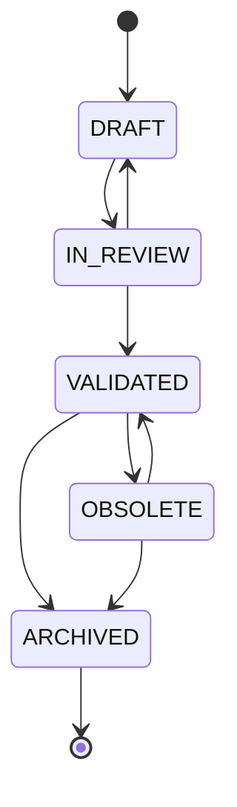

# Guide de la Gouvernance (Sprint 12)

## Rôle

`tmis.cabinet_knowledge.governance` est la machine à états qui
protège une connaissance contre toute promotion silencieuse : brouillon
→ en révision → validé → obsolète → archivé, avec un historique complet
de chaque transition (`GovernanceEvent` : de quel statut, vers quel
statut, par qui, pourquoi, quand).

## Les transitions autorisées



Toute autre transition (par exemple `DRAFT → VALIDATED` directement)
lève `InvalidTransitionError` — `ARCHIVED` est terminal.

```python
governance = get_governance_engine()
governance.transition(firm_id, object_id, KnowledgeStatus.IN_REVIEW, actor="avocat1")
governance.history(firm_id, object_id)   # tuple de GovernanceEvent, dans l'ordre
```

## Validation humaine : `governance` n'agit jamais seul

`GovernanceEngine` sait *appliquer* une transition, mais ne décide
jamais *quand* transitionner vers `VALIDATED` — c'est le rôle de
`tmis.cabinet_knowledge.validation.ValidationEngine`, qui encapsule le
workflow humain complet :

```python
validation = get_validation_engine()

# 1. Un juriste soumet — l'objet passe en IN_REVIEW
request = validation.submit_for_validation(firm_id, object_id, requested_by="avocat1")

# 2. Un humain décide — jamais automatique
validation.decide(firm_id, request.id, ValidationDecision.APPROVE, reviewer="associe1")
# ou REJECT / REQUEST_CHANGES → l'objet retourne en DRAFT
```

C'est le mécanisme qui garantit la contrainte du sprint : *"Aucune
connaissance ne peut être ajoutée automatiquement sans validation
humaine."* — aucune fonction de `cabinet_knowledge` n'atteint
`VALIDATED` autrement qu'en passant par `decide(APPROVE)`.

## Publication : une décision distincte de la validation

Un objet `VALIDATED` n'est pas automatiquement visible des agents.
`tmis.cabinet_knowledge.approval.ApprovalEngine.publish()` est un
second geste humain explicite, qui bascule `is_published` à `True` et
enregistre un `ApprovalRecord` distinct. Toute transition qui fait
sortir un objet de `VALIDATED` (vers `OBSOLETE` ou `ARCHIVED`)
dépublie automatiquement l'objet (`KnowledgeSpace.set_status`) — une
connaissance obsolète ne reste jamais visible par erreur.

## Traçabilité (lineage)

`tmis.cabinet_knowledge.lineage.LineageEngine.explain(firm_id, id)`
assemble en une seule réponse :

- l'origine de la connaissance (`LineageRecord.source_refs` —
  documents/dossiers à l'origine de l'enrichissement) ;
- l'historique complet des transitions de gouvernance ;
- la version actuelle.

C'est la réponse directe à l'exigence du sprint : *"chaque
connaissance doit pouvoir expliquer : son origine ; les documents
utilisés ; les validations ; les révisions ; les versions."*

## Retours utilisateur et révision

`tmis.cabinet_knowledge.feedback.FeedbackEngine` enregistre les
retours (`ACCEPT`/`MODIFY`/`REJECT`/`ANNOTATE`/`EXPLAIN`) sans jamais
muter la connaissance directement. Un retour `MODIFY` peut être
transformé en révision réelle via `apply_feedback_as_revision()`, qui
met à jour le contenu (l'objet redescend en `DRAFT` puis `IN_REVIEW`)
et **soumet immédiatement une nouvelle demande de validation** — la
boucle « retour → révision → validation » ne court-circuite jamais
l'humain.

## API

| Endpoint | Rôle |
|---|---|
| `POST /cabinet-knowledge/objects/{id}/submit-for-validation` | DRAFT → IN_REVIEW |
| `GET /cabinet-knowledge/validation-requests` | demandes en attente |
| `POST /cabinet-knowledge/validation-requests/{id}/decide` | approve / reject / request_changes |
| `POST /cabinet-knowledge/objects/{id}/publish` | VALIDATED → visible des agents |
| `GET /cabinet-knowledge/objects/{id}/history` | historique de gouvernance |
| `GET /cabinet-knowledge/objects/{id}/lineage` | explication complète |
| `POST /cabinet-knowledge/feedback` | retour utilisateur |
