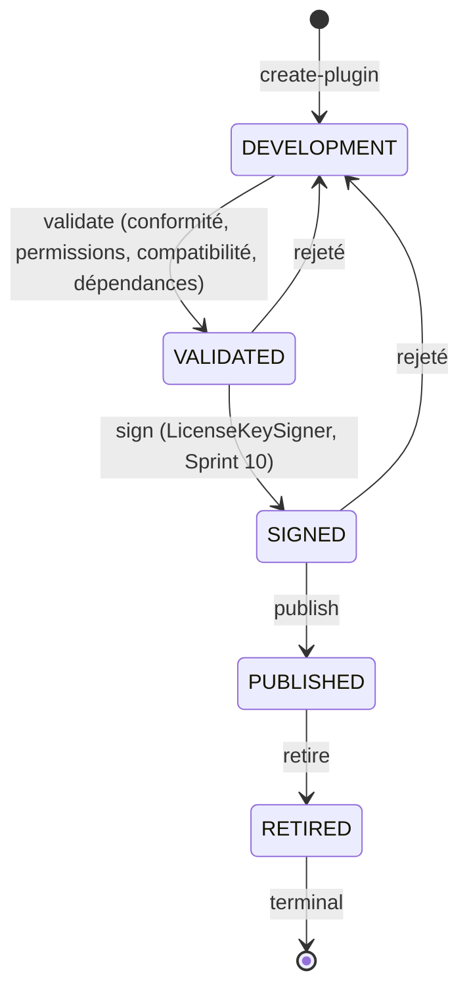
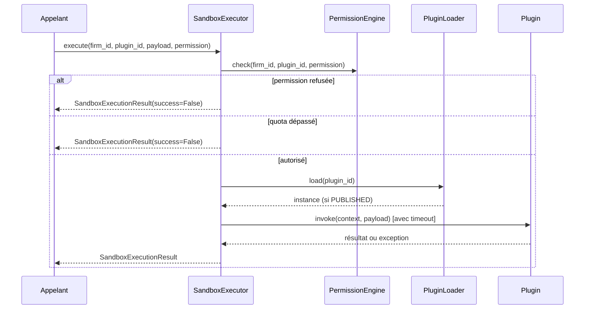

# Architecture — TMIS Platform SDK & Marketplace (Sprint 13)

## Objectif

À partir de ce sprint, TMIS devient une plateforme extensible : des
développeurs, intégrateurs et cabinets peuvent créer leurs propres
agents IA, connecteurs, workflows, modèles documentaires, plugins et
outils métiers — sans jamais modifier le code source principal de
TMIS — au travers d'API publiques et d'interfaces stables
(`tmis.platform_sdk`).

## Les 19 sous-modules + la couche API

```
backend/src/tmis/platform_sdk/
├── sdk/                 # PluginContext + le contrat PluginPort commun à tout plugin
├── plugin_system/         # PluginManifest (identité déclarative) + PublishingStatus
├── plugin_registry/         # catalogue global des manifestes
├── plugin_loader/             # résolution sûre d'une implémentation (jamais eval/exec)
├── sandbox/                     # exécution isolée : permissions, quotas, timeout, journalisation
├── permissions/                    # ExtensionPermission (vocabulaire fermé) + PermissionEngine
├── marketplace/                       # catalogue, recherche, catégories, avis
├── extensions/                           # instances installées par cabinet
├── agent_sdk/                               # BaseAgentPlugin (réutilise KernelPort, Sprint 11)
├── connector_sdk/                              # BaseConnectorPlugin (auth/pagination/cache/erreurs)
├── workflow_sdk/                                  # workflows déclaratifs (jamais de code exécuté)
├── document_sdk/                                     # BaseDocumentTemplatePlugin
├── events_sdk/                                          # PlatformEventBus (propre, sans import croisé)
├── api_sdk/                                                # client officiel (Python, architecture multi-langage)
├── cli/                                                       # créer/valider/empaqueter/publier/installer
├── developer_portal/                                             # catalogue de guides/tutoriels/exemples
├── examples/                                                        # 5 plugins de démonstration
├── templates/                                                          # gabarits de scaffold
├── validation/                                                            # conformité, signature (réutilise Sprint 10)
├── publishing/                                                               # cycle de vie historisé
└── api/                                                                         # 14 endpoints REST
```

Chaque sous-module suit le même patron que les sprints précédents :
`schemas.py` → `ports.py` (si persistance dédiée) → implémentation(s)
→ composition dans `platform_sdk/bootstrap.py`.

## Décision structurante : aucune exécution dynamique de code

Le sprint demande un "sandbox" et un "plugin loader". TMIS **ne
supporte délibérément pas** le chargement dynamique de code non
fiable (pas d'`eval`/`exec`, pas d'import dynamique depuis une chaîne
ou un fichier uploadé) :

- `plugin_loader.PluginImplementationRegistry` n'accepte que des
  classes déjà importées par un import Python ordinaire (voir
  `tmis.platform_sdk.examples.registration` — les cinq plugins
  d'exemple s'enregistrent eux-mêmes au démarrage du processus).
- `workflow_sdk` va plus loin : un workflow est entièrement **de la
  donnée** (étapes, conditions, actions nommées) — `WorkflowCondition`
  n'est jamais une chaîne de code évaluée, seulement un triplet
  `(champ, opérateur, valeur)` interprété par un `match` fermé sur un
  nombre fixe d'opérateurs (`evaluate()`), et les actions sont
  résolues par nom dans un `WorkflowActionRegistry` fermé, jamais
  exécutées depuis une chaîne.

Un vrai isolement de code tiers (conteneur/VM par plugin) est un sujet
de déploiement (Kubernetes, Sprint 10), hors du périmètre d'un
interpréteur Python qui exécute aussi le reste de TMIS dans le même
processus. Le "sandbox" de ce sprint est donc **logique** : contrôle
des permissions, quota d'appels, timeout d'exécution et journalisation
systématique autour de tout appel à un plugin — pas une isolation
système.

## Décision structurante : un contrat uniforme, cinq SDK spécialisés

`tmis.platform_sdk.sdk.ports.PluginPort` est le seul contrat que
`sandbox`/`plugin_loader` connaissent : `id`, `plugin_type`, et une
unique méthode `async invoke(context, payload) -> dict`. Chaque
`*_sdk` (agent, connector, workflow, document) fournit une classe de
base ergonomique pour son type — avec une méthode métier claire à
implémenter (`run()`, `fetch_page()`, `render_section()`...) — et
adapte cette méthode métier vers `invoke()`. Le sandbox n'a donc
jamais besoin de savoir de quel type de plugin il s'agit.

## Cycle de vie d'un plugin



"Installation"/"mise à jour"/"désinstallation" ne sont **pas** des
statuts de ce diagramme : un manifeste publié est une entrée unique du
catalogue, mais peut être installé par de nombreux cabinets
indépendamment. C'est `tmis.platform_sdk.extensions.ExtensionInstance`
qui porte ce second cycle de vie, scopé par `firm_id` — même
séparation « objet global versus instance par tenant » que
`tmis.cabinet_knowledge.playbooks.Playbook`/`PlaybookInstance` au
Sprint 12.

## Exécution d'un plugin dans le sandbox



Chaque appel — accepté ou refusé — est journalisé (`structlog`) et
compté (`tmis.platform.metrics`, Sprint 10) : voir la section
observabilité ci-dessous.

## Réutilisation explicite des sprints précédents

- `tmis.platform.licensing.signing.LicenseKeySigner` (Sprint 10) —
  signature/vérification des manifestes de plugin, sans construire un
  second schéma HMAC.
- `tmis.ai_team.agents.ports.KernelPort` (Sprint 11) — `agent_sdk`
  donne accès au Kernel IA exactement par le même port étroit que les
  agents de `tmis.ai_team`, jamais par un import direct d'un
  fournisseur.
- `tmis.ai.cache.ports.CachePort`/`InMemoryCache` (Sprint 2) —
  `connector_sdk` réutilise l'abstraction de cache existante plutôt
  que d'en construire une nouvelle.
- `tmis.legal_drafting.templates.schemas.DocumentType` (Sprint 7) —
  `document_sdk` référence les neuf types de documents existants.
- `tmis.platform.security.tenant_isolation` (Sprint 10) — convention
  `firm_id` reprise par `extensions`.
- Le bus d'événements est **volontairement indépendant** : suit la
  même convention que `tmis.collaboration.CollaborationEventBus`
  (Sprint 8) — chaque contexte borné a son propre
  `Event`/`EventBus`, zéro import croisé.

## Observabilité

`structlog` journalise chaque transition de publication
(`platform_sdk.publishing_transition`), installation
(`platform_sdk.extension_installed`), désinstallation
(`platform_sdk.extension_uninstalled`) et exécution en sandbox
(`platform_sdk.sandbox_execution`, avec succès/erreur/durée). Les
mêmes évènements alimentent des métriques Prometheus via
`tmis.platform.metrics` : `platform_sdk_installs_total`,
`platform_sdk_uninstalls_total`,
`platform_sdk_sandbox_executions_total{plugin_id,status}`,
`platform_sdk_sandbox_duration_seconds{plugin_id}` — visibles sur
`/platform/metrics` aux côtés des métriques des sprints précédents.

## Ce que ce sprint ne fait pas (dette assumée)

- Pas d'isolation système réelle (conteneur/VM par plugin) — voir
  "Décision structurante" ci-dessus.
- Un seul manifeste par plugin (version bumpée en place, comme
  `tmis.cabinet_knowledge.knowledge.KnowledgeObject`) plutôt qu'un
  stockage multi-versions — "mettre à jour" une installation resynchronise
  vers la version courante du manifeste.
- `api_sdk` ne fournit qu'un client Python de référence — l'architecture
  (un seul `HttpTransportPort` à implémenter) est prête pour un client
  TypeScript, non livré ce sprint.
- Aucune interface utilisateur Marketplace — uniquement le backend et
  l'API REST, conformément à l'énoncé du sprint.

## API

14 endpoints REST sous `/api/v1/platform-sdk/`, documentés
automatiquement par OpenAPI (`/docs`). Voir docs/72-reference-api-
platform-sdk.md pour le détail.
