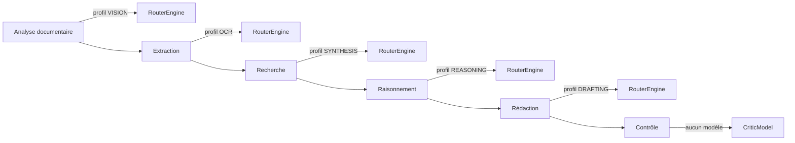
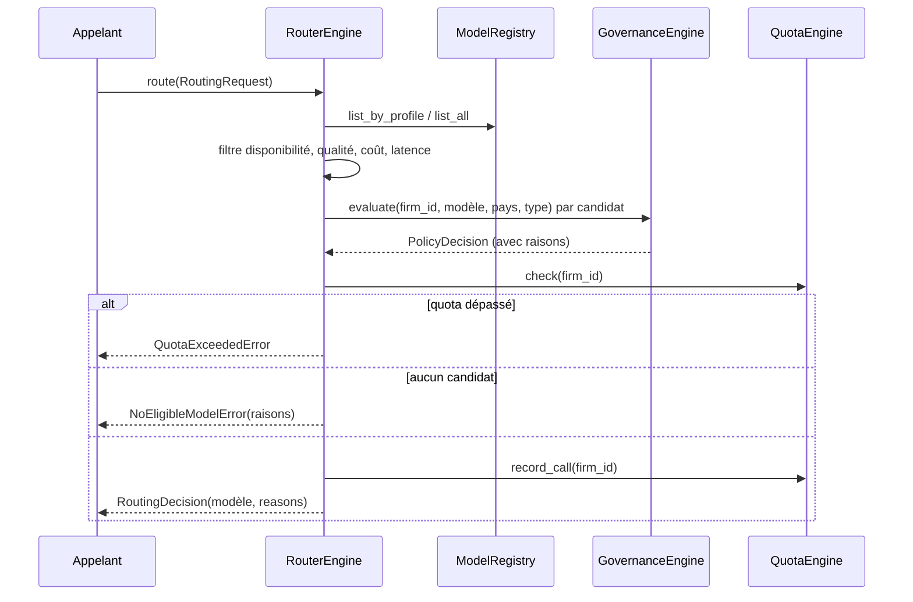

# Architecture — AI Intelligence Fabric (Sprint 14)

## Objectif

Avant ce sprint, chaque contexte métier (`case_intelligence`,
`legal_drafting`, `legal_reasoning`...) qui a besoin d'un modèle d'IA
appelle `tmis.ai.kernel.TMISKernel`, qui lui-même retombe toujours sur
`config.default_provider` — aucune logique de choix. L'**AI
Intelligence Fabric** (`tmis.ai_fabric`) introduit la couche
d'orchestration qui manquait : sélectionner, combiner, superviser et
évaluer plusieurs modèles pour le meilleur compromis qualité/coût/
vitesse/fiabilité, avec des décisions **explicables**.

## Les 26 sous-modules + la couche API

```
backend/src/tmis/ai_fabric/
├── capabilities/       # Capability (technique : OCR, VISION, STREAMING...)
├── model_profiles/       # ModelProfile (sémantique : REASONING, DRAFTING...)
├── model_registry/         # ModelDescriptor (coût, latence, scores) + catalogue seedé
├── provider_registry/        # ré-export de tmis.ai.providers.registry (Sprint 2)
├── policies/                   # Policy (interdiction, Enterprise, pays, type de données)
├── governance/                    # évalue les policies, historise chaque décision
├── quotas/                          # garde-fou dur (bloque), distinct du cost_control alerte
├── token_manager/                     # tokens/coût/cache, sur CostTrackerEngine (Sprint 10)
├── cache/                                # cache de réponses, sur CachePort (Sprint 2)
├── prompt_optimizer/                        # adaptation par modèle, sur PromptRegistry (Sprint 2)
├── evaluation/                                 # métriques déterministes (cohérence, citations...)
├── critic/                                        # évalue seulement, ne génère jamais
├── comparison/                                       # classe plusieurs réponses au même prompt
├── consensus/                                           # synthèse argumentée, préserve les divergences
├── fusion/                                                 # assemble plusieurs réponses, préserve provenance
├── cost_optimizer/                                            # modèle le moins cher au niveau de qualité requis
├── latency_optimizer/                                            # parallélisme borné, timeout, plus rapide dispo
├── quality_optimizer/                                               # taux d'erreur, feedback, stabilité par modèle
├── fallback/                                                           # chaîne modèle principal → secours
├── retry/                                                                 # ré-essai avec backoff exponentiel
├── streaming/                                                              # interface de streaming uniforme
├── batch/                                                                     # exécution parallèle isolée par requête
├── benchmark/                                                                    # mesure qualité/coût/latence/hallucinations
├── telemetry/                                                                       # tableau de bord agrégé
├── router/                                                                             # sélection explicable du modèle
├── planner/                                                                              # décompose une tâche en sous-tâches
├── fabric.py                                                                                # façade unique AIIntelligenceFabric
└── api/                                                                                        # 20+ endpoints REST
```

Chaque sous-module suit le même patron que les sprints précédents :
`schemas.py` → `ports.py` (si persistance dédiée) → implémentation(s)
→ composition dans `ai_fabric/bootstrap.py`.

## Décision structurante : réutiliser le registre de fournisseurs, pas le dupliquer

`tmis.ai.providers.registry.ProviderRegistry` (Sprint 2) résout déjà
un `ProviderPort` (openai/anthropic/mistral/local) par clé de
configuration — c'est le seul chemin par lequel TMIS appelle un
fournisseur. `ai_fabric.provider_registry` le **ré-exporte tel quel**
(`FabricProviderRegistry = ProviderRegistry`) plutôt que de créer un
second registre concurrent. `ai_fabric.model_registry` ajoute
uniquement les métadonnées que le Sprint 2 n'avait pas : coût,
latence, scores de qualité/juridique/rédaction/recherche/raisonnement.

## Décision structurante : capacités techniques vs. profils sémantiques

`Capability` (`TEXT_COMPLETION`, `OCR`, `VISION`, `STREAMING`,
`FUNCTION_CALLING`, `LONG_CONTEXT`, `EMBEDDINGS`) décrit ce qu'un
modèle **peut faire mécaniquement**. `ModelProfile` (`REASONING`,
`DRAFTING`, `TRANSLATION`, `SYNTHESIS`, `CODE`, `OCR`, `VISION`,
`EMBEDDINGS`, `CLASSIFICATION`) décrit ce pour quoi il est **bon**. Ce
sont deux vocabulaires indépendants et composables : un modèle peut
supporter `STREAMING` sans être profilé `DRAFTING`, et l'inverse. Cette
séparation permet à chaque profil d'évoluer indépendamment d'un
modèle donné, comme l'exige explicitement l'énoncé du sprint.

## Décision structurante : policies vs. governance

Même séparation que `publishing`/`plugin_system` au Sprint 13 :
`policies/` ne fait que stocker des règles statiques (`Policy` :
modèle interdit, réservé Enterprise, restreint par pays, restreint par
type de données). `governance/` évalue ces règles pour un
`(firm_id, model_name, country, data_type)` donné et **historise**
chaque décision (`PolicyDecision`), y compris les décisions positives
("aucune politique restrictive applicable") — l'audit trail est
complet, pas seulement les refus.

## Décision structurante : quotas, garde-fou dur

`tmis.platform.cost_control.CostTrackerEngine.check_thresholds`
(Sprint 10) **alerte** sur un dépassement de coût sans jamais bloquer
un appel. `ai_fabric.quotas.QuotaEngine` est le garde-fou dur
correspondant : `check()` doit retourner `True` avant que le routeur
n'accepte de considérer un modèle — sinon `QuotaExceededError`. Les
deux mécanismes coexistent délibérément : l'un informe, l'autre bloque.

## Décision structurante : le Critic ne génère jamais

`tmis.ai_fabric.critic.CriticModel` est construit pour ne jamais
appeler un fournisseur ni produire de texte : il consomme les
métriques déterministes de `tmis.ai_fabric.evaluation.ResponseEvaluator`
(comptage de citations via expression régulière, détection de
contradictions par similarité de Jaccard entre phrases porteuses de
négation) et rend un verdict. `evaluation.jaccard_similarity` est
partagé par `comparison`, `consensus` et `fusion` — un seul calcul de
similarité de texte dans tout le module, pas quatre implémentations
indépendantes.

## Le pipeline du Planner

L'énoncé du sprint donne un exemple de pipeline explicite ; il est
implémenté tel quel dans `planner.DEFAULT_PIPELINE` :



La dernière étape ("Contrôle") ne route jamais vers un fournisseur :
elle est exécutée par `CriticModel`, qui "ne génère jamais, il évalue
uniquement" — elle n'a donc rien à router.

## Décision de routage explicable



`RoutingDecision.reasons` accumule une phrase par étape de filtrage
(nombre de candidats restants, exclusions de gouvernance nommées,
justification du modèle retenu) — c'est la trace d'explicabilité
exigée par le sprint, lisible telle quelle sans outillage
supplémentaire.

## Réutilisation explicite des sprints précédents

- `tmis.ai.providers.registry.ProviderRegistry` (Sprint 2) —
  `provider_registry` le ré-exporte au lieu de le dupliquer.
- `tmis.ai.prompts.registry.PromptRegistry` (Sprint 2) —
  `prompt_optimizer` s'appuie dessus pour le versionnage des prompts,
  comme l'exige l'énoncé ("les prompts restent versionnés dans le
  Prompt Registry").
- `tmis.ai.cache.ports.CachePort`/`InMemoryCache` (Sprint 2) — backend
  de `ai_fabric.cache.ResponseCache`.
- `tmis.platform.cost_control.CostTrackerEngine` (Sprint 10) —
  `token_manager` l'enveloppe pour le suivi coût/cache par
  cabinet/workflow plutôt que de réimplémenter la comptabilité.
- `tmis.platform.licensing.LicenseEngine.has_feature` (Sprint 10) —
  gate `ENTERPRISE_ONLY` dans `governance`, sans nouveau système de
  plans.
- `tmis.platform.performance.concurrency.bounded_gather` (Sprint 10) —
  parallélisme borné dans `latency_optimizer` et `batch`.

## Ce que ce sprint ne fait pas (dette assumée)

- Aucun appel réseau réel vers un fournisseur : `estimate_tokens` reste
  une heuristique de comptage de mots, cohérente avec les stubs de
  `tmis.ai.providers` (Sprint 2), qui ne font pas non plus de véritable
  appel HTTP.
- `benchmark.BenchmarkEngine` alimente `ModelDescriptor.quality_score`
  par moyenne mobile exponentielle simple (facteur fixe 0,3) — pas un
  modèle statistique de dérive.
- `telemetry.FabricTelemetry` calcule des économies implicitement
  (coût par modèle × appels) mais ne produit pas encore de comparaison
  formelle "coût réel vs. coût si toujours le modèle le plus cher".
- Pas d'interface utilisateur — uniquement le backend et l'API REST,
  documentés par OpenAPI.

## API

Voir docs/79-reference-api-ai-fabric.md pour le détail des endpoints
REST sous `/api/v1/ai-fabric/`.

## Guides associés

- docs/74-guide-ajout-provider.md
- docs/75-guide-ajout-modele.md
- docs/76-guide-router.md
- docs/77-guide-benchmark.md
- docs/78-guide-prompt-optimizer.md
