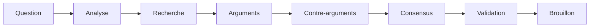
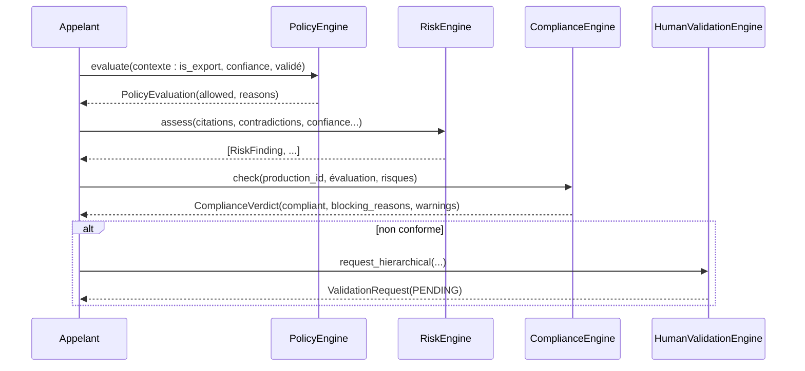

# Architecture — AI Governance & Explainability Platform (Sprint 15)

## Objectif

Chaque production de TMIS — un brouillon, une recommandation, une
synthèse — doit pouvoir répondre à neuf questions : pourquoi cette
réponse, quels faits, quelles sources, quels agents, quels modèles,
quelles hypothèses, quels risques, quel niveau de confiance, quelles
validations humaines. L'**AI Governance & Explainability Platform**
(`tmis.ai_governance`) est la couche transverse qui garantit que
toute production reste explicable, traçable, gouvernée et auditable
— un niveau de transparence attendu des cabinets d'avocats et des
environnements fortement réglementés.

## Les 18 sous-modules + la couche API

```
backend/src/tmis/ai_governance/
├── reasoning_chain/    # Question→Analyse→Recherche→Arguments→Contre-arguments→Consensus→Validation→Brouillon
├── decision_records/     # registre historisé des décisions (contexte, alternatives, justification)
├── confidence/              # score décomposé en 5 facteurs, toujours expliqué
├── risk_engine/                # risques classés par gravité (manque de sources, contradictions...)
├── explainability/                # résumé + étapes + agents + modèles + références + éléments ignorés
├── provenance/                       # chaque affirmation reliée à sa source (4 niveaux de granularité)
├── traceability/                        # utilisateur, dossier, modèles, prompts, validations, décisions
├── lineage/                                # origine + chaîne de révision d'une production
├── bias_detection/                            # détecteurs extensibles, alertes explicables
├── hallucination_detection/                       # alerte + recommandation, ne supprime jamais
├── policy_engine/                                    # politiques configurables par cabinet
├── human_validation/                                    # simple, multiple, hiérarchique, rejet, révision
├── audit/                                                  # journal spécialisé IA (prompts, coûts, décisions)
├── compliance/                                                # verdict combinant policy_engine + risk_engine
├── ethics/                                                       # dépistage déontologique, avis consultatif
├── quality/                                                         # score global de gouvernance (5 facteurs)
├── evaluation/                                                         # télémétrie interne de la plateforme
├── reporting/                                                             # 5 rapports, architecture extensible
├── overview.py                                                               # façade AIGovernancePlatform
├── events.py                                                                    # GovernanceEvent/EventBus dédié
└── api/                                                                            # 30+ endpoints REST
```

Chaque sous-module suit le même patron que les sprints précédents :
`schemas.py` → `ports.py` (si persistance dédiée) → implémentation(s)
→ composition dans `ai_governance/bootstrap.py`.

## Décision structurante : gouvernance de sortie, pas gouvernance de modèle

`tmis.ai_fabric.governance` (Sprint 14) décide **quel modèle** peut
être utilisé (interdit, réservé Enterprise, restreint par pays/type de
données) — une décision prise *avant* l'appel au modèle.
`tmis.ai_governance.policy_engine` gouverne **la production déjà
générée** : seuil de confiance minimal, validation obligatoire avant
export, citations obligatoires, relecture obligatoire pour certains
types de dossiers. Les deux `GovernanceEngine`/`PolicyEngine`
coexistent délibérément, comme `cabinet_knowledge.governance` avant
eux — même nom de rôle, portée différente, documentée explicitement
dans chaque docstring pour éviter toute ambiguïté.

## Décision structurante : entrées découplées plutôt que dépendances croisées

`confidence`, `quality` et `explainability` ne connaissent aucun autre
sous-module : ils reçoivent des facteurs déjà calculés
(`source_quality`, `provenance_completeness`...) en paramètres plutôt
que d'importer `provenance`/`risk_engine`/`human_validation`
directement. Cette convention — déjà utilisée par
`tmis.legal_reasoning.confidence` — garde chaque moteur testable en
isolation ; c'est la façade `AIGovernancePlatform` (`overview.py`) ou
l'appelant métier qui assemble les facteurs avant de les transmettre.

## Décision structurante : la façade compose ce qui est déjà persisté

`AIGovernancePlatform.overview(firm_id, production_id)` répond, en une
seule lecture, aux neuf questions de la Vision du sprint en composant
`reasoning_chain`, `provenance`, `traceability`, `decision_records`,
`human_validation`, `lineage` et `explainability` — tous des moteurs
qui persistent déjà leurs enregistrements. `confidence`, `risk_engine`,
`bias_detection`, `hallucination_detection` et `ethics` restent des
calculs à la demande (pas de store dédié) ; leurs résultats sont
transmis à `overview()` par l'appelant plutôt que recalculés à
l'intérieur de la façade — un choix documenté explicitement dans son
docstring.

## Le pipeline de la chaîne de raisonnement



`ReasoningChainEngine.record_step()` refuse tout enregistrement qui
reviendrait en arrière dans cet ordre canonique (`OutOfOrderStepError`)
— la chaîne enregistrée reste toujours une histoire cohérente,
"chaque étape doit être visualisable" comme l'exige le sprint
(`to_graph()` produit une vue graphe consultable directement).

## Le verdict de conformité avant export



`ComplianceEngine.check()` combine les motifs de refus du
`PolicyEvaluation` avec les risques `HIGH`/`CRITICAL` du `RiskEngine`
— les risques `LOW`/`MEDIUM` deviennent des avertissements non
bloquants. Une production non conforme n'est jamais "considérée comme
définitive", conformément à la contrainte du sprint.

## Décision structurante : validation hiérarchique, un mode inédit dans TMIS

`tmis.collaboration.approvals` (Sprint 8) ne connaît que `SINGLE`
(un seul approbateur suffit) et `MULTIPLE` (tous doivent approuver).
`tmis.ai_governance.human_validation` ajoute `HIERARCHICAL` : une
séquence ordonnée de niveaux (associé → partner → managing partner),
chaque niveau nécessitant au moins une approbation avant que le
niveau suivant ne soit considéré. Un rejet à n'importe quel niveau
fait basculer l'ensemble de la demande à `REJECTED`, comme dans
`collaboration.approvals`.

## Réutilisation explicite des sprints précédents

- `tmis.ai_fabric.evaluation.ResponseEvaluator`/`jaccard_similarity`
  (Sprint 14) — `hallucination_detection` s'appuie directement dessus
  pour le comptage de citations et la détection de contradictions,
  sans réimplémenter un troisième détecteur de cohérence de texte.
- `tmis.cabinet_knowledge.lineage.LineageEngine`/`LineageExplanation`
  (Sprint 12) — modèle direct pour `ai_governance.lineage`, adapté des
  objets de connaissance aux productions IA.
- `tmis.cabinet_knowledge.validation.ValidationEngine`,
  `tmis.collaboration.approvals.ApprovalEngine` et
  `tmis.ai_team.human_loop.HumanLoopEngine` — trois précédents étudiés
  pour concevoir `human_validation` ; le mode `MULTIPLE`/`SIMPLE` suit
  le patron de `collaboration.approvals`, `HIERARCHICAL` est une
  extension propre à ce sprint.
- `tmis.legal_reasoning.confidence.ConfidenceWeights`
  (facteurs pondérés, normalisables) — patron repris pour
  `GovernanceConfidenceWeights`, avec cinq facteurs différents.
- `tmis.legal_reasoning.decision_graph` — inspiration directe pour la
  vue graphe de `reasoning_chain.to_graph()`.

## Ce que ce sprint ne fait pas (dette assumée)

- `confidence`, `risk_engine`, `bias_detection`,
  `hallucination_detection` et `ethics` n'ont pas de store dédié —
  leurs résultats doivent être transmis explicitement à `overview()`
  par l'appelant (voir "Décision structurante" ci-dessus).
- `bias_detection` et `ethics` n'embarquent qu'un détecteur de
  démonstration chacun (généralisations discriminatoires,
  formulations de résultat garanti) — l'architecture est extensible
  (`register()`), mais l'enrichissement du catalogue de détecteurs est
  laissé aux sprints suivants.
- Pas d'interface utilisateur — uniquement le backend et l'API REST,
  documentés par OpenAPI.

## API

Voir docs/85-reference-api-ai-governance.md pour le détail des
endpoints REST sous `/api/v1/ai-governance/`.

## Guides associés

- docs/81-guide-politiques-gouvernance.md
- docs/82-guide-audit-ia.md
- docs/83-guide-explicabilite.md
- docs/84-guide-tracabilite.md
