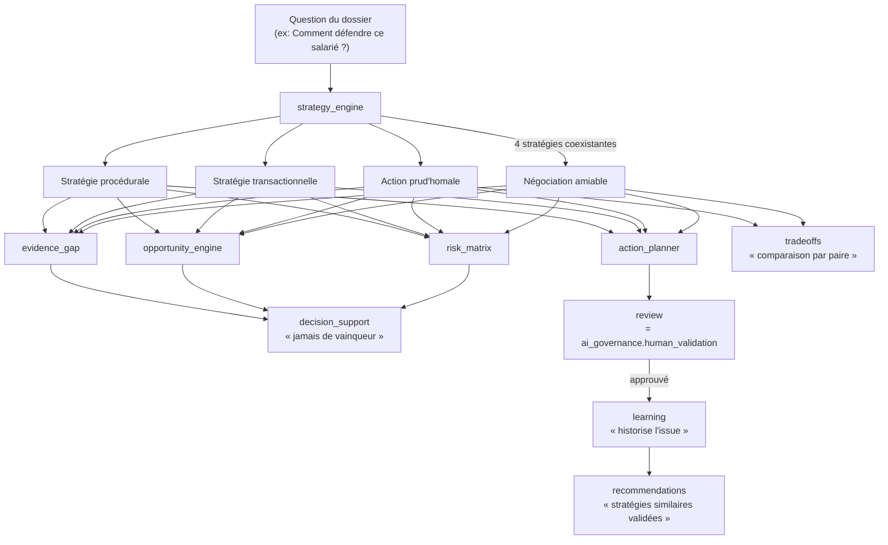

# Architecture — Strategic Litigation & Advisory Intelligence (Sprint 16)

## Objectif

Face à une question comme « Comment défendre ce salarié ? », le SLAI
(`tmis.strategic_intelligence`) génère plusieurs stratégies possibles
— négociation amiable, action prud'homale, stratégie transactionnelle,
stratégie procédurale — les compare, identifie leurs risques, leurs
éléments de preuve manquants et leurs prochaines actions pertinentes.
**Le SLAI ne rend jamais de décision juridique** : chaque proposition
reste une recommandation que l'avocat analyse et valide.

## Les 17 sous-modules + la couche API

```
backend/src/tmis/strategic_intelligence/
├── strategy_engine/       # génère plusieurs stratégies coexistantes, jamais exclusives
├── hypothesis_lab/           # create/compare/merge/invalidate/archive, historisé
├── scenario_builder/            # scénarios favorable/défavorable/intermédiaire, extensible
├── risk_matrix/                    # matrice de risques pondérée et configurable
├── opportunity_engine/                # arguments inexploités, documents complémentaires
├── evidence_gap/                         # éléments de preuve manquants, toujours justifiés
├── action_planner/                          # plan d'action entièrement modifiable par l'utilisateur
├── decision_support/                           # tableau comparatif, ne choisit jamais à la place de l'avocat
├── timeline/                                      # chronologie stratégique (faits + actions proposées)
├── probability/                                      # vraisemblance qualitative d'un sous-élément, jamais du procès
├── simulation/                                          # simulation structurelle, aucune prédiction judiciaire
├── tradeoffs/                                              # comparaison par paire, jamais de vainqueur désigné
├── playbooks/                                                 # adaptateur réutilisant cabinet_knowledge.playbooks
├── recommendations/                                              # cabinet_knowledge.recommendations + stratégies passées
├── review/                                                          # adaptateur réutilisant ai_governance.human_validation
├── learning/                                                           # historique des issues, taux d'acceptation
├── evaluation/                                                           # télémétrie interne du SLAI
├── overview.py                                                             # façade StrategicIntelligencePlatform
└── api/                                                                       # 24 endpoints REST
```

Chaque sous-module suit le même patron que les sprints précédents :
`schemas.py` → `ports.py` (si persistance dédiée) → implémentation(s)
→ composition dans `strategic_intelligence/bootstrap.py`.

## Vue d'ensemble du flux stratégique



## Décision structurante : `strategy_engine` n'est pas `legal_reasoning.strategy`

`tmis.legal_reasoning.strategy.HeuristicStrategyEngine` (Sprint 6)
produit une `StrategyOption` **par hypothèse** — une option tactique
locale. `tmis.strategic_intelligence.strategy_engine.StrategyEngine`
produit une `Strategy` **par approche globale** (négociation,
prud'homale, transactionnelle, procédurale), qui peut mobiliser
plusieurs hypothèses à la fois. Les deux portées sont volontairement
distinctes ; `strategy_engine` a été construit neuf plutôt que réutilisé,
tout en reprenant la convention de forme établie ailleurs dans le
projet — champs `tuple[str, ...]` en texte libre plutôt que des graphes
d'objets typés profonds, jamais de champ "gagnant".

## Décision structurante : aucune prédiction judiciaire

Deux contraintes explicites du sprint façonnent `probability/` et
`simulation/` :

- **`probability/`** ne produit jamais de probabilité de résultat de
  procès. `ProbabilityAssessment` porte une vraisemblance qualitative
  (`LOW`/`MEDIUM`/`HIGH`) sur un **sous-élément** d'une stratégie (par
  exemple la recevabilité d'un témoignage), jamais sur l'issue du
  dossier dans son ensemble.
- **`simulation/`** est purement structurel : `SimulationEngine.run()`
  ne fait que repérer, par correspondance de mots-clés, quelles
  stratégies référencent les éléments d'un changement hypothétique. Il
  ne lit et n'écrit jamais que des copies de texte fournies par
  l'appelant, ne mute aucune donnée réelle et ne produit aucun champ de
  score, probabilité ou issue — conformément à "aucune prédiction
  judiciaire ne doit être fournie dans ce sprint".

## Décision structurante : réutilisation explicite plutôt que réimplémentation

- **`playbooks/`** enveloppe directement
  `cabinet_knowledge.playbooks.PlaybookEngine` — aucun nouveau stockage.
- **`recommendations/`** compose directement
  `cabinet_knowledge.recommendations.RecommendationEngine.recommend()`
  comme source principale, complétée par les stratégies passées issues
  de `learning/`.
- **`review/`** enveloppe directement
  `ai_governance.human_validation.HumanValidationEngine` — pas de
  quatrième réimplémentation du patron d'approbation (après
  `cabinet_knowledge.validation`, `collaboration.approvals` et
  `ai_governance.human_validation`).

## Décision structurante : entrées découplées

`risk_matrix`, `opportunity_engine`, `evidence_gap`, `probability`,
`simulation`, `tradeoffs` et `decision_support` ne font aucun import
croisé vers `strategy_engine`, `hypothesis_lab` ou `case_intelligence`
— ils reçoivent des valeurs déjà calculées en paramètres. C'est
l'appelant métier (ou le futur script de démonstration) qui assemble
ces valeurs. Ce choix, déjà présent dans `ai_governance.confidence` et
`legal_reasoning.confidence`, garde chaque moteur testable isolément.

## Décision structurante : "jamais de vainqueur désigné"

`decision_support.StrategyComparison` et `tradeoffs.TradeoffAnalysis`
n'ont **aucun champ** `recommended`, `winner` ou `best_strategy_id` —
seulement des métriques côte à côte et un disclaimer explicite. C'est
une contrainte architecturale, pas seulement documentaire : les tests
`test_decision_support_never_ranks_or_recommends` et
`test_tradeoff_engine_never_declares_a_winner` vérifient l'absence de
ces attributs.

## Le facade `StrategicIntelligencePlatform`

Contrairement à `AIGovernancePlatform` (Sprint 15) qui compose sept
moteurs persistés autour d'un `production_id`, seuls quatre
sous-modules du SLAI persistent un état consultable par identifiant :
`hypothesis_lab`, `action_planner`, `review` et `learning`.
`StrategicIntelligencePlatform` les compose en deux lectures :
`case_overview(firm_id, case_id)` (hypothèses + historique
d'apprentissage) et `strategy_overview(firm_id, strategy_id)` (plan
d'action + statut de validation). Les autres sous-modules sont sans
état interne — ils prennent des entrées et retournent un résultat frais
à chaque appel, donc rien à consulter par identifiant.

## Vérification de non-régression

`ruff check src tests` et `mypy src` : aucune erreur sur 1170 fichiers
source (contre 1105 avant ce sprint). `pytest` : **1418 tests passés,
4 ignorés** (contre 1362 avant ce sprint) — 56 tests dédiés à
`strategic_intelligence` (46 unitaires + 10 d'intégration), couverture
globale du dépôt 95,95 %, sans qu'aucun des 1362 tests précédents
n'ait été modifié.

## Voir aussi

- docs/87-guide-strategy-engine-hypothesis-lab.md
- docs/88-guide-risk-scenario-opportunity.md
- docs/89-guide-probability-simulation.md
- docs/90-guide-reutilisation-playbooks-review.md
- docs/91-reference-api-strategic-intelligence.md
- docs/reports/sprint-16-rapport-architecture.md
- docs/reports/sprint-16-demo-strategies.md
