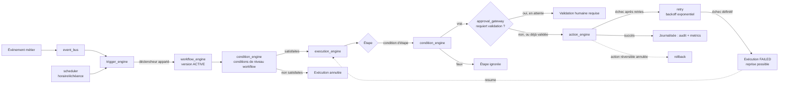

# Architecture — Autonomous Legal Workflow Platform (Sprint 17)

## Objectif

L'ALWP (`tmis.workflow_automation`) automatise les processus métier
d'un cabinet d'avocats grâce à des workflows intelligents, pilotés par
des événements : import de document → analyse automatique ; création
d'audience → checklist de préparation ; échéance qui approche →
tâches et notifications ; brouillon validé → circuit de signature.
**Le système ne remplace jamais l'avocat dans les décisions
juridiques** — il n'automatise que les tâches administratives,
documentaires, organisationnelles et les analyses préparatoires,
toujours gouvernées par des règles définies par le cabinet.

## Les 17 sous-modules + la couche API

```
backend/src/tmis/workflow_automation/
├── event_bus/          # WorkflowEvent/WorkflowEventBus dédié
├── trigger_engine/         # déclencheurs extensibles (7 types)
├── condition_engine/           # ET/OU/NON, comparateurs, dates, rôles, expressions nommées
├── rule_engine/                    # règles configurables sans code
├── action_engine/                     # registre d'actions extensible, toujours journalisé
├── approval_gateway/                     # validation humaine des actions critiques
├── workflow_engine/                         # Workflow versionné (draft/active/archived)
├── scheduler/                                  # déclencheurs horaires/échéances
├── execution_engine/                              # séquentiel + parallèle, retry, timeout, reprise
├── retry/                                            # backoff exponentiel
├── rollback/                                            # compensation des actions réversibles
├── simulation/                                             # dry-run sur données fictives
├── workflow_designer/                                         # schémas pour un futur concepteur visuel
├── template_library/                                             # 6 modèles personnalisables
├── notifications/                                                    # adaptateur collaboration.notifications
├── integrations/                                                       # points d'extension (aucune intégration imposée)
├── audit/                                                                # journal append-only spécialisé
├── metrics/                                                                # télémétrie interne
└── api/                                                                       # 24 endpoints REST
```

Chaque sous-module suit le même patron que les sprints précédents :
`schemas.py` → `ports.py` (si persistance dédiée) → implémentation(s)
→ composition dans `workflow_automation/bootstrap.py`.

## Flux d'un workflow



## Décision structurante : quatre "Workflow" au sens différent

`workflow_automation.workflow_engine.Workflow` est le **quatrième**
concept nommé "Workflow" dans TMIS :
`case_intelligence.workflow.CaseIntelligenceWorkflow` (l'orchestrateur
du dossier vivant, Sprint 4), `collaboration.workflow.
ConfigurableWorkflowEngine` (cycle de statut Kanban d'une tâche,
Sprint 8), et celui-ci (une définition de processus métier automatisé
: déclencheurs/conditions/étapes/actions). Même nom de rôle, trois
portées différentes — documenté explicitement plutôt que renommé, sur
le même principe que les collisions `GovernanceEngine`/`PolicyEngine`
déjà actées aux Sprints 12, 14 et 15.

## Décision structurante : réutilisation plutôt que réimplémentation

- **`approval_gateway/`** enveloppe directement
  `ai_governance.human_validation.HumanValidationEngine` — pas une
  cinquième réimplémentation du patron d'approbation (après
  `cabinet_knowledge.validation`, `collaboration.approvals`,
  `ai_governance.human_validation` et `strategic_intelligence.review`,
  Sprint 16).
- **`notifications/`** enveloppe directement
  `collaboration.notifications.NotificationEngine` — pas une seconde
  implémentation de dispatch multi-canal (in-app/email/webhook).
- **`retry/`** réimplémente localement le patron de
  `ai_fabric.retry.RetryPolicy` (bounded context distinct, pas
  d'import croisé), plutôt que de le copier tel quel.

## Décision structurante : reprise après interruption

`execution_engine.ExecutionEngine` n'avance
`WorkflowExecution.current_step_index` qu'après le succès complet
d'une étape (ou d'un groupe d'étapes parallèles). Une étape qui
échoue après épuisement des tentatives (`retry.WorkflowRetryPolicy`)
lève une exception qui interrompt l'exécution **avant** l'incrément —
`resume()` reprend donc exactement à l'étape qui a échoué, jamais
depuis le début, satisfaisant "reprise après interruption" et
"reprise automatique" du sprint.

## Décision structurante : simulation sans jamais toucher aux données réelles

`simulation.SimulationEngine.simulate()` n'appelle **jamais**
`action_engine` — il n'évalue que les conditions (niveau workflow et
niveau étape) contre un contexte fictif fourni par l'appelant, et
retourne uniquement des prédictions (`would_run`/`skip_reason`),
jamais un effet de bord. C'est une garantie structurelle, pas
seulement documentaire : aucune dépendance vers `action_engine`
n'existe dans le code de `simulation/`.

## Vérification de non-régression

`ruff check src tests` et `mypy src` : aucune erreur sur 1249 fichiers
source (contre 1170 avant ce sprint). `pytest` : **1478 tests passés,
4 ignorés** (contre 1418 avant ce sprint) — 60 tests dédiés à
`workflow_automation` (55 unitaires + 5 d'intégration), couverture
globale du dépôt 95,70 %, sans qu'aucun des 1418 tests précédents
n'ait été modifié.

## Voir aussi

- docs/93-guide-workflow-engine.md
- docs/94-guide-regles-declencheurs.md
- docs/95-guide-validations-simulations.md
- docs/96-reference-api-workflow-automation.md
- docs/reports/sprint-17-rapport-architecture.md
- docs/reports/sprint-17-demo-workflows.md
