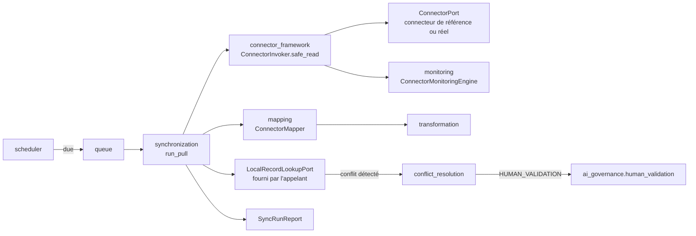
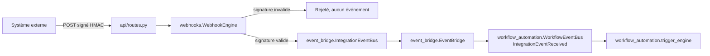

# Architecture — Legal Integration Hub (Sprint 18)

## Objectif

Le LIH (`tmis.integration_hub`) est la couche d'intégration
universelle de TMIS : il connecte le cabinet à son écosystème
applicatif (messagerie, agenda, stockage documentaire, signature
électronique, GED, facturation, CRM...) **sans dépendance forte à un
fournisseur**. TMIS reste le point central : l'information circule de
façon contrôlée entre TMIS et les applications autorisées, toutes les
synchronisations sont configurables, et le cabinet reste maître de ses
données.

Le LIH ne contient **aucune logique métier propre à un fournisseur** :
toute intégration passe par des interfaces publiques
(`ConnectorPort`) et des adaptateurs ; les connecteurs de
démonstration livrés avec ce sprint sont facilement remplaçables par
de vraies implémentations sans toucher au reste du système.

## Les 19 sous-modules + connecteurs de référence + la couche API

```
backend/src/tmis/integration_hub/
├── connector_framework/    # ConnectorPort, ConnectorInvoker (safe_read/safe_write)
├── connector_registry/     # installation dynamique, activation/désactivation
├── authentication/         # OAuth2, OIDC, API key, JWT, certificat
├── synchronization/        # jobs pull/push/bidirectionnels, full/incrémental
├── mapping/                # mapping de champs configurable par cabinet
├── transformation/         # transformations de valeurs (casse, dates...)
├── webhooks/                # entrant (signé) / sortant (signé)
├── event_bridge/            # IntegrationEvent -> WorkflowEvent
├── queue/                    # file de synchronisation, priorité, retry, timeout
├── scheduler/                  # planification horaire des synchronisations
├── conflict_resolution/          # local_wins/remote_wins/last_write_wins/validation humaine
├── monitoring/                      # latence, taux d'erreur, volumes
├── health/                            # liveness/readiness par connecteur
├── retry/                                # backoff exponentiel
├── sandbox/                                # quota d'appels + timeout d'exécution
├── security/                                 # chiffrement, rotation, isolation tenant, rate limiting
├── configuration/                              # configuration par cabinet, validée par schéma
├── developer_sdk/                                # BaseConnector, register_connector
├── testing/                                         # doubles de test, harnais de conformité
├── connectors/                                         # 7 connecteurs de référence (démo)
└── api/                                                    # endpoints REST
```

Chaque sous-module suit le patron déjà établi dans TMIS :
`schemas.py` → `ports.py` (si un point d'extension est plausible) →
implémentation(s) → composition dans `integration_hub/bootstrap.py`.

## Flux d'une synchronisation



## Flux d'un webhook entrant



## Réutilisation et distinctions de nommage

Conformément à la discipline établie depuis le Sprint 15
(`docs/09-roadmap-30-sprints.md` § Règles de passage entre sprints),
le LIH **réutilise directement** ce qui existe déjà plutôt que de le
réimplémenter :

- `security/` compose `platform.security.encryption`,
  `platform.security.secrets_rotation`, `platform.security.tenant_isolation`
  et `platform.rate_limiting` (Sprint 10) — chiffrement, rotation des
  secrets, isolation par tenant et limitation de débit ne sont
  jamais réimplémentés.
- `health/` compose `platform.health.HealthCheckEngine` (Sprint 10) —
  un `CallableHealthCheck` est enregistré par connecteur.
- `conflict_resolution.HumanValidationStrategy` compose
  `ai_governance.human_validation.HumanValidationEngine` (Sprint 15)
  pour la stratégie `HUMAN_VALIDATION`.
- `event_bridge.EventBridge` relie explicitement
  `event_bridge.IntegrationEventBus` (propre au LIH) à
  `workflow_automation.event_bus.WorkflowEventBus`, en publiant un
  `IntegrationEventReceived` — le seul endroit du LIH qui importe
  `workflow_automation` directement, puisque c'est précisément son
  rôle de pont.

À l'inverse, certains modules **réimplémentent délibérément** un
patron déjà vu ailleurs plutôt que d'importer à travers un contexte
borné différent :

- `queue.InMemorySyncQueue` reprend la forme de
  `ai_team.work_queue.InMemoryWorkQueue` (priorité, retry, timeout)
  mais est réimplémenté localement — le LIH n'importe pas `ai_team`.
- `retry.IntegrationRetryPolicy` reprend la forme de
  `workflow_automation.retry.WorkflowRetryPolicy` /
  `ai_fabric.retry.RetryPolicy` (backoff exponentiel), réimplémentée
  localement pour la même raison.
- `sandbox.ConnectorSandbox` reprend uniquement le *patron* de
  `platform_sdk.sandbox.SandboxExecutor` (quota + timeout autour d'un
  appel) sans importer son implémentation, qui est fortement couplée
  aux internes du Plugin System (`PluginLoader`, `PermissionEngine`,
  `PluginContext`, `KernelPort`) sans équivalent ici.

## Une collision de nommage documentée

`platform_sdk.connector_sdk.BaseConnectorPlugin` (Sprint 13) et
`integration_hub.connector_framework.ConnectorPort` (Sprint 18)
portent tous les deux le rôle de « connecteur », mais avec des
périmètres très différents :

| | `platform_sdk.connector_sdk.BaseConnectorPlugin` | `integration_hub.connector_framework.ConnectorPort` |
|---|---|---|
| Périmètre | Recherche seule (`fetch_page`/`normalize`/`search`) | CRUD complet : authentifier, lire, écrire, synchroniser |
| Lié à | `PluginContext`, pagination, cache du Plugin System | Rien — tenant/config passés explicitement |
| Isolation tenant | Héritée du Plugin System | Native (`security.IntegrationSecurityEngine`) |
| Cas d'usage | Un plugin de recherche interroge une source externe | TMIS synchronise des données bidirectionnelles avec un système du cabinet |

Les deux coexistent par conception ; voir aussi
`docs/71-guide-connecteurs.md` (Sprint 13) pour le premier.

## Sécurité

Toutes les communications externes sont authentifiées
(`authentication`), chiffrées au repos (`security.encrypt_config`),
signées (`webhooks.sign_payload`/`verify_signature`, HMAC-SHA256),
journalisées (`monitoring`) et isolées par tenant
(`security.require_tenant`). La rotation des secrets et la limitation
de débit s'appuient directement sur `platform.security` et
`platform.rate_limiting`.

## Vérification

- `ruff check src tests` : aucune erreur
- `mypy src` : aucune erreur (1348+ fichiers)
- `pytest -q --cov=tmis --cov-fail-under=90` : suite complète verte,
  couverture 95,8 % (97 % sur `tmis.integration_hub` seul)
