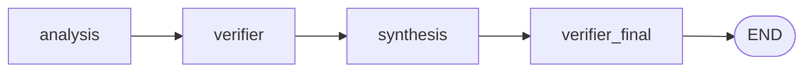

# Rapport d'architecture — Sprint 31 (Agent Vérificateur enrichi)

## Résumé

Le Sprint 31 est un sprint d'enrichissement strictement scopé, comme
annoncé par la roadmap : il enrichit `VerifierAgent.verify()` avec trois
vérifications supplémentaires, chacune une composition sur un moteur
déjà livré par un sprint précédent (`HeuristicConflictDetector`,
Sprint 6 ; `HallucinationDetectionEngine` et `BiasDetectionEngine`,
Sprint 15), et corrige un bug de câblage du graphe de l'`Orchestrator`
introduit sans s'en rendre compte au Sprint 30. La Phase 0 de re-audit
(docs/reports/sprint-31-rapport-audit.md) a confirmé que les 15 fichiers
désignés par le prompt avaient exactement la forme attendue, et a
identifié deux écarts structurels tranchés avant tout code.

Périmètre livré : `agents/verifier_agent.py` (réécrit intégralement),
`agents/orchestrator.py` (constructeur inchangé, `_build_graph` +
docstring étendus, nœud `"verifier_final"` ajouté), 9 tests unitaires + 1
test d'intégration bout-en-bout nouveaux, 0 test existant modifié,
docs/159-architecture-agent-verificateur.md, note de révision dans
docs/09-roadmap-30-sprints.md.

## Décisions structurantes

### Un seul agent enrichi, pas huit — le périmètre strict du prompt est respecté à la lettre

`ResearchAgent`, `JurisprudenceAgent`, `ContractAgent`, `DraftingAgent`,
`StrategyAgent`, `WatchAgent`, `CollaborationAgent` restent exactement
les placeholders (`raise NotImplementedError`, aucune ligne de logique)
— inchangés par ce sprint. Seul `VerifierAgent` a reçu une
implémentation enrichie ; `AnalysisAgent` et `SynthesisAgent`
(Sprints 29/30, réels) ne sont pas touchés — le sprint ne fait que les
router correctement à travers le graphe existant.

### `case_id` retrouvé par convention de citation, jamais par un nouveau champ

`AgentOutput` (`tmis.ai.schemas.agent`) n'a pas de champ `case_id` et la
contrainte « zéro changement de signature » interdit de lui en ajouter
un. `SynthesisAgent` attache déjà, depuis le Sprint 30, une `Citation`
`connector="case_store"` dont `source_id` est le `case_id` du dossier
résumé — un fait confirmé en Phase 0 par lecture directe de
`SynthesisAgent.run()`, pas supposé depuis le nom du champ.
`VerifierAgent._resolve_case_id()` réutilise cette convention telle
quelle :

```python
for citation in output.citations:
    if citation.connector == "case_store":
        return citation.source_id
```

Conséquence assumée : la vérification de cohérence dossier ne se
déclenche jamais sur la seule sortie d'Analyse (qui cite le document,
jamais le dossier) — seulement une fois la sortie de Synthèse fusionnée
dans les citations, ce qui est exactement le scénario que la correction
du graphe (section suivante) garantit désormais d'atteindre `verify()`.
Aucune alternative (ex. faire porter `case_id` par `output.result`) n'a
été retenue : cela aurait imposé une convention de clé à *chaque* agent
présent et futur plutôt que de réutiliser une convention déjà en place.

### Trois vérifications, trois compositions strictes — jamais de seconde détection

- **Cohérence dossier** : `CaseStorePort.get(case_id)` (déjà injectable,
  patron identique à `AnalysisAgent`/`SynthesisAgent`) charge le
  `CaseProfile`, puis `case_profile.facts`/`.timeline_inconsistencies`
  sont passés tels quels à `HeuristicConflictDetector.detect()`. Les
  `Conflict` retournés (`type`, `description`, `explanation`) sont
  reformatés en chaînes de `warnings` — aucun recalcul, aucune seconde
  heuristique de contradiction.
- **Hallucinations** : `HallucinationDetectionEngine.scan(text)` pour
  chaque texte narratif trouvé (voir section suivante). Les
  `HallucinationAlert.reason`/`.recommendation` sont reportés tels
  quels dans les `warnings`.
- **Biais** : `BiasDetectionEngine.scan(text)` sur les mêmes textes ;
  `BiasFinding.category`/`.description`/`.explanation` reportés tels
  quels.

### Texte narratif : seules les clés réellement générées par modèle

La Phase 0 a établi, par lecture directe (pas par supposition), que sur
les 5+9 clés produites par `AnalysisAgent`/`SynthesisAgent`, seules trois
appellent effectivement `TMISKernel.complete()` : `result["narrative"]`
(Analyse), `result["synthesis_note"]` et `result["executive_summary"]`
(Synthèse — via `CaseSummaryGenerator`, dont
`chronological_summary`/`documentary_summary`/`case_status` sont des
agrégations déterministes pures, jamais un appel modèle). Scanner
`entities`, `table`, `fact_sheet`, `checklist`, etc. pour des
hallucinations ou des biais n'aurait aucun sens : ce sont des structures
de données réutilisées telles quelles depuis le Case/Document
Intelligence Engine, jamais du texte généré.

Après `_fuse_with_synthesis` (inchangée), le résultat de Synthèse vit
sous `result["synthesis"]`. `_extract_narrative_texts()` regarde donc les
mêmes trois clés à la racine, puis dans ce sous-dictionnaire s'il est
présent — sans jamais renommer une clé produite par un autre agent,
conformément à la contrainte du prompt.

### Dégradation de confiance : une cascade documentée, qui remplace la règle Sprint 1

La règle Sprint 1 (`if warnings: HIGH -> MEDIUM`) réagissait à *tout*
avertissement déjà présent sur `output.warnings`, même sans rapport avec
ce que le Vérificateur contrôle — par exemple un avertissement
« document sans entités » d'Analyse aurait, par accident, dégradé la
confiance dès le premier passage par `verify()`, sans qu'aucune des
quatre vérifications du Vérificateur n'ait elle-même rien trouvé
d'anormal.

**Décision** : compter un « signal » par catégorie de vérification
(citations incomplètes, conflits, hallucinations, biais) qui a produit
*au moins un nouvel avertissement pendant cet appel* — pas la taille du
`warnings` accumulé. Cascade explicite :

1. `signal_categories >= 1` et `confidence == HIGH` → `MEDIUM`.
2. `signal_categories >= 2` et `confidence == MEDIUM` (dans le même
   appel, donc en cascade si l'étape 1 vient de s'appliquer) → `LOW`.
3. Jamais de remontée.

Ce choix respecte l'exemple donné par le prompt (« HIGH -> MEDIUM si un
signal, MEDIUM -> LOW si plusieurs ») tout en restant compatible avec le
test Sprint 1 existant (`test_verifier_flags_incomplete_citations` :
un seul signal, citation incomplète, `HIGH -> MEDIUM`, toujours vert).

### Orchestrateur : `verifier_final`, pas un déplacement du nœud `"verifier"`

**Le bug** : le graphe Sprint 30 était `analysis -> verifier ->
synthesis -> END`. `run_verifier` n'était câblé qu'entre `"analysis"` et
`"synthesis"` — la sortie de `SynthesisAgent` atteignait `END` sans
jamais passer par `.verify()`, en contradiction directe avec la première
phrase du docstring de `VerifierAgent` lui-même. Les tests Sprint 29/30
ne l'ont jamais détecté car aucun scénario testé ne portait de problème
sur la sortie de Synthèse elle-même — ils vérifiaient la fusion, jamais
la vérification de ce qui est fusionné.

**Deux options envisagées** (les deux permises par le prompt) :

1. Déplacer `"verifier"` après `"synthesis"` :
   `analysis -> synthesis -> verifier -> END`.
2. Garder `analysis -> verifier -> synthesis` inchangé, ajouter un
   second nœud `verifier_final` entre `"synthesis"` et `END`.

**Décision : l'option 2.** Le rapport d'architecture Sprint 30 justifie
explicitement le positionnement `"verifier"` avant `"synthesis"` : «
`SynthesisAgent` consomme conceptuellement la sortie déjà vérifiée du
pipeline (...) la Synthèse est conceptuellement la dernière étape d'un
pipeline de traitement de dossier ». Ce raisonnement n'a rien de faux —
Analyse doit toujours être vérifiée avant que Synthèse ne s'exécute. Le
bug n'était pas l'ordre `analysis -> verifier -> synthesis`, c'était
l'absence de tout contrôle *après* cet ordre. Défaire le positionnement
Sprint 30 pour résoudre un problème d'absence de contrôle final aurait
rouvert une décision déjà motivée sans raison — l'option 1 aurait de
plus supprimé la vérification actuelle de la sortie brute d'Analyse
avant que Synthèse ne s'exécute dessus, un recul net de couverture.
L'option 2 est un ajout strictement additif : elle prolonge exactement
le patron déjà documenté par les Sprints 29/30 dans le docstring
d'`Orchestrator` (« one that runs *after* Synthesis is inserted between
`"synthesis"` and `END` ») — `verifier_final` est ce nœud, la seule
différence étant qu'il réutilise `self._verifier_agent` plutôt qu'un
nouvel agent.



`_fuse_with_synthesis` reste inchangée : `verifier_final` appelle
simplement `self._verifier_agent.verify(state["output"])` sur la sortie
déjà fusionnée, exactement le même appel que `run_verifier` fait sur la
sortie d'Analyse — aucun code de fusion à dupliquer ou à modifier.

Le docstring d'`Orchestrator` est mis à jour pour refléter ce nouveau
patron : un futur agent terminal (Sprint 32 et suivants) s'insère entre
`"synthesis"` et `"verifier_final"`, jamais après — `verifier_final` doit
rester le dernier nœud avant `END`.

## Test existant modifié : aucun

Les deux tests Sprint 1/29 dans `tests/unit/test_orchestrator.py`
(`test_orchestrator_runs_analysis_then_verifier`,
`test_verifier_flags_incomplete_citations`) et les 22 tests Sprint 29/30
dans `tests/unit/agents/`, `tests/integration/agents/` passent tous sans
aucune modification — vérifié par exécution. La nouvelle règle de
cascade de confiance a été conçue précisément pour préserver
`test_verifier_flags_incomplete_citations` (un seul signal, `HIGH ->
MEDIUM`) ; la seconde passe `verifier_final` ne modifie ni `result` ni
`citations` sur les scénarios déjà couverts, et ne trouve aucun nouveau
signal sur leurs entrées (pas de `case_store` citation, pas de texte
narratif hallucinatoire/biaisé dans ces fixtures) — la confiance finale
de ces tests reste identique.

## Reuse ledger

| Composant nouveau | Compose | Ne reconstruit jamais |
|---|---|---|
| `tmis.agents.verifier_agent.VerifierAgent` (réécrit) | `CaseStorePort.get()` (Sprint 26), `HeuristicConflictDetector.detect()` (Sprint 6), `HallucinationDetectionEngine.scan()` (Sprint 15), `BiasDetectionEngine.scan()` (Sprint 15) | Un second moteur de conflits, un second compteur de citations, un second détecteur de généralisation, un second entrepôt de dossiers |
| `tmis.agents.orchestrator.Orchestrator` (`_build_graph` + docstring) | Le patron déjà existant (constructeur avec agents injectables, closure `.verify(state["output"])` déjà utilisée par `run_verifier`) | Un second mécanisme d'extension du graphe, un second type d'état (`OrchestratorState` inchangé), une réécriture de `_fuse_with_synthesis` |

## Vérification finale

- `ruff check .` → All checks passed
- `mypy src` (1890 fichiers) → Success, aucune erreur
- `pytest` → 2106 tests passants (2096 préexistants + 10 nouveaux : 9
  tests unitaires `VerifierAgent` (`tests/unit/agents/
  test_verifier_agent.py`) + 1 test d'intégration bout-en-bout
  (`tests/integration/agents/test_verifier_agent_integration.py`)),
  7 skipped (préexistants, gatés par
  `TMIS_REDIS_URL`/`TMIS_RUN_MODEL_DOWNLOAD_TESTS`), aucune régression
- Couverture globale : 96 % (seuil CI 90 %) ; `agents/verifier_agent.py` :
  99 % (83 énoncés, 1 manqué — le `raise NotImplementedError` de `run()`,
  jamais invoqué par construction, même statut que Sprint 1) ;
  `agents/orchestrator.py` : 100 %
- Vérification manuelle bout en bout
  (`tests/integration/agents/test_verifier_agent_integration.py`) : un
  `CaseProfile` réel portant un fait contradictoire
  (`contradicting_document_ids`) et un point ouvert biaisé, plus un
  `DocumentRecord` réel citant un article de loi (pour isoler le
  scénario de la propre narration d'Analyse), traités via `Orchestrator
  (analysis_agent=..., verifier_agent=VerifierAgent(case_store=...),
  synthesis_agent=...).run(agent_input)`. Le `SynthesisAgent` brut, appelé
  seul (comme le faisait l'ancien graphe avant `END`), retourne `HIGH`
  sans le moindre avertissement — la preuve que ces trois problèmes sont
  invisibles sans la correction du graphe. Une fois passé par le graphe
  complet, `output.warnings` porte un avertissement « Conflict detected »
  (`fact_inconsistency`), un avertissement « Hallucination risk » et un
  avertissement « Bias detected », et `output.confidence` descend de
  `HIGH` à `LOW` (trois catégories de signal en cascade) — sans qu'aucune
  clé de `result` n'ait été supprimée ou réécrite
  (`result["synthesis"]["synthesis_note"]`,
  `result["entities"]["persons"]`, etc. restent intacts).

## Confirmation explicite de périmètre

- Seul `VerifierAgent` a reçu une implémentation enrichie ce sprint, plus
  le graphe de l'`Orchestrator`. `AnalysisAgent`/`SynthesisAgent`
  (Sprints 29/30) ne sont pas modifiés ; `ResearchAgent`,
  `JurisprudenceAgent`, `ContractAgent`, `DraftingAgent`, `StrategyAgent`,
  `WatchAgent`, `CollaborationAgent` restent des placeholders inchangés
  (`raise NotImplementedError`) — pas une ligne de comportement modifiée.
- Aucune signature de `AgentInput`, `AgentOutput`, `AgentPort`
  (`tmis.ai.schemas.agent`), `ConflictDetectorPort`
  (`tmis.legal_reasoning.conflicts.ports`) ou `BiasDetectorPort`
  (`tmis.ai_governance.bias_detection.ports`) n'a changé.
- Aucune seconde détection de conflits, d'hallucinations ou de biais
  n'a été introduite — `VerifierAgent` compose strictement sur
  `HeuristicConflictDetector`, `HallucinationDetectionEngine` et
  `BiasDetectionEngine`, les trois moteurs listés par le prompt (voir
  aussi le rapport d'audit, section sur `ReasoningOrchestrator`/
  `ConfidenceEngine`, délibérément non câblés).
- Aucun contenu produit par un autre agent n'est supprimé ni réécrit par
  le Vérificateur : `verify()` retourne toujours `output.result` et
  `output.citations` inchangés, seuls `warnings` (ajouts uniquement) et
  `confidence` (dégradation uniquement, jamais de remontée) évoluent.
